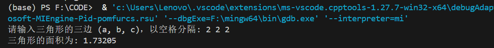
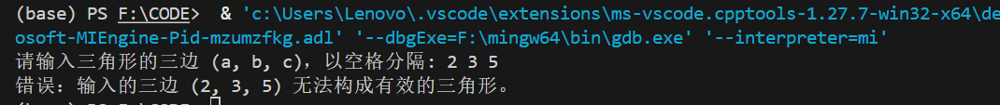
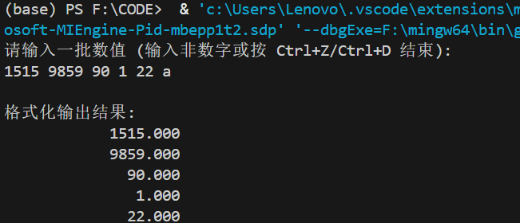
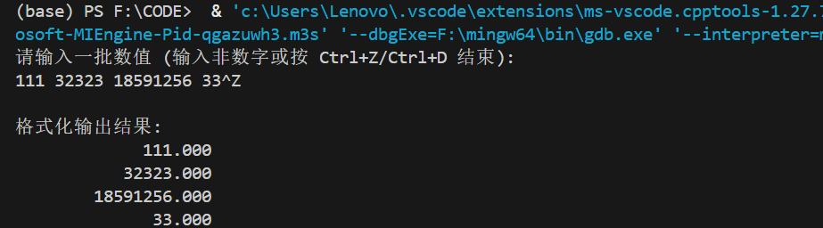

## C++ 作业四
---
### 自动化三班——2023312309——张韶恒 
---
*  **T1:** 输入三角形的三边 a,b,c，计算三角形的面积的公式是
    $$area = \sqrt{s(s-a)(s-b)(s-c)}, \quad s = \frac{a+b+c}{2}$$
   形成三角形的条件是: `a+b>c`, `b+c>a`, `c+a>b`
   编写程序，输入 a, b, c，检查 a, b, c 是否满足以上条件，如不满足，由 `cerr` 输出有关出错信息；如满足条件，计算面积。
   <br>
*  **代码如下：**
  ```c++
    #include <iostream>
    #include <cmath> // 要用sqrt (平方根) 函数

    int main()
    {
        double a, b, c;
        std::cout << "请输入三角形的三边 (a, b, c)，以空格分隔: ";
        std::cin >> a >> b >> c;
        // 检查是否满足三角形的条件
        // (a+b>c) && (b+c>a) && (c+a>b)
        if (a > 0 && b > 0 && c > 0 && (a + b > c) && (b + c > a) && (c + a > b))
        {
            // 先计算半周长 s
            double s = (a + b + c) / 2.0;

            // 计算面积 (海伦公式) ，s(s-a)(s-b)(s-c) 是面积的平方
            double area = std::sqrt(s * (s - a) * (s - b) * (s - c));
            std::cout << "三角形的面积为: " << area << std::endl;
        }
        else
        {
            // 不满足条件，使用 cerr 输出错误信息
            std::cerr << "错误：输入的三边 (" << a << ", " << b << ", " << c << ") 无法构成有效的三角形。" << std::endl;
        }
        return 0;
    }
  ```
*  **运行结果展示：**
  正确的一组数：（2 2 2）
  
  错误的一组数：（2 3 5）\
  
---
*  **T2:** 从键盘输入一批数值，要求保留3位小数，在输出时上下行小数点对齐。
*   **代码如下：**
  ```c++
    #include <iostream>
    #include <iomanip> // 使用 fixed, setprecision, setw
    #include <vector>
    int main()
    {
        std::vector<double> numbers;
        double num;
        std::cout << "请输入一批数值 (输入非数字或按 Ctrl+Z/Ctrl+D 结束):" << std::endl;
        // 循环读取一批数值
        while (std::cin >> num)
        {
            numbers.push_back(num);
        }
        std::cout << "\n格式化输出结果:" << std::endl;
        // 设置输出格式：固定小数表示法，保留3位小数
        // 这两个设置是“粘性”的，设置一次即可
        std::cout << std::fixed << std::setprecision(3);
        // 遍历 vector 并输出
        for (double val : numbers)
        {
            // 通过设置一个固定的总宽度并右对齐（默认）来实现
            std::cout << std::setw(20) << val << std::endl;
        }
        return 0;
    }
  ```
*  **运行结果展示：**
  键入字母结束模式：
  
  键入CTRL+Z结束模式：
  