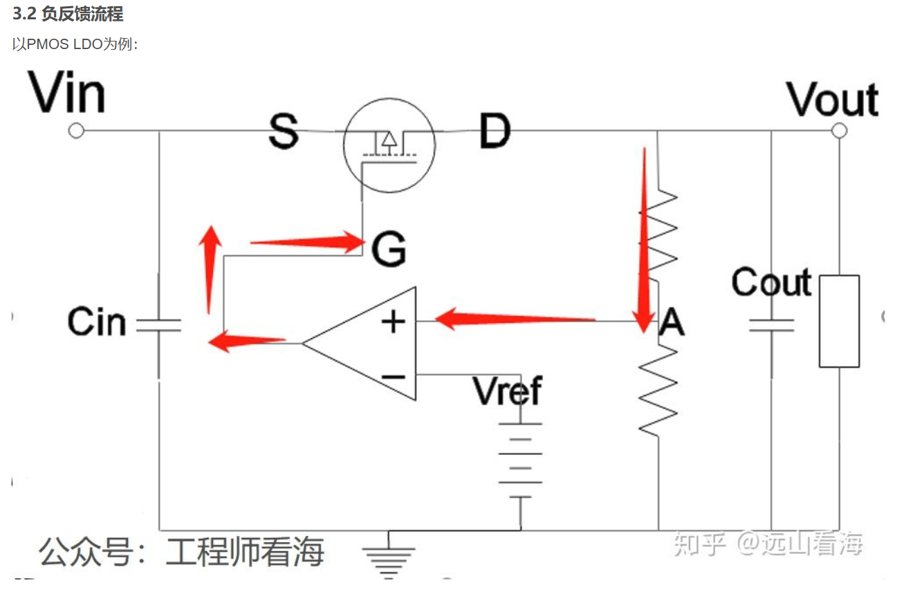

好的，我们来详细分析一下这张PMOS LDO电路图中，PMOS管所处的工作状态。

在正常工作的LDO（Low-Dropout Regulator，低压差线性稳压器）电路中，这里的 **PMOS管工作在线性区（也称为欧姆区或三极管区）。**

下面是详细的分析过程：

### 1. LDO的基本工作原理

首先，我们回顾一下这个LDO电路的工作流程（负反馈过程）：
1.  **输出电压采样**：输出电压 $V_{out}$ 通过两个电阻串联分压，得到一个采样电压（图中A点电压），我们称之为 $V_{fb}$。
2.  **比较放大**：运算放大器（Error Amplifier）比较这个采样电压 $V_{fb}$ 和一个非常稳定的基准电压 $V_{ref}$。
3.  **产生控制信号**：运放会将 $V_{fb}$ 和 $V_{ref}$ 之间的微小差值进行放大，其输出端会产生一个控制电压，这个电压直接连接到PMOS管的栅极（G极）。
4.  **调整输出**：PMOS管根据栅极电压的变化，改变其源极（S）和漏极（D）之间的导通电阻，从而调整流向输出端的电流，使 $V_{out}$ 稳定在预设值。

例如：
* 如果负载电流增大，导致 $V_{out}$ **下降** -> $V_{fb}$ 下降。
* 运放的同相输入端（+）电压低于反相输入端（-）的 $V_{ref}$，运放输出电压将会**下降**。
* 对于PMOS管，栅极电压 $V_G$ 下降，意味着其导通程度**增强**（$|V_{GS}|$ 增大），等效电阻 $R_{DS}$ 减小。
* 更小的电阻允许更大的电流通过，从而将 $V_{out}$ **拉高**，使其恢复到设定值。

整个过程是一个闭环的负反馈，目的是让 $V_{fb}$ 永远紧紧地跟随 $V_{ref}$，最终实现 $V_{out}$ 的稳定。

### 2. PMOS管为什么工作在线性区？

现在我们来看PMOS管本身。一个MOS管有三个主要工作区：截止区、线性区和饱和区。

* **截止区**：$|V_{GS}| < |V_{th}|$（栅源电压的绝对值小于阈值电压的绝对值），管子不导通。LDO正常工作时显然不在此区。
* **饱和区**：$|V_{GS}| > |V_{th}|$ 且 $|V_{DS}| > |V_{GS} - V_{th}|$。在此区域，MOS管像一个**受 $V_{GS}$ 控制的恒流源**，其电流在很大程度上不受 $V_{DS}$ 影响。
* **线性区**：$|V_{GS}| > |V_{th}|$ 且 $|V_{DS}| < |V_{GS} - V_{th}|$。在此区域，MOS管像一个**受 $V_{GS}$ 控制的可变电阻**。

在LDO电路中，这个PMOS管的角色是一个**调整管（Pass Transistor）**，它的核心作用是根据反馈信号来**动态改变自身的等效电阻**，以适应输入电压的波动和负载电流的变化，从而维持输出电压恒定。

LDO的全称是“低压差”稳压器，这意味着它被设计用于输入电压 $V_{in}$ 和输出电压 $V_{out}$ 非常接近的场合。PMOS管的源极S接 $V_{in}$，漏极D接 $V_{out}$，那么它两端的压降就是 $V_{SD}$ (即 $V_{in} - V_{out}$)。
$$V_{DS} = V_{out} - V_{in} = -V_{SD}$$
由于是低压差应用，这个 $V_{SD}$ (即 $|V_{DS}|$ ) 会非常小。

我们来看线性区的条件：$|V_{DS}| < |V_{GS} - V_{th}|$
* $|V_{DS}|$ 就是 LDO 的压差 $V_{in} - V_{out}$，这个值本身就很小。
* $V_{GS}$ 是由运放控制的，为了让PMOS管导通，运放会提供一个合适的栅极电压，使得 $|V_{GS}|$ 必须大于阈值电压 $|V_{th}|$。

在绝大多数工作条件下，特别是当负载电流较大时，运放会把栅极电压拉得足够低，使得 $|V_{GS}|$ 较大，很容易满足 $|V_{in} - V_{out}| < |V_{GS} - V_{th}|$ 这个条件。

**总结与对比：**

* 如果PMOS工作在**饱和区**，它就像一个恒流源。这意味着运放只能通过改变 $V_{GS}$ 来设定一个大致的输出电流值，但对于 $V_{out}$ 的精细调节能力很差。当负载需要不同电流时，饱和区的PMOS无法像电阻一样灵活地进行调整，反馈环路很难稳定。
* 如果PMOS工作在**线性区**，它就像一个由栅极电压精确控制的**可变电阻**。运放可以通过微调栅极电压，非常精细地改变PMOS的导通电阻 $R_{DS}$，从而精确控制经过它的压降，确保 $V_{out} = V_{in} - I_{load} \times R_{DS}$ 的稳定。这完美契合了LDO作为“线性”稳压器的本质。

因此，**为了实现精确、稳定的线性电压调节功能，LDO中的PMOS调整管必须工作在线性区（欧姆区）。**

好的，这张幻灯片非常清晰地总结了三种最主流的直流（DC）电源转换方案。下面我将对这三种方案进行详细的讲解，并对幻灯片中的要点进行展开。

---

### 1. 线性稳压器 (LDO - Low Dropout Regulator)

幻灯片总结：只能用作降压电路，设计非常简单，输出电流一般较小，带负载能力较差。

#### 工作原理
线性稳压器的工作方式可以非常形象地比喻成一个**由智能芯片控制的可变水龙头**。

* **输入电压 ($V_{in}$)**：相当于水管里的总水压。
* **输出电压 ($V_{out}$)**：是我们希望在水龙头出口得到的稳定水压。
* **调整管 (Pass Transistor)**：就是那个水龙头阀门。在LDO中，通常是一个PMOS或NMOS管。
* **反馈控制电路**：是一个时刻监控出口水压的“管理员”。它不断地将实际输出电压与一个精准的基准电压($V_{ref}$)进行比较。

工作流程是：当负载（用水量）变化或输入水压波动导致输出水压变化时，“管理员”会立刻发现，并去拧动“水龙头阀门”，精确地调整其开度，直到出口水压不多不少，正好是我们想要的值。

#### 优点详解
* **设计非常简单**：这是它最大的优点之一。一个基本的LDO只需要很少的外部元件（通常是两个小电容），甚至很多集成芯片已经把所有东西都做好了，你只需要连接输入、输出和地。
* **极低的噪声和电磁干扰 (EMI)**：因为LDO内部没有高频率的开关动作，它是一个连续的、模拟的调节过程。就像平滑地调节水龙头一样，不会产生剧烈的“开关”噪声。这对于为敏感的模拟电路（如音频、射频、传感器）供电至关重要。

#### 缺点详解
* **效率低下，发热严重**：这是LDO的致命弱点。为了把高的输入电压降到低的输出电压，多余的电压差 ($V_{in} - V_{out}$) 全部消耗在内部的“水龙头阀门”（调整管）上，并以**热量**的形式散发掉。
    * **功率损耗公式：$P_{loss} = (V_{in} - V_{out}) \times I_{load}$**
    * 举个例子：输入5V，输出3.3V，负载电流为0.5A。那么LDO自身消耗的功率为 $(5V - 3.3V) \times 0.5A = 0.85W$。这0.85W的能量会全部变成热量。如果压差更大或电流更大，发热会非常严重，甚至需要加装散热片。
* **只能降压**：水龙头只能把水压调低，不可能把低水压调高。同理，LDO只能进行降压。
* **带负载能力较差**：正是因为发热问题，LDO无法承载很大的负载电流。一旦电流过大，巨大的热量会损坏芯片。所以LDO通常用于电流几十毫安到1安培左右的场合。

---

### 2. 电荷泵 (Charge Pump)

幻灯片总结：采用飞度电容作为中间储能级，进行电压的转换，效率高，体积小，低电磁干扰，但是在高电压和大功率场合占有劣势。

#### 工作原理
电荷泵可以比喻成一个**用小桶接力倒水的系统**。它不靠“节流”，而是靠“搬运”电荷。

* **飞度电容 (Flying Capacitor)**：就是那个用来搬运电荷的“小桶”。
* **开关网络**：是一组快速切换的电子开关（通常是MOSFET）。

工作流程分两步，不断循环：
1.  **充电阶段**：开关网络把“小桶”（电容）连接到输入电源上，给它充满电荷（充电）。
2.  **泵送阶段**：开关网络瞬间切换，把这个充满了电的“小桶”以不同的方式连接到输出端。
    * **升压**：把“小桶”和输入电源**串联**起来，输出电压就是两者之和。
    * **反压**：把“小桶”的极性反过来接到输出端。
    * **降压**：用更复杂的方式实现。

通过控制开关的切换方式和频率，电荷泵可以实现升压、降压和产生负电压。

#### 优点详解
* **效率高（在小功率下）**：因为它是在“搬运”能量，而不是像LDO那样消耗能量，所以效率很高，通常能达到80%-95%。
* **体积小，无需电感**：它最核心的优势是不需要笨重、昂贵的电感器，只需要小小的电容。这使得整个电源方案可以做得非常紧凑。
* **低电磁干扰**：相比于下面要讲的电感式开关电源，电荷泵的能量存储在电容的电场里，而不是电感的磁场里。磁场更容易向外辐射产生干扰，所以电荷泵的EMI特性相对更好。

#### 缺点详解
* **高电压大功率场合劣势**：
    * **带载能力有限**：“小桶”的容量（电容容量）和开关的电流处理能力是有限的。当负载电流需求很大时，需要非常大的电容和强壮的开关，这会使其失去体积和成本优势。
    * **输出纹波较大**：由于是间歇性地“倒水”，输出电压的平顺性（纹波）不如其他方案，且纹波大小与负载电流关系很大。

---

### 3. 电感式开关电源 (Inductor-based Switching Power Supply)

幻灯片总结：设计方案成熟，相关参考资料丰富，同时有着较高的效率和大功率输出的能力，但是使用时电感会产生电磁干扰。

这是我们最常见到的电源类型，例如手机充电器、电脑电源等，涵盖了**Buck（降压）、Boost（升压）、Buck-Boost（升降压）**等多种拓扑。

#### 工作原理
这类电源可以比喻成一个**能量“飞轮”系统**。

* **电感 (Inductor)**：就是那个储存和释放能量的“飞轮”。
* **开关管 (MOSFET)**：是给“飞轮”加速的“推手”。

工作流程也是两步循环：
1.  **储能阶段**：开关闭合，电源给电感充电，电流流过电感，能量以磁场的形式储存在电感中（飞轮被加速）。
2.  **释能阶段**：开关断开，电感的磁场为了维持电流继续流动，会产生一个感应电压，将刚刚储存的能量释放给负载（断开推力后，飞轮依靠惯性继续转动并带动机器）。

通过高速地重复这个过程，并精确控制每次“推”的时间（即**占空比 Duty Cycle**），就可以精确控制传输给负载的能量，从而实现稳定高效的电压转换。

#### 优点详解
* **效率极高**：这是最高效的电源转换方式，效率可以轻松做到90%以上，因为能量在储存和释放过程中的损耗非常小。
* **大功率输出能力**：电感和开关管可以被设计用来处理非常大的电流和功率，从几瓦到几千瓦甚至更高。这是它相比于LDO和电荷泵的绝对优势。
* **功能灵活**：通过不同的电路拓扑，可以非常高效地实现降压（Buck）、升压（Boost）和升降压（Buck-Boost）。
* **设计方案成熟**：技术非常普及，有海量的现成控制芯片、设计工具和参考资料，大大降低了设计门槛。

#### 缺点详解
* **电磁干扰 (EMI)**：这是它最大的“原罪”。高频率、大电流在电感和开关环路中流动，会产生强大的、不断变化的磁场，像一个小小的无线电发射站一样向外辐射电磁波，干扰周围的其他电子设备。因此，设计时需要非常注意PCB布局、滤波和屏蔽。
* **设计复杂，体积较大**：相对于LDO，它的元件更多（控制器、开关管、电感、二极管、电容等），设计和调试更复杂。电感器通常是电路板上最高、最重的元件之一。