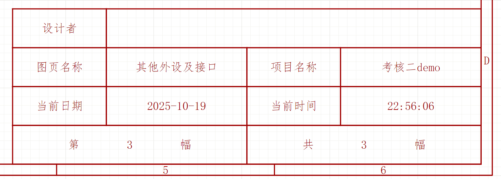

# 2026赛季NGXY硬件组第二轮考核
---

## 设计你的 **第一块单片机最小系统板**
---
#### 本次考核将提供一份demo.epro工程，请 **一定** 在此基础上进行完善，完成你的考核二原理图（参考demo中的原理图分页绘制）与PCB绘制
---
### 截止时间为 **10月25日 22：00**
---
### 考核具体要求如下：
---
* 需使用立创EDA（专业版）全在线模式进行**原理图**以及**PCB**绘制
   
* 单片机指定型号：**STM32F303CBT6**
   
* 只允许使用一个24V外部电源供电 （**XT30接口公头卧插**）
   
* 电源树需包括 **24V → 12V → 5V → 3.3V** （**3V3为芯片供电**）
   
* **一路CAN**通信 （需要使用一个**gh1.25 2P 卧贴**和一个**gh1.25 4P 卧贴**）
   
* **两路UART**串口通信 （采用**gh1.25 4p 卧贴**）
   
* 采用**SWD**下载口 （采用**MX1.25 4p**）
   
* 按键复位功能（**RESET**）
   
* 工作指示灯、上电指示灯（**使用不同颜色，上电指示灯指示3V3回路，工作指示灯由芯片引脚GPIO模式控制**）
   
* 利用stm32cubemx配置好对应各个通信和指示灯的引脚
   
* 在上述配置好各引脚以及通信的CubeMX工程中
  **编写工作指示灯先闪烁（一个周期1s内，闪烁10次）再呼吸（亮度从暗到亮再从亮到暗 ***请用PWM调控***，一个周期3s）的程序，整个周期4s**
---
### 注意事项：
---
* 请编辑图纸，在设计者一栏填写 **姓名+年级+学号**
       
 

       
* 考试时间为6天，需在**周六（10月25日）晚22：00**前提交
   
* 提交一个.zip压缩包，里面包含整个名为 **姓名+年级+学号.epro** 工程文件以及CubeMX生成的工程文件夹，发送至邮箱**2632443421@qq.com**，邮件主题为“硬件组第二次考核+姓名+年级+学号”。压缩文件夹用相同的命名。
   
* 本次考核无需制作实物，完成考核题目后无需发板/购买元器件

***

### 评分表
---
| 任务           | 得分项                               | 满分             |
|:---------------:|:-------------------------------------:|:-----------------:|
| **原理图设计** | **(共50分)**                         |        50分          |
|        1.1        | MCU最小系统电路（含复位、指示灯）    | 10分             |
|           1.2     | 电源电路（24V 转 12V 转 5V 转 3.3V）                | 25分             |
|              1.3 | 通信接口电路（CAN, UART, SWD）       | 15分             | 
| **PCB设计**    | **(共25分)**                         |             25分     |      
|              2.1  | 元件布局与接口合理性（含3D干涉检查） | 10分             |      
|       2.2         | 电源与信号布线规范性                 | 10分             |      
|       2.3         | PCB可制造性（丝印、DRC等）           | 5分              |      
| **工程完整性** | **(共5分)**                         |       5分           |      
|       3.1         | 工程文件规范，原理图清晰易读         | 5分             |      
| **软件部分**     | **(共20分)**                         |        20分          |      
|      4.1          | CubeMX引脚配置                       | 10分             |      
|      4.2          | 指示灯闪烁/呼吸灯程序            | 10分             |      
| **总计**       |                 **（共100分）**                     | **100分** |      

