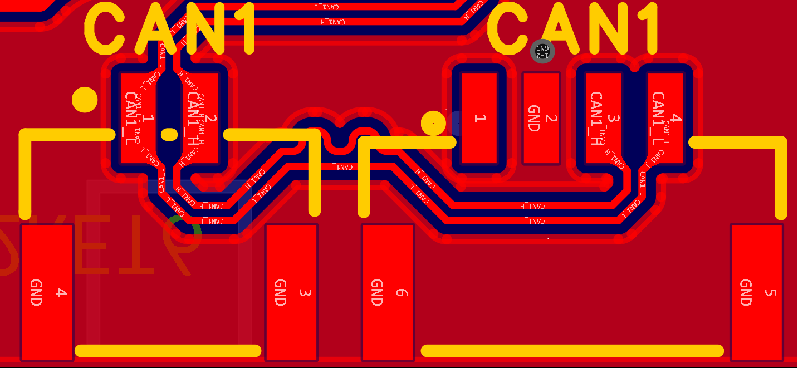
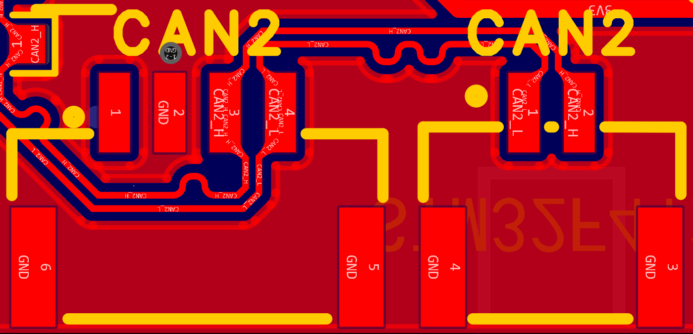
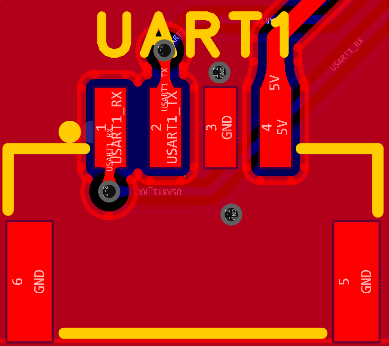
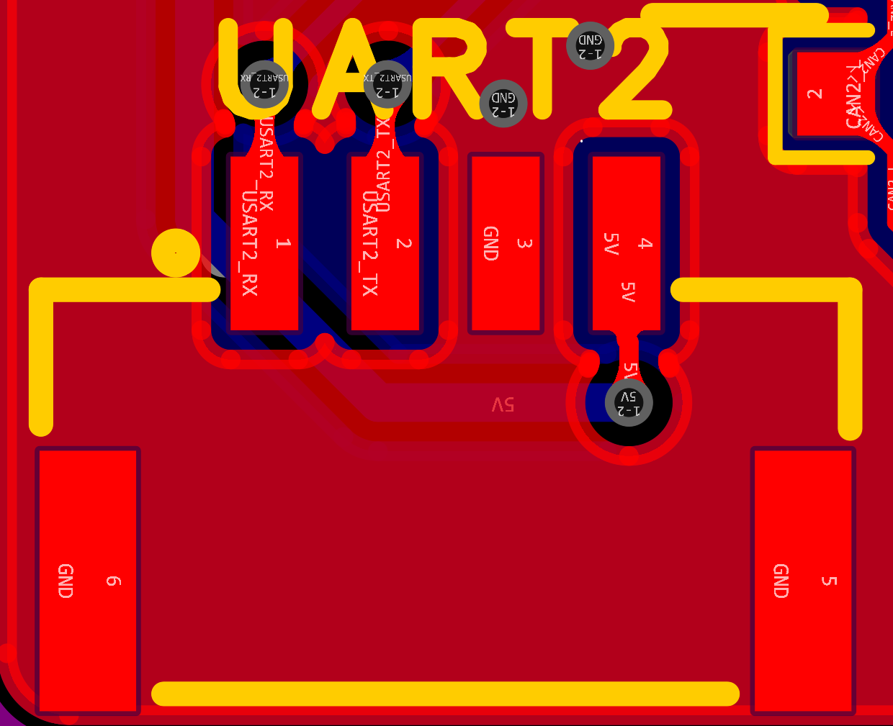
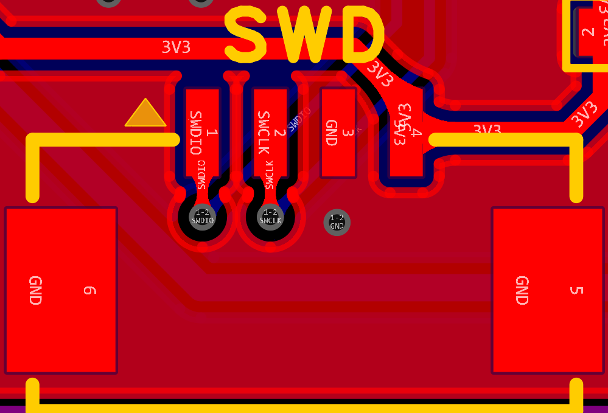
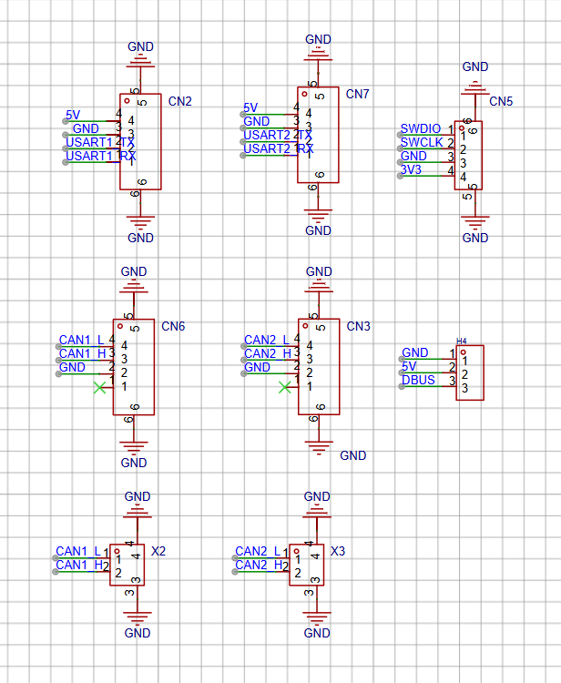
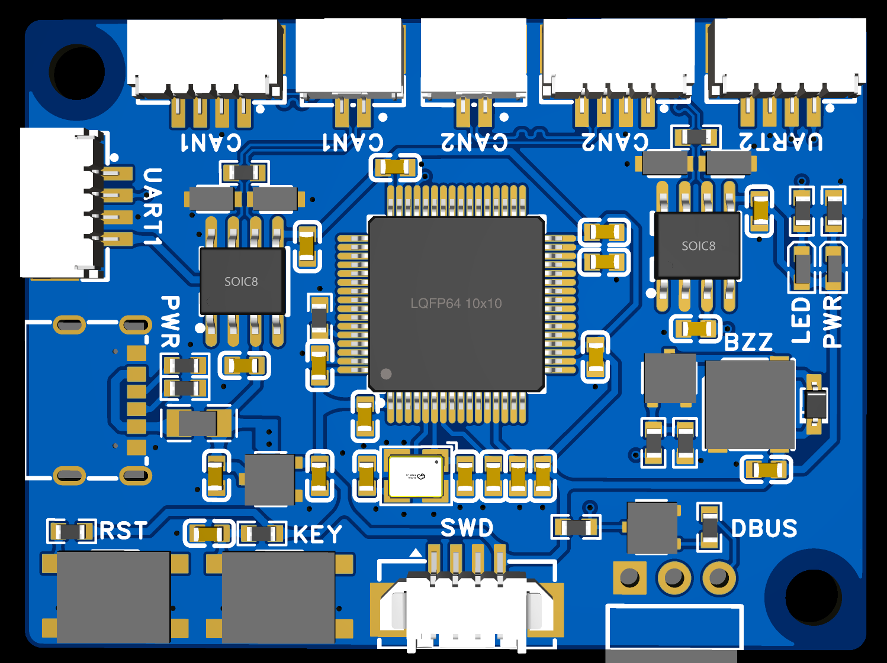

## 培训板线序（修正）
---
#### 1.1 CAN1 线序

  

---
#### 1.2 CAN2 线序

  

---
#### 1.3 UART1 线序

  

---
#### 1.4 UART2 线序

  

---

#### 1.5 SWD口 线序

  

---
 #### 1.6 DBUS 线序

  

---
#### 2. 对应的接口部分原理图

  

  ---
  
  #### 3. 对应的PCB的3D渲染图

  

