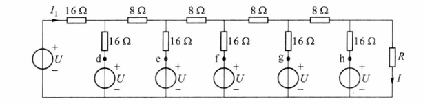
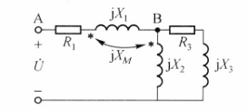
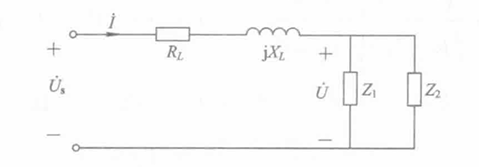
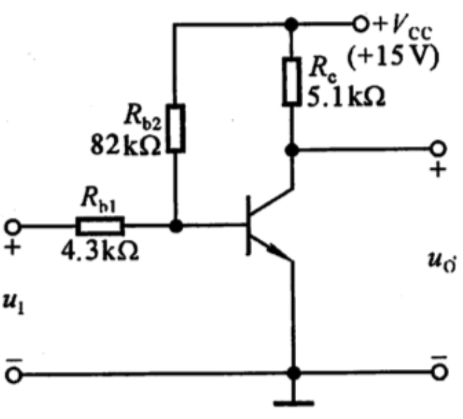

# 2026赛季硬件组直通考核
---
### 笔试部分：
>  共五题，可以使用计算器，该部分用时上限为60分钟
> 笔试部分共计60分，各题目分数分配为：10  10  10  15  15
### T1:
用含源支路等效变换的方式计算图(a)中所示的电流 $I$

（a） 
           

### T2:
图示电路，已知 $U = 8\text{V}$，$R = 12\Omega$。求电流 $I$ 和 $I_1$ 的值。

  

            

### T3:
设图示电路中 $R_1 = 12\Omega$，$X_1 = 12\Omega$，$X_2 = 10\Omega$，$X_M = 6\Omega$，$R_3 = 8\Omega$，$X_3 = 6\Omega$，$U = 120\text{V}$，求电压 $U_{AB}$。

  

            

### T4:
电路如图所示，其中 \( Z_1 \) 和 \( Z_2 \) 分别为负载1和负载2的阻抗，\( Z_L = R_L + jX_L \)，为传输线阻抗。已知：负载1吸收的平均功率为8kW，其功率因数为0.8（超前）；负载2吸收的视在功率为20kVA，其功率因数为0.6（滞后）；\( R_L = 0.05  \Omega \)，\( X_L = 0.5  \Omega \)，\( U = 250 / 20^\circ  V \)。     

(1) 求两个负载并联后的功率因数；   

(2) 求两个负载并联后的视在功率、电流有效值I及传输线上的平均功率损耗；   

(3) 若电源频率 \( f = 50  Hz \)，将一电容与 \( Z_1 \) 及 \( Z_2 \) 并联，假设 \( Z_1 \) 及 \( Z_2 \) 的功率和功率因数仍为题目所给的已知条件，希望 \( Z_1 \)、\( Z_2 \) 及电容并联后的功率因数提高到1，求该电容值，在这种情况下重新计算第(2)问。

  

                   

### T5:
电路如图所示，已知晶体管 \(\beta = 120\)，\(U_{BE} = 0.7\,\text{V}\)，饱和管压降 \(U_{CES} = 0.5\,\text{V}\)。在下列情况下，用直流电压表测晶体管的集电极电位，应分别为多少？  
（1）正常情况；  
（2）\(R_{b1}\) 短路；  
（3）\(R_{b1}\) 开路；  
（4）\(R_{b2}\) 开路；  
（5）\(R_{b2}\) 短路；  
（6）\(R_e\) 短路。

  

                  

