### 无线充电部分需要介绍的内容
###    
 ————数据+图片+独特优势
---
#### 一、为什么决定设计无线充电装置？
**1. 磁牵引管道机器人困境**

管道外机器人在管道外作业时，不仅需要实时变径转动，适应管道外侧的法兰盘与支架得以通过，还需要借助海姆贝克阵列铷磁铁实现对管内机器人的牵引，以及对管内机器人外传的超声波讯息进行解调编码，以上的一系列操作都使得管外机器人的功耗难以降低，无法实现长距离的牵引工作。

为了解决如上的大功耗续航短问题，我们团队首先从降低功耗这一角度出发，优化了机器人机构，减重了机器人重量，并采用更高效的电机驱动，使机器人整体功耗降低，但续航时间依然无法满足实际需求。

**因此，一个为机器人在运行过程中充电的想法应运而生**

**2. 无线充电的具体使用场景介绍**

为了既能实现能量补充，又能减少人力物力财力，我们决定设计一款部署简单、能量传输功率大、安全系数高的无线充电接收、发射模块与基站。

我们希望这款无线充电装置能够应用于磁牵引管道机器人，实现机器人运行过程中的能量补充，延长机器人的运行时间，降低维护成本，提高工作效率。

---

#### 二、无线充电装置的设计要点
* 无线充电装置的设计必须满足《无线充电（电力传输）设备无线电管理暂行规定》中对**发射频率**、**充电功率**等关键参数的要求，以及新规则中对**尺寸**的要求。
##### 优越特性
* **安全性高与智能控制:**
    * 具有过流保护、过温保护、**异物检测**等保护措施。
    * 配合接收端可实现**恒功率充电**。
    * 能够实现**识别到管外机器人上的接收线圈后才开始充电**，具有良好的安全性。
    * 接收端即使在单片机程序跑飞的情况下，也能通过模拟控制维持恒流充电，**安全系数较高**。
    * 系统具备异物检测功能，可防止为接收线圈之外的物品辐射能量。
* **硬件优势:**
    * 发射端的PCB尺寸仅为 $53\text{mm} \times 41\text{mm}$，**非常小巧**。
    * 工作时温升较低，**无需主动散热**，可随意放置。
    * 发射端静态功耗小于 $1\text{W}$。

##### 关键参数展示
* **工作频率:** $148\text{KHz}$。
* **能量交互面尺寸:** 约 $90\text{mm} \times 90\text{mm}$。
* **最高持续输出功率:** 设计目标是在线圈相距 $2\text{cm}$ 以内时，最大充电功率大于 $120\text{W}$。
---

| 图片要点 | 报告中的对应信息和数据 |
| :---: | :---: |
| **充电时间** | 实测显示，该装置约 $40$ 秒即可将3S锂电池从零充至满电。充电时通过缓启动机制提高系统稳定性。 |
| **充电效率** | 该系统在 $120\text{W}$ 负载下，发射端热点温度仅 $40^\circ\text{C}$ 左右，表明**散热表现优秀**。接收端通过PID控制输出电流实现充电功率闭环，静态误差小于 $0.2\text{W}$。最终可实现接近45%的充电效率。 |
| **充电传输范围** | 设计目标是在线圈**相距 $2\text{cm}$ 以内**时，最大充电功率大于 $120\text{W}$。 |
| **应用后扩大的作业半径** | 在充满电后，经过我们仿真功耗、理论计算预估为管外机器人可走**10km** |

---
#### 三、硬件电路设计展示
##### 发射端电路设计
发射端设计 (LC 谐振)
* **拓扑与激励:** 采用四颗功率 MOSFET 构成**全桥拓扑**。发射线圈采用 **LC 补偿**。全桥电路将 $24\text{V}$ 直流输入转换为高频交流信号，驱动 $\text{LC}$ 谐振线圈。
* **主控与驱动:** $\text{STM}32\text{F}334$ 利用内部的 $\text{HRTIM}$ 进行精准的**调频控制**。栅极驱动电路采用了 $\text{MP}18024$ 高低侧驱动器。
   
---
主控：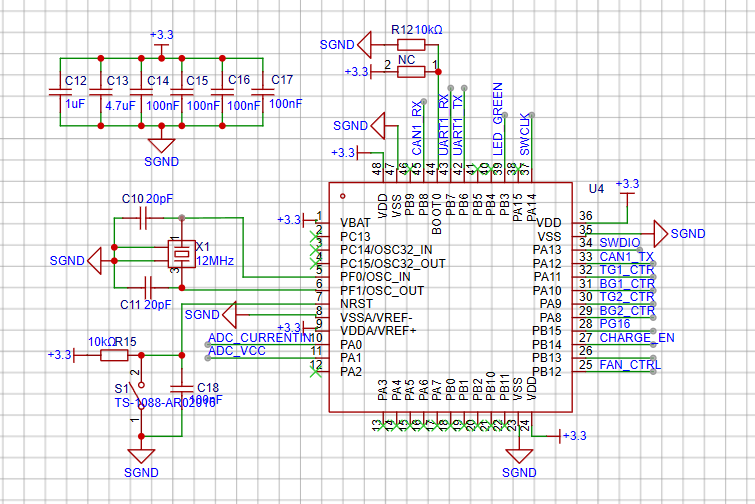
主控电源回路：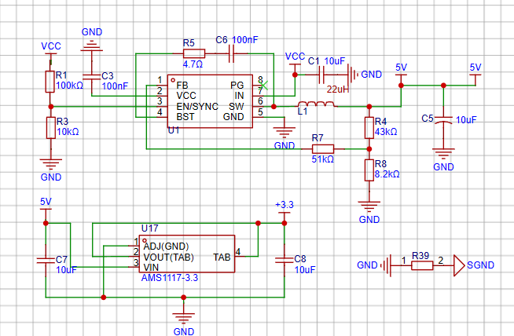
主控功率PID调节所需的采样电路：
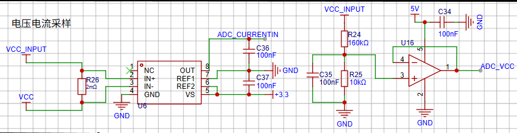
工作指示灯：  
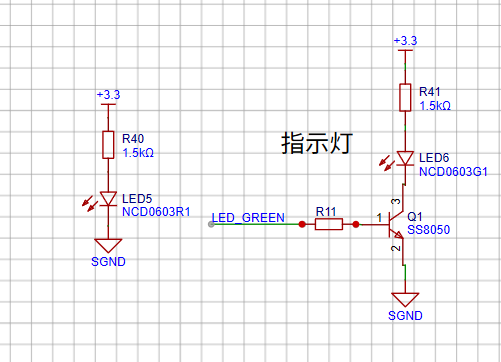
通信接口：
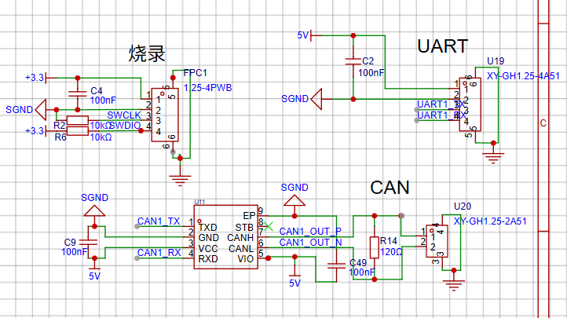
H桥电路——调制交流电:

LC谐振回路；
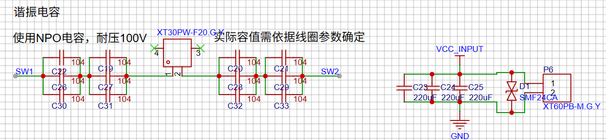
H桥驱动电源回路（与主控独立）：
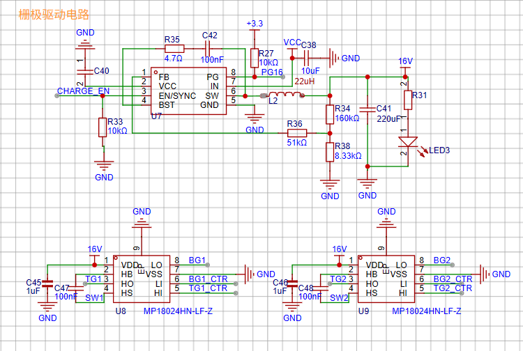
预留接口：
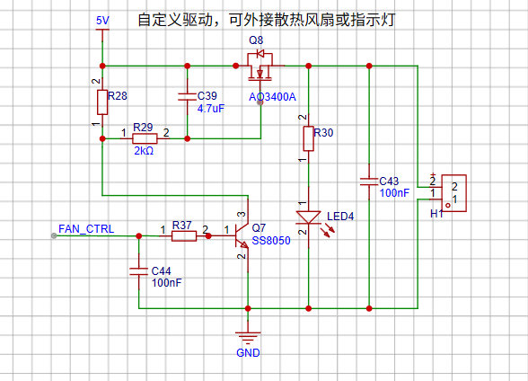
  

---
##### 接收端电路设计
 接收端设计 (LCC 谐振与 Buck-Boost)
* **拓扑优化:** 为解决发射端方波中的高次谐波问题（特别是三次谐波），接收线圈的补偿网络由 $\text{LC}$ 修改为 **LCC 补偿**，额外并联了一个高频滤波电容 $\text{Cf}$，以抑制高次谐波。
* **DC-DC 变换:** 接收端使用了整流滤波 $+$ 电流模式 $\text{DCDC}$ 的设计。选用 **Buck-Boost 电路**（控制器为 $\text{LT}3790\text{EFE}$）以应对接收端感应电压在 $10\text{V}$ 到 $50\text{V}$ 之间波动的情况。
* **控制方式:** $\text{LT}3790\text{EFE}$ 具备**恒流模式**。$\text{STM}32\text{F}334$ 通过 $\text{INA}226$ 监测电容充电功率，通过 **PID 算法**实现充电功率闭环。

---
主控：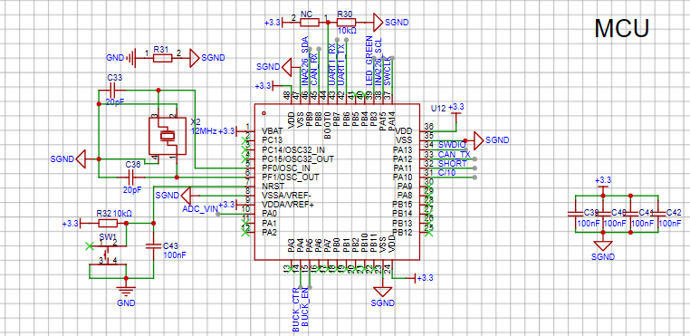
主控采样：
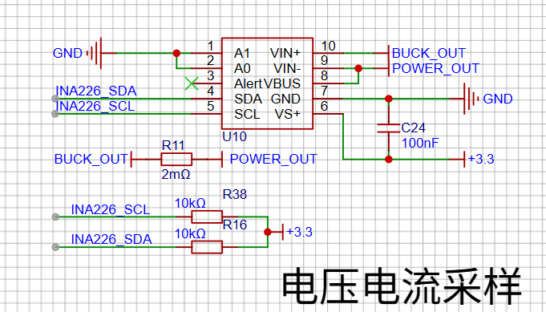
LT3790EFE电路：
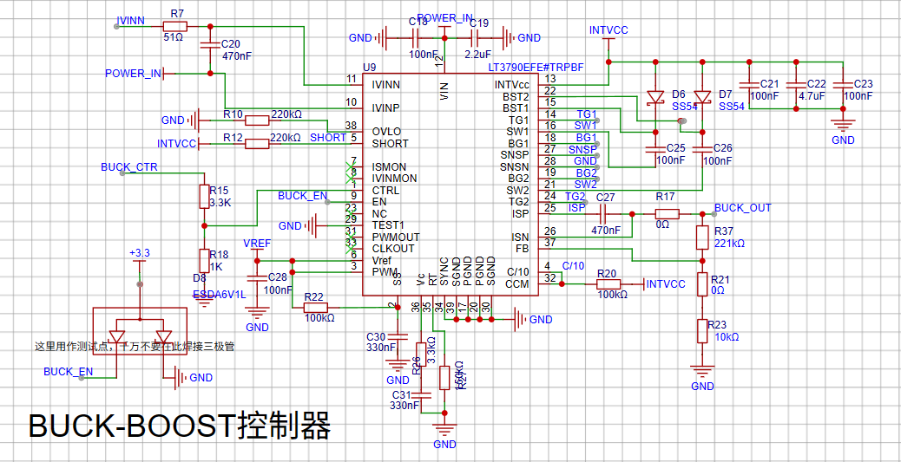
通讯、烧录接口：
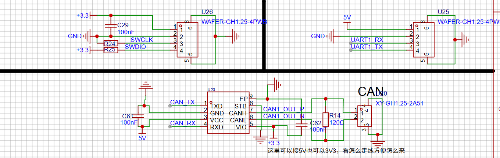
功率回路：
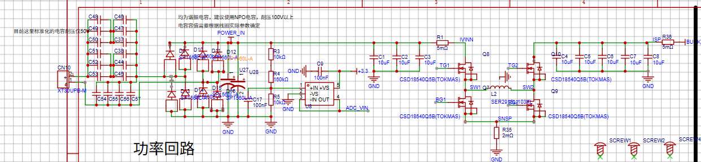

---

#### 四、异物检测与线圈识别原理

* **机制:** 采用类似 $\text{Q}$ 值检测的思路，通过采集发射端输入电流的**直流成分**（“铁损”）来实现异物检测和线圈识别。
* **异物检测:** 当金属异物靠近线圈时，交变电磁场在金属中产生涡流，涡流产热功率远大于环境中的“铁损”，导致采集到的输入电流**显著增大**。
* **线圈识别:** 接收线圈靠近时，由于线圈背面的隔磁片作用，空间中泄露的电磁波急剧减少，**铁损值降低**，输入电流显著下降。通过设置电流阈值，即可区分无物品、有异物和有接收线圈三种状态。
  
---

#### 五、部分仿真展示：
谐振电容选型环节：
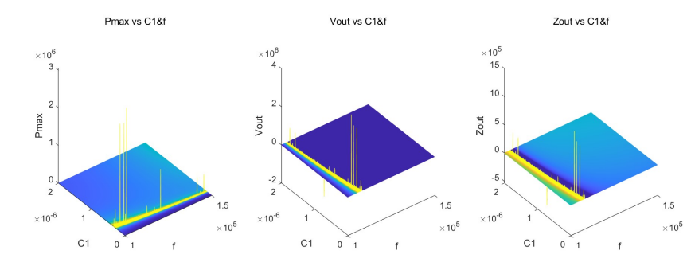
耦合系数扫描环节：

高频滤波电容扫描选型环节：
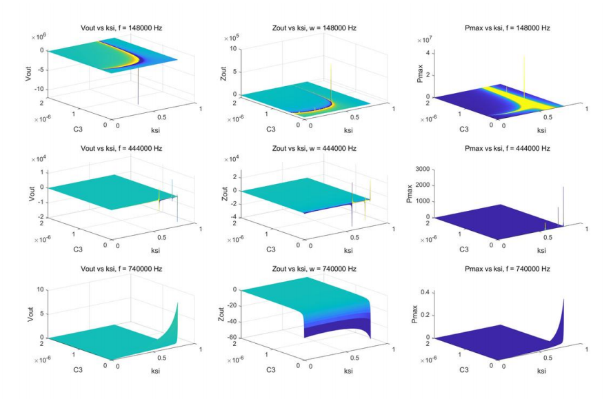

---
#### 六、实物展示
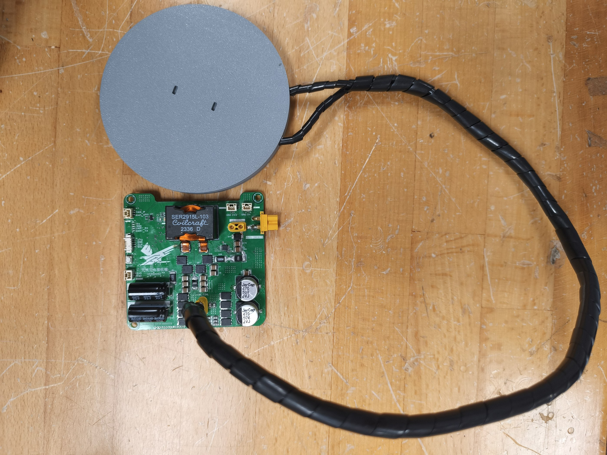
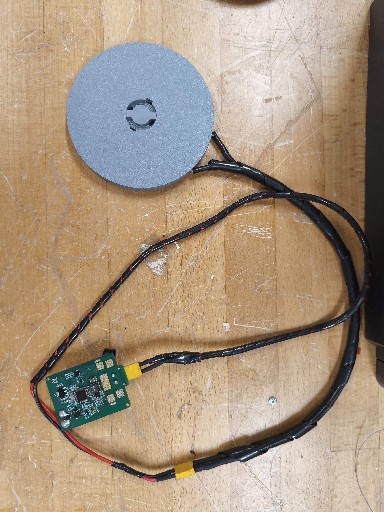
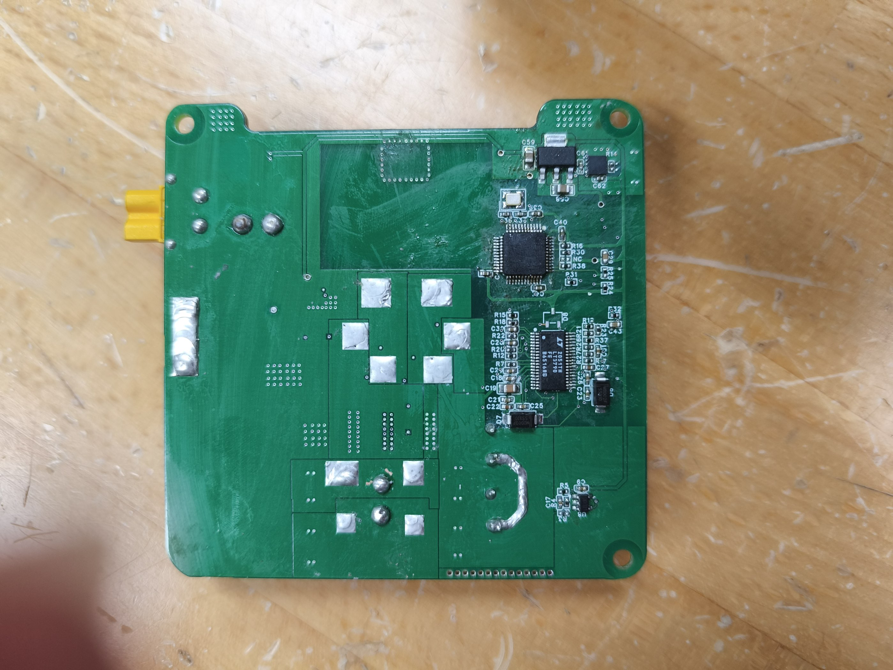
**静态温度控制实测展示：**
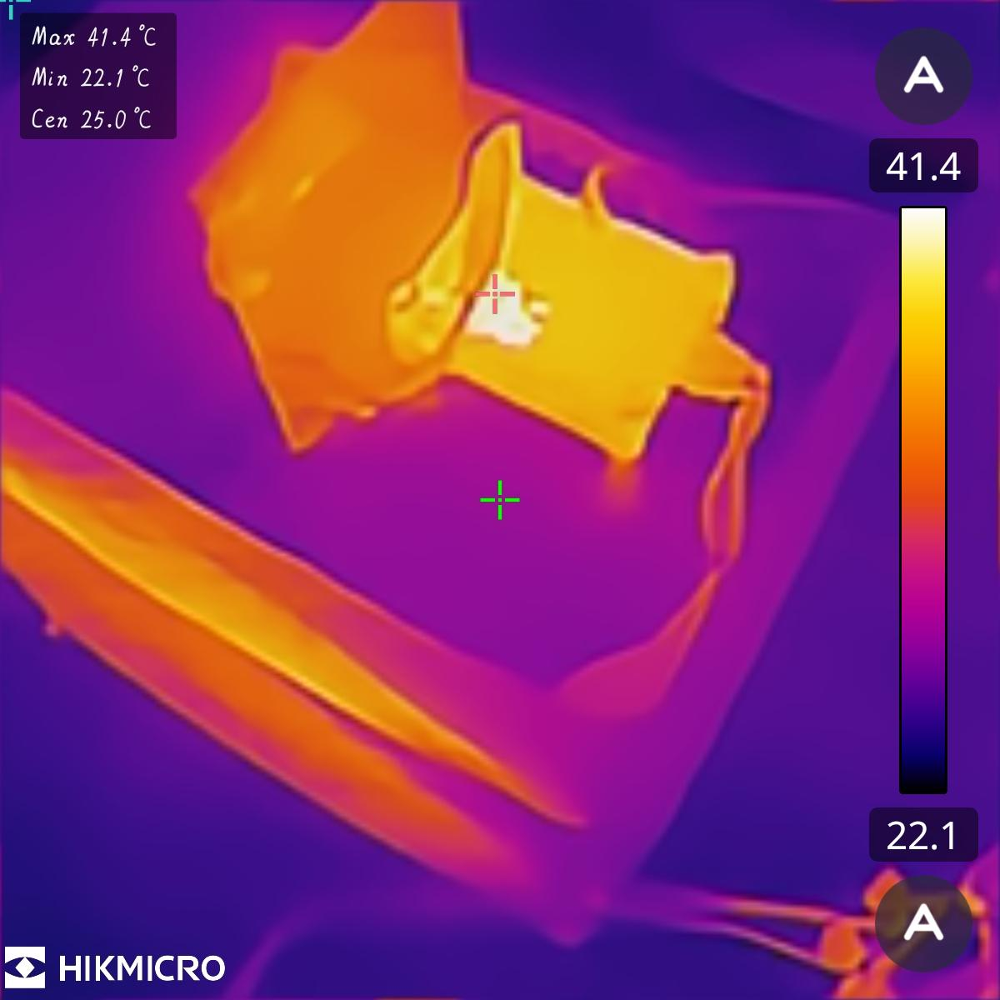