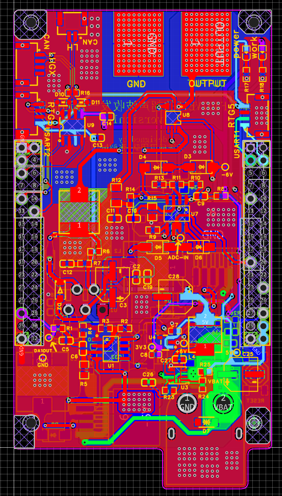
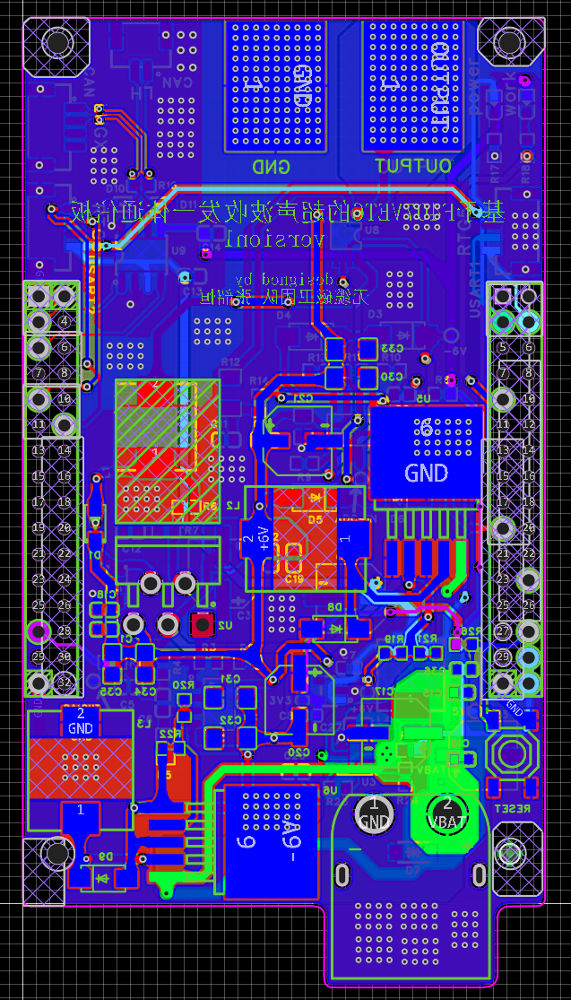
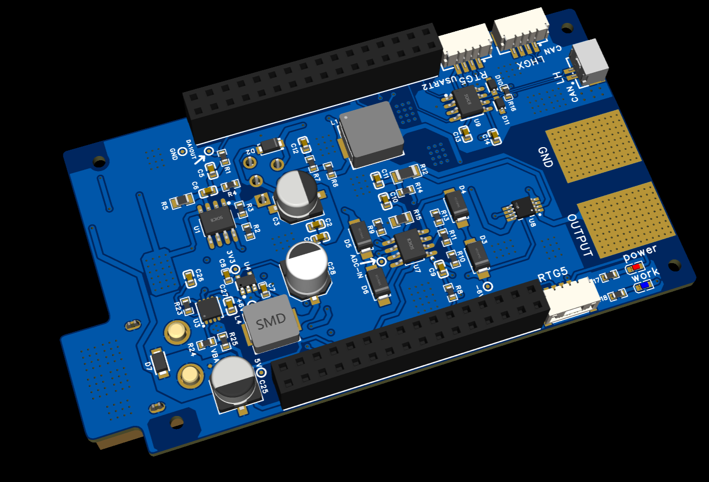
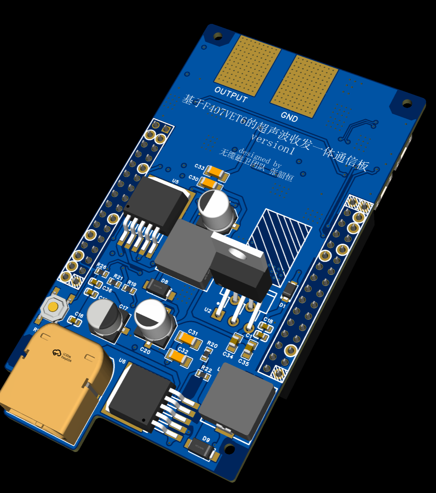
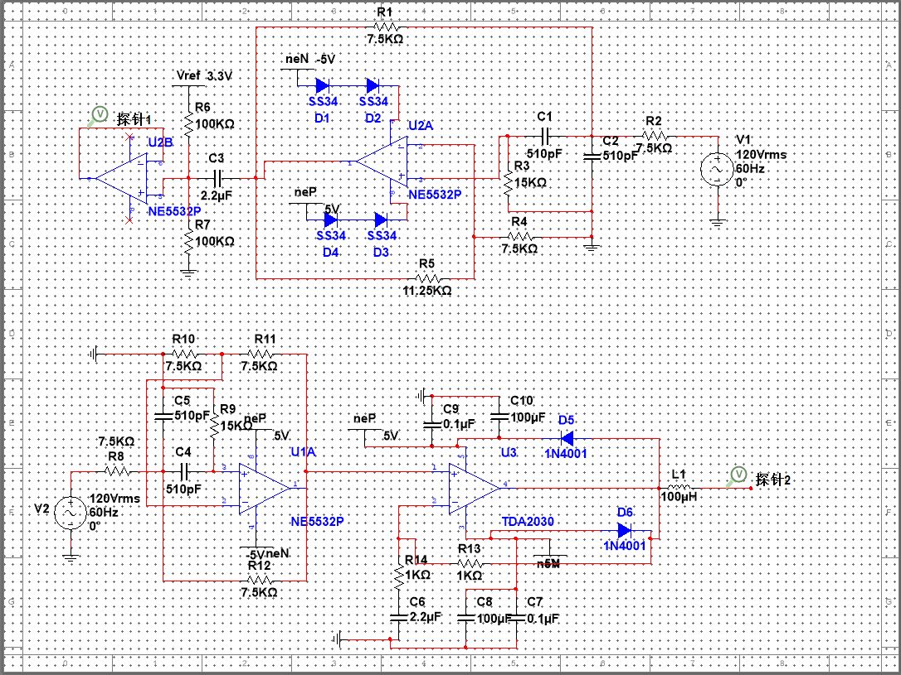
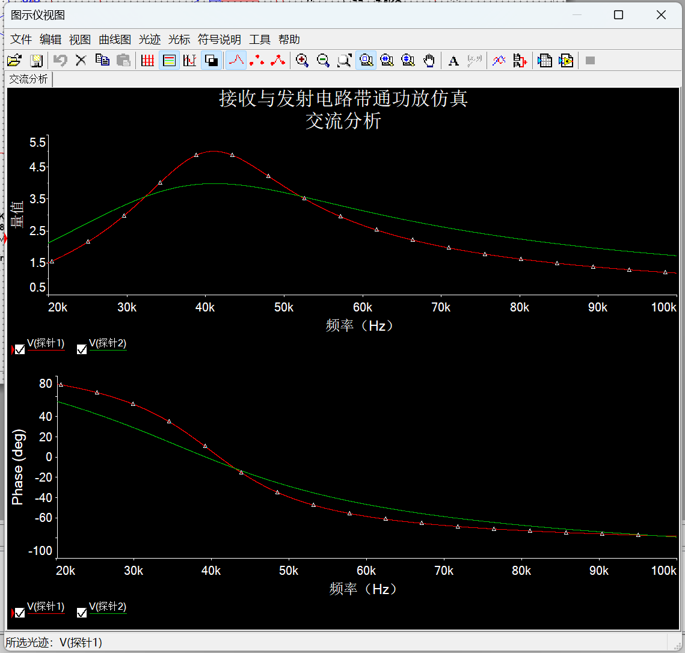

### 超声波通讯部分需要介绍的内容
###    
 ————数据+图片+独特优势

---

#### 1. 工作背景与优越特性

##### 工作背景
随着无线通信技术广泛应用于智能制造、车联网、智慧城市等领域，特定工作场景下的通信难题也随之出现。这些难题包括：
* **静电屏蔽限制**：封闭金属容器（如储油罐体内部）产生的静电屏蔽会限制电磁波的传输。
* **强电磁干扰**：在强电磁干扰场合下，无线电磁波通信无法正常使用。
* **密闭环境数据传输**：在石油井下或密闭建筑物内外部，数据传输亟待解决。

本次磁吸管道机器人便是工作在具有强电磁屏蔽的环境下的，因此我们提出采用**超声波**作为信息传输的载体。

##### 优越特性（超声波相比电磁波）
我们无缆磁卫团队提出采用**超声波**代替电磁波作为信息传输的载体，其优势在于：
* **不受干扰**：能克服静电屏蔽和强电磁干扰的影响。
* **穿透力强**：具有**方向性好、穿透力强**的优点，可以穿透固体，且不受电磁屏蔽的困扰。
* **不占频谱**：超声波作为机械波，不占用宝贵的频谱资源。

---

#### 2. 硬件：系统架构与关键组件

该系统是一个**低速率半双工通信系统**，采用**主机询问、从机应答**的方式进行数据传输。系统通过软件定义功能，以降低硬件成本并提高灵活性。

| 硬件部分 | 组成/功能描述 |
| :--- | :--- |
| **超声波换能器** | **收发两用型压电超声波换能器**。工作频率选择为 **$40\text{kHz}$**。系统信号收发**共用同一换能器**。 |
| **MCU 核心** | 选用 **STM32F407VET6** 芯片，利用其 $\text{ADC}$、$\text{DAC}$、$\text{DMA}$ 等资源实现通信功能。|
| **信号发射电路** | 主要由**带通滤波电路**和**功率放大电路**组成，用于滤除 $\text{DAC}$ 信号中的杂波并进行功率放大，驱动换能器。|
| **信号接收电路** | 由**带通滤波电路**和**电平迁移电路**组成，用于滤波、信号放大，并将信号电平迁移至 $\text{ADC}$ 采集范围（$0\text{V} \sim 3.3\text{V}$）。|
| **半双工收/发切换** | 基于模拟开关芯片 ($\text{ADG}1419$)，用于在信号发射和接收状态之间切换，避免相互干扰。|
| **电源电路** | 提供 $\text{MCU}$ 及其外围电路主控板所需的 $5\text{V}$ 电源（经 $\text{DC}$-$\text{DC}$ 和 $\text{LDO}$ 两级降压），以及信号收发电路所需的双电源 $\pm 6\text{V}$ 供电。|

##### 核心芯片选型
* **MCU 主控**：**STM32F407VET6**。该芯片时钟频率最高可达 $168\text{MHz}$，片上资源丰富，内嵌 $\text{ADC}$ 和 $\text{DAC}$，用于完成差错控制编译码、扩频解扩、调制解调等复杂的数字运算。
* **模拟开关**：**ADG1419BRMZ**。用于实现信号收/发状态的半双工切换。
* **功率放大器**：**TDA2030A**。用于信号发射，具有大功率输出和小失真的优点。
* **运放芯片**：**NE5532DR**。用于信号接收和发射电路中的滤波和放大。

##### 信号处理电路
| 硬件模块 | 组成与功能 | 关键参数 |
| :--- | :--- | :--- |
| **信号发射电路** | **带通滤波** ($\text{NE5532}$ 运放回路) $\rightarrow$ **功率放大** ($\text{TDA}2030\text{A}$ 芯片)。**功能**：滤除 $\text{DAC}$ 输出信号中的直流分量和高次谐波，并将信号放大，驱动超声波换能器。| 带通滤波中心频率约为 $41.6\text{kHz}$。功率放大电路的电压增益设置为 $2$ 倍。|
| **信号接收电路** | **带通滤波** $\rightarrow$ **信号放大** $\rightarrow$ **电平迁移** ($\text{NE5532}$ 运放回路)。**功能**：滤除噪声干扰，放大微弱信号，并将信号电平整体迁移至 $\text{ADC}$ 采集范围（$0\text{V} \sim 3.3\text{V}$）。| 带通滤波中心频率约为 $41.6\text{kHz}$。电平迁移幅度设置为 $1.65\text{V}$。|
| **收/发切换** | 使用 **ADG1419** 模拟开关芯片。**功能**：在信号接收和发射之间进行切换，确保电路共用同一超声波换能器时不相互干扰。$\text{MCU}$ 的 $\text{PE}13$ 引脚输出逻辑电平控制开关状态。| 供电电压为 $\pm 6\text{V}$。|

##### 系统电源电路
电源模块负责提供稳定能量：
* **$3.3\text{V}$ 电源**：为 $\text{MCU}$ 及其外围电路供电，并作为 $\text{ADC}/\text{DAC}$ 的参考电压。采用 $\text{DC}$-$\text{DC}$ 降压 ($\text{LM}2596\text{S}$-$5.0$) 后接 $\text{LDO}$ 稳压 ($\text{RT}9013$) 的两级降压方式，以获得纯净电源。
* **双电源 $\pm 6\text{V}$**：为信号收/发相关电路（运放、功放、模拟开关）供电。通过两颗 $\text{LM}2576\text{-ADJ}$ 芯片，以独立输出和串联输出的方式生成 $\pm 6\text{V}$ 电压。
---

#### 3. 算法：通信技术与性能数据

##### 通信关键技术（算法）
系统软件在 $\text{MCU}$ 中实现各通信模块功能，具有高度灵活性：

| 算法技术 | 目的/实现细节 |
| :--- | :--- |
| **DSSS 扩频解扩** | **直接序列扩频通信** ($\text{DSSS}$)。采用 **Gold 序列**作为扩频码（周期 $31$，扩频因子 $31$），可有效抵抗**窄带干扰、多径干扰**，并实现 **CDMA 多址通信**。|
| **数字调制解调** | 采用 **DPSK** (二进制差分相移键控) 和 **$\pi/4$-QDPSK** (四进制差分相移键控)。$\pi/4$-QDPSK 具有**峰均比小、抗多径衰弱能力强**等优点。|
| **差错控制** | 采用 **HARQ** (混合自动重传请求) 差错控制原理。编码采用 **RS 编码**（内码，用于纠错）与 **CRC16 校验**（外码，用于检错）的**混合编码**。|
| **调制速率模式自适应** | 利用 $\text{HARQ}$ 的重传机制评估信道质量，**自适应调整调制方式与传输速率**（$2\text{k Baud}$ $\text{DPSK}$ $\rightarrow$ $4\text{k Baud}$ $\text{DPSK}$ $\rightarrow$ $4\text{k Baud}$ $\pi/4$-QDPSK），以平衡通信的可靠性与有效性。|
| **信号生成** | 采用 $\text{DMA}+\text{DAC}+$ 定时方式实现**直接数字频率合成 ($\text{DDS}$)** 技术，通过查找波形表动态填充缓冲区，实现调制信号输出。|

##### 性能数据

| 性能指标 | 测试结果或指标 |
| :--- | :--- |
| **通信速率与模式** | **模式 1 (2k Baud DPSK)**：可靠性高，有效性低。**模式 3 (4k Baud $\pi/4$-QDPSK)**：可靠性低，有效性高。|
| **通信稳定性** | 在单频干扰和多址干扰下，信噪比 ($S/N$) 大于 $0\text{dB}$ 时，误码率基本低于 $10^{-3}$。**DSSS** 技术验证了抵抗干扰和实现 **CDMA** 多址通信的可行性。|
| **通信距离** | 在硬橡胶、金属 ($40\text{mm}$ 厚) 和混凝土等墙体介质上均完成了通信测试。发送信号峰峰值 $4\text{V}$ 时，最大**错开距离**在 $64\text{mm}$ 到 $92\text{mm}$ 之间。|
| **能耗** | **信号接收状态**整机平均功耗约为 **$1.44\text{W}$**。**信号发射状态**整机平均功耗约为 **$2.04\text{W}$**。|
| **数据处理耗时** | 在 $4\text{k Baud}$ 模式下，数据发送处理耗时约 $8.8\text{ms}$ 至 $14.8\text{ms}$，数据接收处理耗时约 $13.6\text{ms}$ 至 $21.6\text{ms}$，均小于 $\text{ADC}/\text{DAC}$ 对缓冲数组 $31\text{ms}$ 的处理时间。|

---
#### 4. 硬件电路展示：

---
#### 5. 部分仿真展示：

