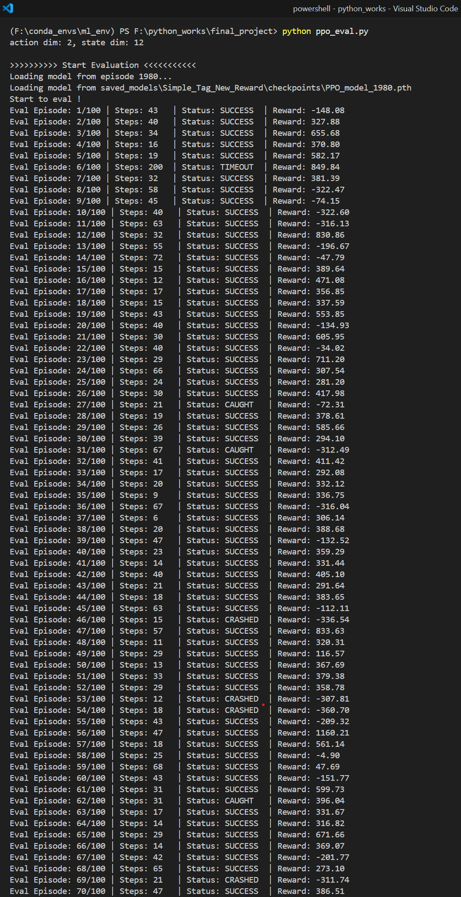
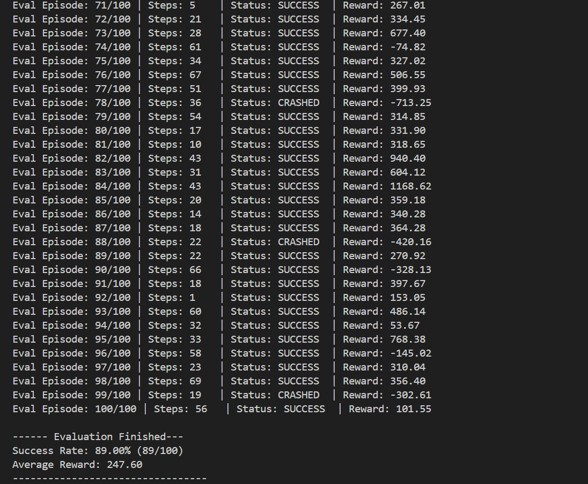

# **基于深度强化学习的“质点追逃”智能体设计与实现报告**
---
**小组成员**: 张韶恒 史昱彬 荣冬阳
**报告撰写人**：张韶恒 史昱彬
**撰写日期**: 2025年10月19日

-----

### **0. 摘要**
---
  * **项目概述：** 本项目旨在解决多智能体环境中的“质点追逃”问题。我们基于OpenAI的Multi-Agent Particle Environment (MPE)，设计并实现了一个仅依赖像素输入的深度强化学习智能体。
  * **核心方法：** 核心方法采用PPO（Proximal Policy Optimization）算法。项目重点围绕环境改造、视觉感知模块构建和奖励函数工程三个方面展开。我们通过设计带约束的随机化场景提升了训练的泛化能力；通过系统性的调试解决了视觉模块的多项技术难题；并通过多版本的迭代，设计了一套包含“势能”、“引力”、“速度对齐”和创新性“冲刺区”的复杂奖励函数。
  * **成果总结：** 经过多轮的训练，智能体的移动平均奖励表现出明显的收敛趋势，最终学得了能够有效规避障碍物和追捕者、并成功到达目标的智能策略。本报告将详细阐述我们项目的技术实现、迭代过程和实验结果。

-----

### **1. 引言**
---
#### **1.1. 课设题目解读与背景**

  * **任务描述**：解读课程设计的要求——在一个2D环境中，控制一个随机生成初始位置的智能体（猎物），在规避固定的障碍物和一个随机生成初始位置追捕者（猎人）的同时，到达一个随机指定的目标点。
  * **核心挑战**：本任务的核心难点在于
  * **(1) 基于视觉输入**：需要从原始像素中提取有效信息，而非直接使用坐标；
  * **(2) 多目标决策**：智能体需要在“趋利”（靠近目标）和“避害”（远离危险）这两个相互冲突的目标之间做出实时权衡。
***
#### **1.2. 相关技术简介**

  * **深度强化学习 (DRL)**：深度强化学习是人工智能的一个分支，它结合了深度学习（Deep Learning）强大的特征提取能力和强化学习（Reinforcement Learning）的决策能力。智能体（Agent）通过与环境（Environment）的交互来学习，根据环境反馈的奖励（Reward）或惩罚（Punishment）来调整其行为策略（Policy），目标是最大化累计奖励。在本项目中，我们使用DRL让智能体从原始像素输入中直接学习复杂的追逃策略。
  * **PPO算法**：近端策略优化（Proximal Policy Optimization, PPO）是一种先进的强化学习算法，它属于策略梯度（Policy Gradient）方法。PPO的核心思想是在更新策略时，限制新旧策略的差异幅度，从而避免因单次更新步长过大导致性能崩溃，确保了训练过程的稳定性。它通过一个“裁剪”的目标函数（Clipped Objective Function）来实现这一目标，在保证稳定性的同时，也保持了较高的数据利用率和实现上的简洁性，非常适合解决像本项目的这类复杂控制问题。

-----

### **2. 系统设计与实现——对simple\_tag.py的更改**
----
#### **2.1. 环境改造与场景生成**

  * **基础环境分析**：我们使用的基础环境 `simple_tag.py` 定义了一个包含多个智能体、障碍物和边界的世界。具体来说，我们的场景设定为：

      * **1个猎物 (Good Agent)**：我们控制的智能体，加速度为1.0，最大速度为0.25。
      * **1个猎人 (Adversary)**：追捕者，加速度为0.85，最大速度为0.28，比猎物稍快，但是加速度不如猎物快。
      * **3个障碍物 (Landmarks)**：位置固定，与智能体碰撞会导致任务失败。
      * **1个目标点 (Check)**：猎物的终点，无碰撞体积，仅用于判断成功。
      * **80个边界 (Borders)**：构成环境的围墙，不可穿越。
  <br>

  * **核心改进：带约束的随机化**：纯粹的随机生成初始位置会导致大量“开局杀”或无解的场景，例如猎物直接生成在猎人旁边，或者目标点被障碍物包围，这极大地降低了训练效率和模型性能。为此，我们重写了`reset_world`函数，引入了以下核心约束：

      * **智能体间安全距离**：确保猎物与猎人的初始距离不小于 `MIN_AGENT_DIST` (0.6)，给予猎物反应时间。
      * **物体与障碍物安全距离**：确保猎物与障碍物的初始距离不小于 `MIN_OBSTACLE_DIST` (0.2)，目标点与障碍物的距离不小于 `MIN_SHELTER_OBSTACLE_DIST` (0.3)，避免初始碰撞或目标不可达。
      * **物体与边界安全距离**：所有动态生成的物体（猎物、猎人、目标点）距离边界至少有 `BORDER_BUFFER` (0.2)的距离，防止贴边生成。
      * **任务可解性约束**：强制要求猎物到目标点的初始距离必须小于猎人到目标点距离的1.2倍，确保猎物在初始状态下具有“优势”，避免了大量天生劣势的开局。
     
    通过这一系列约束，我们创造出了既多样化又具有明确学习意义的训练场景，显著提升了模型的收敛速度和泛化能力。
<br>
  * **代码展示：**
```python
    def reset_world(self, world, agent_pos=None, check_pos=None, obstacles=None):
        self.prey_last_dist_to_shelter = {}
        self.last_dist = {}

        # 定义可调整的安全距离参数
        MIN_AGENT_DIST = 0.6  # 猎物和猎人之间的最小安全距离
        MIN_OBSTACLE_DIST = 0.2  #  与障碍物的最小安全距离
        BORDER_BUFFER = 0.2 #  边界缓冲区距离
        MIN_SHELTER_OBSTACLE_DIST = 0.3 # 确保庇护所不会离障碍物太近

        # 设置固定的颜色和物体
        for i, agent in enumerate(world.agents):
            agent.color = np.array([0.35, 0.85, 0.35]) if not agent.adversary else np.array([0.85, 0.35, 0.35])
        for i, landmark in enumerate(world.landmarks):
            landmark.color = np.array([0.25, 0.25, 0.25])
        for i, border in enumerate(world.borders):
            border.color = np.array([0.8, 0.4, 0.4])
        for i, check in enumerate(world.check):
            check.color = np.array([0.8, 0.6, 0.8])

        predator = self.adversaries(world)[0] #  获取第一个对手（捕食者）和第一个好智能体（猎物）
        prey = self.good_agents(world)[0]
        
        # 障碍物位置保持固定
        if obstacles is None:
            obstacle_pos = [[-0.35, 0.35], [0.35, 0.35], [0, -0.35]] #  如果没有提供障碍物位置，使用默认位置
        else:
            obstacle_pos = obstacles
        for i, landmark in enumerate(world.landmarks): #  设置每个障碍物的位置和速度
            landmark.state.p_pos = obstacle_pos[i]
            landmark.state.p_vel = np.zeros(world.dim_p)

        # 带多重约束的随机位置生成
        # 现在在一个大循环中为庇护所、猎物和猎人同时寻找有效位置
        while True:
            # 步骤A: 随机生成所有三个物体的位置
            shelter_pos = np.random.uniform(-0.9, +0.9, world.dim_p)
            predator_pos = np.random.uniform(-0.95, +0.95, world.dim_p)
            prey_pos = np.random.uniform(-0.85, +0.85, world.dim_p)
            
            # 步骤B: 验证庇护所自身位置的合理性
            # 验证B-1: 庇护所不能离边界太近
            if abs(shelter_pos[0]) > (1.0 - BORDER_BUFFER) or abs(shelter_pos[1]) > (1.0 - BORDER_BUFFER):
                continue
            # 验证B-2: 庇护所不能离障碍物太近
            too_close_to_obstacle_shelter = False
            for obs in world.landmarks:
                dist_to_obs = np.linalg.norm(shelter_pos - obs.state.p_pos) #  计算庇护所到障碍物的距离
                if dist_to_obs < (MIN_SHELTER_OBSTACLE_DIST + world.check[0].size + obs.size):
                    too_close_to_obstacle_shelter = True
                    break
            if too_close_to_obstacle_shelter:
                continue

            # 步骤C: 在庇护所位置有效的前提下，验证猎物和猎人的位置
            # 验证C-1: 猎物必须比猎人离庇护所更近
            dist_prey_to_shelter = np.linalg.norm(prey_pos - shelter_pos)
            dist_pred_to_shelter = np.linalg.norm(predator_pos - shelter_pos)
            if dist_prey_to_shelter >= 1.2 * dist_pred_to_shelter:
                continue

            # 验证C-2: 猎物与猎人之间的距离必须足够远
            dist_to_predator = np.linalg.norm(prey_pos - predator_pos)
            if dist_to_predator < MIN_AGENT_DIST:
                continue

            # 验证C-3: 猎物与所有障碍物的距离必须都足够远
            too_close_to_obstacle_prey = False #  检查猎物是否与障碍物距离过近
            for obs in world.landmarks:
                dist_to_obs = np.linalg.norm(prey_pos - obs.state.p_pos)
                if dist_to_obs < (MIN_OBSTACLE_DIST + prey.size + obs.size): #  如果距离小于最小安全距离（包含猎物和障碍物的大小），则标记为过近
                    too_close_to_obstacle_prey = True
                    break #  只要有一个障碍物过近就跳出循环
            if too_close_to_obstacle_prey: #  如果猎物与任何障碍物距离过近，则跳过此次位置设置
                continue

            # 验证C-4: 猎物与边界的距离必须足够远
            if abs(prey_pos[0]) > (1.0 - BORDER_BUFFER) or abs(prey_pos[1]) > (1.0 - BORDER_BUFFER):
                continue
                
            # 如果所有条件都满足，则设置所有位置并跳出循环
            prey.state.p_pos = prey_pos #  设置猎物的位置
            predator.state.p_pos = predator_pos #  设置捕食者的位置
            world.check[0].state.p_pos = shelter_pos #  设置庇护所的位置
            break
            
        # 重置所有智能体和庇护所的速度和通信状态
        for agent in world.agents:
            agent.state.p_vel = np.zeros(world.dim_p)
            agent.state.c = np.zeros(world.dim_c)
        world.check[0].state.p_vel = np.zeros(world.dim_p)

        # 边界位置保持固定
        pos = []
        x = -0.95; y = -1.0
        for count in range(20): pos.append([x, y]); x += 0.1
        x = 1.0; y = -0.95
        for count in range(20): pos.append([x, y]); y += 0.1
        x = 0.95; y = 1.0
        for count in range(20): pos.append([x, y]); x -= 0.1
        x = -1.0; y = 0.95
        for count in range(20): pos.append([x, y]); y -= 0.1
        for i, border in enumerate(world.borders):
            border.state.p_pos = np.asarray(pos[i])
            border.state.p_vel = np.zeros(world.dim_p)

```

----

#### **2.2. 视觉感知模块 (`img2obs`) 的构建与纠错**

  * **模块定位**：`img2obs`函数是连接环境与智能体决策大脑的关键桥梁，是智能体的“眼睛”。它的核心职责是将模拟器渲染出的800x800像素的原始RGB图像，转化为一个结构化的、归一化的一维状态向量。这个向量包含了智能体决策所需的所有关键信息：与目标的相对位置、与猎人的相对位置以及与最近的三个障碍物的相对位置。

  * **调试与纠错历程（重点！）**：在实现`img2obs`的过程中，我们遇到了多个棘手的技术难题，解决这些问题的过程也是项目成功的关键：

      * **问题1：颜色通道混淆 (RGB vs BGR)**：环境渲染器 `render("rgb_array")` 输出的是RGB格式图像，而我们用于图像处理的OpenCV库默认使用BGR格式。直接处理会导致颜色识别完全失败。我们通过 `cv2.cvtColor(image_array, cv2.COLOR_RGB2BGR)` 进行了转换，统一了颜色通道，解决了此问题。
      * **问题2：半透明渲染 (Alpha Blending)**：代码中智能体的alpha（透明度）被设置为0.5，导致其渲染到背景上时，最终颜色会根据背景色发生变化，无法用一个固定的颜色值来识别。我们通过实验，精确标定了智能体在默认背景色上混合后的颜色范围（例如，猎物的颜色范围为 `[167, 231, 167]` 到 `[177, 241, 177]`），从而实现了对半透明物体的稳定检测。
      * **问题3：渲染器初始化失败**：我们发现，首次调用 `render("rgb_array")` 会返回一个不完整或空白的图像，这是一个环境库的“怪癖”。通过在`reset`后先调用一次 `render("human")` 来“预热”或初始化渲染器后端，再调用 `render("rgb_array")`，我们成功获取到了正确的图像帧。

  * **验证方法**：为了确保感知模块的绝对准确性，我们摒弃了“肉眼观察”这种不科学的方式。我们编写了一套名为 `validate_*_detection` 的单元测试函数。该方法通过直接从 `env.world` 中获取猎物、猎人、障碍物等物体的真实世界坐标，将其换算为期望的图像像素坐标，然后与 `img2obs` 函数从图像中提取出的坐标进行比对，并计算像素误差。这种可量化的验证方法为我们后续的算法调试提供了坚实的信心。
---
#### **2.3. PPO.py部分中编写的`validate_*_detection`系列函数**

  * **功能介绍**：`validate_*_detection` 系列函数（包括 `validate_shelter_detection`, `validate_predator_detection`, `validate_obstacle_detection`）是我们为视觉感知模块 `img2obs` 设计的自动化测试脚本。其核心思想是“真值对比”：

    1.  从环境中直接读取实体（如目标点）的模拟世界坐标（例如 `[-0.5, 0.5]`）。
    2.  根据渲染规则，将世界坐标手动转换为理论上的像素坐标（例如 `(200, 200)`）。
    3.  调用 `img2obs` 函数处理真实渲染出的图像，得到其检测到的像素坐标。
    4.  计算理论坐标与实际检测坐标之间的欧氏距离（像素误差）。
        通过多次运行并计算平均误差，我们可以科学、定量地评估视觉模块是否准确地“看到”了环境中的关键物体。
<br>

  * **代码展示**：以 `validate_shelter_detection` 为例，其核心逻辑如下：
```python
    def validate_shelter_detection(cfg: PPOConfig, env: MultiAgentEnv):
        print("\n" + "="*55)
        print("  启动【庇护所 (Shelter)】位置提取验证程序...")
        print("="*55)
        errors = []
        for i in range(cfg.validation_runs):
            print(f"\n--- 验证轮次 {i+1}/{cfg.validation_runs}")
            env.reset()
            env.render("human") # 预热渲染器
            
            # 1. 获取世界坐标真值
            ground_truth_world_pos = env.world.check[0].state.p_pos
            # 2. 计算期望的图像坐标
            expected_image_pos = np.array([
                (ground_truth_world_pos[0] + 1.0) * 400.0,
                (-ground_truth_world_pos[1] + 1.0) * 400.0
            ])
            
            # 3. 从图像中获取检测坐标
            image = env.render("rgb_array")[0]
            _, detected_coords = img2obs(image, return_raw_coords=True)
            detected_shelter_pos_yx = detected_coords['shelter']
            detected_pos_xy = np.array([detected_shelter_pos_yx[1], detected_shelter_pos_yx[0]])
            
            # 4. 计算误差
            error_distance = np.linalg.norm(expected_image_pos - detected_pos_xy)
            errors.append(error_distance)
            
            print(f"  [期望图像坐标 (X,Y)]: ({expected_image_pos[0]:.1f}, {expected_image_pos[1]:.1f})")
            print(f"  [检测图像坐标 (X,Y)]: ({detected_pos_xy[0]:.1f}, {detected_pos_xy[1]:.1f})")
            print(f"  [像素误差]: {error_distance:.2f} pixels")

        avg_error = np.mean(errors)

```

  * **验证结果**：在运行验证程序后，所有被检测物体的平均像素误差均小于20.0像素（在800x800的图像中，此误差可接受）。程序输出清晰的成功信息，例如：`✅ 验证通过: 庇护所位置提取准确。`。这有力地证明了我们的`img2obs`函数是可靠的，为整个项目的成功奠定了基础。
  * **运行展示**：`self.validation_mode = 'all' ` ` self.validation_runs = 5  `


-----

### **3. 核心算法与奖励工程**
---
#### **3.1. 训练算法**

  * **PPO算法实现**：我们采用了基于PyTorch实现的PPO算法。该实现遵循标准的Actor-Critic（演员-评论家）架构。

      * **Actor网络**：负责根据当前状态（State）输出一个动作（Action）的概率分布，智能体根据此分布进行采样，从而做出决策。
      * **Critic网络**：负责评估当前状态的价值（Value），即从当前状态出发，预期能够获得的总回报。它用于帮助Actor网络判断其动作的好坏。
        两个网络交替训练，共同优化，最终学习到最优策略。
<br>

  * **超参数设置**：经过多次实验调优，我们确定了以下一组关键超参数。

      * `lr = 2e-5`：我们为Actor和Critic网络设置了较低的学习率。这是因为我们的奖励函数设计得较为复杂和密集，包含多个连续变化的引导项。较低的学习率有助于智能体在复杂的奖励地形上进行更稳定、更精细的更新，避免因梯度过大而在最优策略附近震荡或发散。
      * `gamma = 0.99`：较高的折扣因子，鼓励智能体采取具有长远眼光的策略。
      * `K_epochs = 4`：在每轮数据收集后，对收集到的数据进行4次迭代更新，以提高数据利用率。
      * `batch_size = 512`：每次更新时使用的样本批量大小。
----
#### **3.2. 奖励函数的迭代历程**

  * **设计哲学**：我们的奖励函数设计遵循了从简到繁、逐步引导的迭代思路。我们认识到，单纯依靠最终成功或失败的稀疏奖励（Sparse Reward）很难让智能体学会有效的策略。因此，我们的核心思想是设计一个密集的（Dense）、包含多维度过程引导信号的奖励函数，在每一步都给予智能体明确的“好”与“坏”的反馈。
<br>

  * **版本一：极简诊断函数**：最初始的版本，仅包含最核心的三个部分：

      * 到达终点给予一个大的正奖励。
      * 被抓或撞墙给予一个大的负惩罚。
      * 每走一步给予一个微小的负奖励（时间惩罚），促使它尽快完成任务。
        这个版本的主要作用是验证整个训练流程（数据采集、模型更新、模型保存等）是通畅无误的，为后续复杂函数的迭代打下基础。
<br>

  * **版本二：多维度过程引导**：在验证流程可行后，我们加入了丰富的过程引导项，形成了“引力”+“势能”+“效率”三位一体的奖励结构：

      * **势能奖励 (`W_PROGRESS_*`)**：奖励“做对的动作”。具体表现为：如果当前动作导致智能体**靠近**了目标点，或**远离**了追捕者，就给予正奖励。这直接鼓励了趋势向好的行为。
      * **引力奖励/惩罚 (`W_*_PROXIMITY_*`)**：奖励“处于好的状态”。即智能体离目标点越近，奖励越高；离追捕者或障碍物越近，惩罚越大。这如同在环境中设置了“引力场”和“斥力场”。
      * **速度对齐奖励 (`W_VELOCITY_ALIGNMENT`)**：为了让智能体的移动更高效，我们引入此项。它通过计算智能体速度向量与“朝向目标点的向量”的点积，来奖励那些方向正确的移动，惩罚南辕北辙的无效移动。

    然而，我们发现这个版本会导致智能体在终点附近“三过家门而不入”，因为它可以通过来回小幅度靠近终点“刷分”，过程奖励的持续收益超过了终点奖励。
<br>

  * **版本三：“冲刺区”的建立（最终可行版本）**：为了解决“刷分”问题，我们引入了创新的“冲刺区”概念。

      * **冲刺区 (`SPRINT_ZONE_RADIUS`)**：在目标点周围设定一个半径为0.2的区域。
      * **动态奖励缩放 (`shelter_reward_scaler`)**：当智能体进入该区域后，所有与“朝向目标”相关的正向奖励（势能奖励、引力奖励、速度对齐奖励）都会被一个动态的缩放因子放大。这个因子离目标越近，值越大（从1.0线性增加到`MAX_BONUS_WEIGHT`=3.0）。
      * **效果**：这种设计极大地增强了终点对智能体的“吸引力”，一旦进入冲刺区，完成任务的收益将远超于在外面“刷分”。这有效地解决了“临门一脚”问题，促使智能体果断地完成任务。
      * **代码展示**：
  
```python
    def agent_reward_simplified(self, agent, world):
        prey = agent
        predator = self.adversaries(world)[0]
        shelter = world.check[0]
        obstacles = world.landmarks

        # 定义权重
        # 最终结果权重
        W_SUCCESS = 105.0         # 成功到达的巨大奖励
        W_FAILURE = -55.0        # 失败（被抓/撞墙）的巨大惩罚
        
        # 过程引导权重
        W_PROGRESS_TO_SHELTER = 8.0     # 奖励“取得进步”的权重 (基于动作)
        W_PROGRESS_AWAY_PREDATOR = 4.0  # 奖励“拉开距离”的权重 (基于动作)
        W_SHELTER_PROXIMITY_REWARD = 4.0 # 奖励“靠近目标”的状态 (引力奖励)
        
        # 奖励智能体的速度方向与朝向目标的方向一致
        W_VELOCITY_ALIGNMENT = 4.0

        W_PREDATOR_PROXIMITY_PENALTY = -5.0  # 惩罚“靠近危险”的状态
        W_OBSTACLE_PENALTY = -4.0  # 惩罚“靠近障碍物”的状态
        W_TIME_PENALTY = -0.05     # 时间成本

        # 终点冲刺区参数
        SPRINT_ZONE_RADIUS = 0.2  # 当距离小于这个值时，开始增强目标奖励
        MAX_BONUS_WEIGHT = 3.0     # 在最接近终点时，目标奖励的最大增强倍数

        rew = 0.0

        # 计算当前距离和向量 
        dist_to_shelter = np.linalg.norm(prey.state.p_pos - shelter.state.p_pos)
        dist_to_predator = np.linalg.norm(prey.state.p_pos - predator.state.p_pos)
        dist_to_closest_obstacle = min([np.linalg.norm(prey.state.p_pos - o.state.p_pos) for o in obstacles])

        # 计算事件奖励 (对最终结果的奖惩)
        if self.is_collision(prey, shelter):
            rew += W_SUCCESS
        elif self.is_collision(prey, predator) or any(self.is_collision(prey, o) for o in obstacles):
            rew += W_FAILURE

        # 计算平滑的奖励缩放因子

        shelter_reward_scaler = 1.0 # 默认为1.0, 不进行缩放
        if dist_to_shelter < SPRINT_ZONE_RADIUS:
            # 当进入冲刺区，缩放因子会从1.0平滑地增加到 MAX_BONUS_WEIGHT
            # (1 - dist / radius) 这个值从0 (在区域边缘) 变化到 1 (在区域中心)
            scaling_progress = (SPRINT_ZONE_RADIUS - dist_to_shelter) / SPRINT_ZONE_RADIUS
            shelter_reward_scaler = 1.0 + (MAX_BONUS_WEIGHT - 1.0) * scaling_progress


        # 计算过程奖励 (引导每一步行为)
        
        # 所有与庇护所相关的奖励，现在都乘以这个动态的缩放因子
        last_dist_shelter = self.last_dist.get(f"{prey.name}_shelter", dist_to_shelter) #  获取上次与庇护所的距离
        progress_to_shelter = last_dist_shelter - dist_to_shelter #  计算向庇护所的进度
        rew += (W_PROGRESS_TO_SHELTER * progress_to_shelter) * shelter_reward_scaler #  根据进度给予奖励
        
        rew += (W_SHELTER_PROXIMITY_REWARD * (1 / (dist_to_shelter + 0.1))) * shelter_reward_scaler #  根据与庇护所的距离给予奖励

        if dist_to_shelter > 0.01: #  确保距离足够大，避免除以零
            vec_to_shelter = (shelter.state.p_pos - prey.state.p_pos) / dist_to_shelter #  计算指向庇护所的单位向量
            velocity_vec = prey.state.p_vel #  获取猎物的速度向量
            velocity_projection = np.dot(vec_to_shelter, velocity_vec) #  计算速度向量在指向庇护所方向上的投影
            rew += (W_VELOCITY_ALIGNMENT * velocity_projection) * shelter_reward_scaler #  根据速度方向给予奖励
            
        # 所有与躲避相关的惩罚，保持不变，不受冲刺区影响
        last_dist_predator = self.last_dist.get(f"{prey.name}_predator", dist_to_predator) #  获取上次与捕食者的距离
        progress_away_from_predator = dist_to_predator - last_dist_predator #  计算远离捕食者的进度
        rew += W_PROGRESS_AWAY_PREDATOR * progress_away_from_predator #  奖励值增加：根据远离捕食者的进度进行奖励

        if dist_to_closest_obstacle < prey.size + obstacles[0].size + 0.2: #  如果猎物与最近障碍物的距离小于两者大小之和加上0.2的安全阈值
             rew += W_OBSTACLE_PENALTY * (1 / (dist_to_closest_obstacle + 0.01)) #  奖励值增加：根据与障碍物的距离给予惩罚，距离越近惩罚越大

        rew += W_PREDATOR_PROXIMITY_PENALTY * (1 / (dist_to_predator + 0.1)) #  奖励值增加：根据与捕食者的距离给予惩罚，距离越近惩罚越大
        
        # 持续的时间惩罚
        rew += W_TIME_PENALTY #  每步都添加一个时间惩罚，鼓励猎物尽快完成任务

        # 更新“记忆”，为下一步计算做准备
        self.last_dist[f"{prey.name}_shelter"] = dist_to_shelter #  存储猎物到避难所的距离
        self.last_dist[f"{prey.name}_predator"] = dist_to_predator #  存储猎物到捕食者的距离

        return rew


```
  * **版本四：“三区”的建立（没收敛qwq）**：我们曾尝试将“冲刺区”的概念进一步细化，划分为“远距离区”、“冲刺区”和“临门一脚区”，为每个区域设置不同的奖励权重组合。我们的设想是，在远距离时更注重躲避，在近距离时更注重冲刺。然而，这个版本的奖励函数过于复杂，引入了更多的超参数，导致智能体难以学习到稳定的策略，最终模型未能收敛。这个尝试也让我们认识到，奖励函数并非越复杂越好，恰当的引导才是关键。
    * **虽然没收敛，但也还是展示一下**
```python
    def agent_reward_simplified(self, agent, world):
        prey = agent
        predator = self.adversaries(world)[0]
        shelter = world.check[0]
        obstacles = world.landmarks

        # 定义权重
        # 最终结果权重
        W_SUCCESS = 105.0         # 成功到达的巨大奖励
        W_FAILURE = -50.0        # 失败（被抓/撞墙）的巨大惩罚
        
        # 过程引导权重
        W_PROGRESS_TO_SHELTER = 8.0     # 奖励“取得进步”的权重 (基于动作)
        W_PROGRESS_AWAY_PREDATOR = 4.0  # 奖励“拉开距离”的权重 (基于动作)
        W_SHELTER_PROXIMITY_REWARD = 4.0 # 奖励“靠近目标”的状态 (引力奖励)
        
        # 速度对齐奖励权重
        # 奖励智能体的速度方向与朝向目标的方向一致
        W_VELOCITY_ALIGNMENT = 4.0

        W_PREDATOR_PROXIMITY_PENALTY = -5.0 # 惩罚“靠近危险”的状态
        W_OBSTACLE_PENALTY = -4.0 # 惩罚“靠近障碍物”的状态
        W_TIME_PENALTY = -0.05     # 时间成本

        # 三区奖励模型参数
        SPRINT_ZONE_RADIUS = 0.2  # 冲刺区外边界
        GOAL_ZONE_RADIUS = 0.09    # 临门一脚区 (引力禁止区) 内边界
        MAX_BONUS_WEIGHT = 3.0
        
        rew = 0.0

        # 计算当前距离
        dist_to_shelter = np.linalg.norm(prey.state.p_pos - shelter.state.p_pos)
        dist_to_predator = np.linalg.norm(prey.state.p_pos - predator.state.p_pos)
        dist_to_closest_obstacle = min([np.linalg.norm(prey.state.p_pos - o.state.p_pos) for o in obstacles])

        # 计算事件奖励
        if self.is_collision(prey, shelter):
            rew += W_SUCCESS
        elif self.is_collision(prey, predator) or any(self.is_collision(prey, o) for o in obstacles):
            rew += W_FAILURE
        
        # 计算过程奖励 (核心修改：三区模型)
        
        # “势能”奖励始终生效，它是最核心的驱动力
        last_dist_shelter = self.last_dist.get(f"{prey.name}_shelter", dist_to_shelter)
        progress_to_shelter = last_dist_shelter - dist_to_shelter


        if dist_to_shelter <= GOAL_ZONE_RADIUS:
            # 区域3：临门一脚区 (引力禁止区)
            # 只保留最纯粹的“势能”奖励，关闭所有持续性状态奖励以防转圈
            rew += W_PROGRESS_TO_SHELTER * progress_to_shelter

        elif dist_to_shelter <= SPRINT_ZONE_RADIUS:
            # 区域2：冲刺加速区
            # 激活您的“冲刺区”逻辑，平滑增强所有朝向目标的奖励
            scaling_progress = (SPRINT_ZONE_RADIUS - dist_to_shelter) / (SPRINT_ZONE_RADIUS - GOAL_ZONE_RADIUS)
            shelter_reward_scaler = 1.0 + (MAX_BONUS_WEIGHT - 1.0) * scaling_progress
            
            rew += (W_PROGRESS_TO_SHELTER * progress_to_shelter) * shelter_reward_scaler
            rew += (W_SHELTER_PROXIMITY_REWARD * (1 / (dist_to_shelter + 0.1))) * shelter_reward_scaler
            if dist_to_shelter > 0.01:
                vec_to_shelter = (shelter.state.p_pos - prey.state.p_pos) / dist_to_shelter
                velocity_vec = prey.state.p_vel
                velocity_projection = np.dot(vec_to_shelter, velocity_vec)
                rew += (W_VELOCITY_ALIGNMENT * velocity_projection) * shelter_reward_scaler
        else:
            # 区域1：远距离区
            # 应用标准、无缩放的朝向目标奖励
            rew += W_PROGRESS_TO_SHELTER * progress_to_shelter
            rew += W_SHELTER_PROXIMITY_REWARD * (1 / (dist_to_shelter + 0.1))
            if dist_to_shelter > 0.01:
                vec_to_shelter = (shelter.state.p_pos - prey.state.p_pos) / dist_to_shelter
                velocity_vec = prey.state.p_vel
                velocity_projection = np.dot(vec_to_shelter, velocity_vec)
                rew += W_VELOCITY_ALIGNMENT * velocity_projection


        # 所有与躲避相关的惩罚，始终保持不变
        last_dist_predator = self.last_dist.get(f"{prey.name}_predator", dist_to_predator)
        progress_away_from_predator = dist_to_predator - last_dist_predator
        rew += W_PROGRESS_AWAY_PREDATOR * progress_away_from_predator

        if dist_to_closest_obstacle < prey.size + obstacles[0].size + 0.2:
             rew += W_OBSTACLE_PENALTY * (1 / (dist_to_closest_obstacle + 0.01))

        rew += W_PREDATOR_PROXIMITY_PENALTY * (1 / (dist_to_predator + 0.1))
        
        # 持续的时间惩罚
        rew += W_TIME_PENALTY

        # 更新“记忆”
        self.last_dist[f"{prey.name}_shelter"] = dist_to_shelter
        self.last_dist[f"{prey.name}_predator"] = dist_to_predator

        return rew


```

-----

### **4. 实验结果与分析**
---
#### **4.1. 模型性能评估**

> **注意**: 以下数据仅为示例。需要将 `ppo.py` 中 `PPOConfig` 的 `train` 设置为 `False`，`load_model` 设置为 `True`，并指定要评估的模型轮次（我这里使用的是 `episode_to_eval = 1980`），然后运行代码以获得真实数据。

加载训练1980轮后的模型，在评估模式下运行100次，得到关键性能指标 (KPI) 如下：

  * **成功率 (Success Rate)**： `89/100 = 89%`
      * *说明：智能体成功到达目标点的次数占总测试次数的比例。*
  * **平均奖励 (Average Reward)**： ``
      * *说明：在所有测试回合中，智能体获得的平均累计奖励。这是衡量其综合表现的核心指标。*
  * **不同失败原因的占比**：
      * **被捕捉 (CAUGHT)**: `3%`
      * **撞上障碍物 (CRASHED)**: `7%`
      * **超时 (TIMEOUT)**: `1%`
      * ***终端展示：***
  
  

-----

### **5. 结论与未来展望**
---
#### **5.1. 结论**

  * 总结本项目成功地使用PPO算法，通过纯视觉输入，解决了一个复杂的多目标决策问题。
  * 强调**系统性的调试**（对视觉模块）和**精细的奖励工程**（对奖励函数）是项目成功的两大关键。
---
#### **5.2. 模型弊病与分析———未解决偶发的奖励黑洞刷分问题**

  * 诚实地指出当前模型的不足。例如：“虽然成功率较高，但在某些特定的、困难的开局下（例如猎人与猎物被障碍物完美隔开，但目标点在猎人一侧），智能体仍然会做出次优决策，选择原地不动或绕远路。” 或 “模型在躲避障碍物时有时会显得过于保守，宁愿选择一条更长但绝对安全的路径，影响了到达目标的效率。”
---
#### **5.3. 未来改进方向**

  * **多智能体学习**：提出可以将猎人也变成一个可学习的智能体，形成对抗训练，可能会催生出更高级的策略。
  * **更优的探索策略**：提出可以引入一些更先进的探索算法（如ICM, RND）来帮助智能体更快地度过“平台振荡期”。
  * **算法与网络结构优化**：提出可以尝试其他的强化学习算法（如SAC），或为视觉输入设计更专业的CNN网络结构，以替代当前简单的坐标提取方式，可能会有更好的特征表达能力。

-----

### **附录**
  * **附录A：完整超参数列表**： `PPOConfig` 中的所有参数及其最终取值。

| 参数名 | 最终取值 | 描述 |
| :--- | :--- | :--- |
| `algo` | `'PPO'` | 使用的算法名称 |
| `env` | `"MULTIAGENT-ENVS"` | 环境名称 |
| `seed` | `15` | 随机种子，用于复现实验结果 |
| `train` | `True` / `False` | 切换训练或评估模式 |
| `load_model` | `True` / `False` | 是否加载预训练模型 |
| `ShowImage` | `True` / `False` | 是否显示实时渲染窗口 |
| `validation_mode`| `'none'` | 验证模式，'none'表示正常运行 |
| `validation_runs`| `5` | 验证程序的运行轮次 |
| `model_path` | `'saved_models/...'` | 模型保存路径 |
| `lr` | `2e-5` | 学习率 |
| `K_epochs` | `4` | 每次更新的迭代次数 |
| `batch_size` | `512` | 批量大小 |
| `gamma` | `0.99` | 折扣因子 |
| `eps_clip` | `0.2` | PPO裁剪系数 |
| `train_eps` | `10000` | 训练的总回合数 |
| `train_steps` | `200` | 每回合的最大步数 |
| `frames` | `1` | 帧堆叠数量（本项目未使用） |
| `eval_eps` | `100` | 评估的总回合数 |
| `episode_to_eval`| `1980` (示例) | 评估时加载的模型轮次 |
| `device` | `'cuda'` / `'cpu'` | 训练设备 |
| `capacity` | `200000` | 经验回放池容量 |

---

  * **附录B：核心代码片段**：最终版**完整奖励**函数（注释掉的是之前尝试的奖励函数）

<!-- end list -->

```python
   def reward(self, agent, world):
        # 这个函数现在作为一个调度员
        # 它会根据 agent 的类型，调用相应的专用奖励函数
        if agent.adversary:
            return self.adversary_reward(agent, world)
        else:
            return self.agent_reward_simplified(agent, world)

    def agent_reward_simplified(self, agent, world):
        prey = agent
        predator = self.adversaries(world)[0]
        shelter = world.check[0]
        obstacles = world.landmarks

        # 1. 定义权重
        # 最终结果权重
        W_SUCCESS = 105.0         # 成功到达的巨大奖励
        W_FAILURE = -55.0        # 失败（被抓/撞墙）的巨大惩罚
        
        # 过程引导权重
        W_PROGRESS_TO_SHELTER = 8.0     # 奖励“取得进步”的权重 (基于动作)
        W_PROGRESS_AWAY_PREDATOR = 4.0  # 奖励“拉开距离”的权重 (基于动作)
        W_SHELTER_PROXIMITY_REWARD = 4.0 # 奖励“靠近目标”的状态 (引力奖励)
        
        # 奖励智能体的速度方向与朝向目标的方向一致
        W_VELOCITY_ALIGNMENT = 4.0

        W_PREDATOR_PROXIMITY_PENALTY = -5.0  # 惩罚“靠近危险”的状态
        W_OBSTACLE_PENALTY = -4.0  # 惩罚“靠近障碍物”的状态
        W_TIME_PENALTY = -0.05     # 时间成本

        # 终点冲刺区参数
        SPRINT_ZONE_RADIUS = 0.2  # 当距离小于这个值时，开始增强目标奖励
        MAX_BONUS_WEIGHT = 3.0     # 在最接近终点时，目标奖励的最大增强倍数

        rew = 0.0

        # 2. 计算当前距离和向量 
        dist_to_shelter = np.linalg.norm(prey.state.p_pos - shelter.state.p_pos)
        dist_to_predator = np.linalg.norm(prey.state.p_pos - predator.state.p_pos)
        dist_to_closest_obstacle = min([np.linalg.norm(prey.state.p_pos - o.state.p_pos) for o in obstacles])

        # 3. 计算事件奖励 (对最终结果的奖惩)
        if self.is_collision(prey, shelter):
            rew += W_SUCCESS
        elif self.is_collision(prey, predator) or any(self.is_collision(prey, o) for o in obstacles):
            rew += W_FAILURE

        # 计算平滑的奖励缩放因子

        shelter_reward_scaler = 1.0 # 默认为1.0, 不进行缩放
        if dist_to_shelter < SPRINT_ZONE_RADIUS:
            # 当进入冲刺区，缩放因子会从1.0平滑地增加到 MAX_BONUS_WEIGHT
            # (1 - dist / radius) 这个值从0 (在区域边缘) 变化到 1 (在区域中心)
            scaling_progress = (SPRINT_ZONE_RADIUS - dist_to_shelter) / SPRINT_ZONE_RADIUS
            shelter_reward_scaler = 1.0 + (MAX_BONUS_WEIGHT - 1.0) * scaling_progress


        # 4. 计算过程奖励 (引导每一步行为)
        
        # a), b), f) 所有与庇护所相关的奖励，现在都乘以这个动态的缩放因子
        last_dist_shelter = self.last_dist.get(f"{prey.name}_shelter", dist_to_shelter) #  获取上次与庇护所的距离
        progress_to_shelter = last_dist_shelter - dist_to_shelter #  计算向庇护所的进度
        rew += (W_PROGRESS_TO_SHELTER * progress_to_shelter) * shelter_reward_scaler #  根据进度给予奖励
        
        rew += (W_SHELTER_PROXIMITY_REWARD * (1 / (dist_to_shelter + 0.1))) * shelter_reward_scaler #  根据与庇护所的距离给予奖励

        if dist_to_shelter > 0.01: #  确保距离足够大，避免除以零
            vec_to_shelter = (shelter.state.p_pos - prey.state.p_pos) / dist_to_shelter #  计算指向庇护所的单位向量
            velocity_vec = prey.state.p_vel #  获取猎物的速度向量
            velocity_projection = np.dot(vec_to_shelter, velocity_vec) #  计算速度向量在指向庇护所方向上的投影
            rew += (W_VELOCITY_ALIGNMENT * velocity_projection) * shelter_reward_scaler #  根据速度方向给予奖励
            
        # c), d), e) 所有与躲避相关的惩罚，保持不变，不受冲刺区影响
        last_dist_predator = self.last_dist.get(f"{prey.name}_predator", dist_to_predator) #  获取上次与捕食者的距离
        progress_away_from_predator = dist_to_predator - last_dist_predator #  计算远离捕食者的进度
        rew += W_PROGRESS_AWAY_PREDATOR * progress_away_from_predator #  奖励值增加：根据远离捕食者的进度进行奖励

        if dist_to_closest_obstacle < prey.size + obstacles[0].size + 0.2: #  如果猎物与最近障碍物的距离小于两者大小之和加上0.2的安全阈值
             rew += W_OBSTACLE_PENALTY * (1 / (dist_to_closest_obstacle + 0.01)) #  奖励值增加：根据与障碍物的距离给予惩罚，距离越近惩罚越大

        rew += W_PREDATOR_PROXIMITY_PENALTY * (1 / (dist_to_predator + 0.1)) #  奖励值增加：根据与捕食者的距离给予惩罚，距离越近惩罚越大
        
        # 5. 持续的时间惩罚
        rew += W_TIME_PENALTY #  每步都添加一个时间惩罚，鼓励猎物尽快完成任务

        # 6. 更新“记忆”，为下一步计算做准备
        self.last_dist[f"{prey.name}_shelter"] = dist_to_shelter #  存储猎物到避难所的距离
        self.last_dist[f"{prey.name}_predator"] = dist_to_predator #  存储猎物到捕食者的距离

        return rew


    # 2. 这是专门为“猎物”设计的奖励函数 (agent_reward)
    # 我们将之前设计的分层逻辑放在这里

    # def agent_reward(self, agent, world):
    #     prey = agent 
    #     predator = self.adversaries(world)[0]
        
    #     # 1. 定义权重和超参数
    #     W_REACH_SHELTER = 300.0 #  到达避难所的奖励权重
    #     W_CAUGHT = -300.0 #  被捕食者抓住的惩罚权重
    #     W_HIT_OBSTACLE = -150.0 #  碰到障碍物的惩罚权重
    #     DANGER_ZONE = 0.5
        
    #     # “生存模式”权重
    #     W_SHIELDING = 6.0  # 主要奖励：利用障碍物躲避
    #     W_SHELTER_INCENTIVE_IN_DANGER = 2 # 新次要奖励：在危险中也要有朝向目标的倾向
        
    #     # “寻路模式”权重
    #     W_SHELTER_DISTANCE_CHANGE = 10.0 # 奖励距离缩短
    #     W_SHELTER_SEEKING = 5.0       # 奖励靠近目标的状态
    #     W_PREDATOR_AVOIDANCE = -1.0   # 对追捕者保持警惕
        
    #     W_OBSTACLE_AVOIDANCE = -2.5 #  障碍物规避的权重系数
    #     W_TIME_PENALTY = -0.1 #  时间惩罚的权重系数

    #     rew = 0.0 #  初始化奖励值为0.0
        
    #     # 2. 计算距离
    #     dist_to_predator = np.linalg.norm(prey.state.p_pos - predator.state.p_pos)
    #     shelters = world.check
    #     if shelters:
    #         dist_to_closest_shelter = min([np.linalg.norm(prey.state.p_pos - s.state.p_pos) for s in shelters])
    #     else:
    #         dist_to_closest_shelter = float('inf')

    #     obstacles = world.landmarks
    #     if obstacles:
    #         dist_to_closest_obstacle = min([np.linalg.norm(prey.state.p_pos - o.state.p_pos) for o in obstacles])
    #     else:
    #         dist_to_closest_obstacle = float('inf')

    #     # 3. 计算事件奖励
    #     if shelters and dist_to_closest_shelter < prey.size + shelters[0].size:
    #         rew += W_REACH_SHELTER
    #     if dist_to_predator < prey.size + predator.size:
    #         rew += W_CAUGHT
    #     if obstacles and dist_to_closest_obstacle < prey.size + obstacles[0].size:
    #         rew += W_HIT_OBSTACLE
            
    #     # 4. 分层计算过程奖励
    #     if dist_to_predator < DANGER_ZONE: #  如果捕食者在危险区域内
    #         # **生存模式**: 追捕者太近，首要任务是利用障碍物
    #         if obstacles:
    #             best_shield_reward = -float('inf') #  初始化最佳屏蔽奖励为负无穷
    #             for obs in obstacles:
    #                 dist_pred_to_obs = np.linalg.norm(predator.state.p_pos - obs.state.p_pos) #  计算追捕者到障碍物的距离
    #                 dist_prey_to_obs = np.linalg.norm(prey.state.p_pos - obs.state.p_pos) #  计算猎物到障碍物的距离
    #                 shield_reward = dist_pred_to_obs / (dist_prey_to_obs + 1e-6) #  加上1e-6防止除零
    #                 if shield_reward > best_shield_reward:
    #                     best_shield_reward = shield_reward #  更新最佳屏蔽奖励
    #             rew += W_SHIELDING * best_shield_reward #  应用屏蔽奖励权重
            
    #         # 新在生存模式下，依然给予一个微弱的、朝向庇护所的激励
    #         if shelters: #  如果存在庇护所，给予寻找庇护所的奖励，奖励值与到最近庇护所的距离成反比
    #             rew += W_SHELTER_INCENTIVE_IN_DANGER * (1 / (dist_to_closest_shelter + 0.1)) #  计算朝向最近庇护所的奖励，与距离成反比

    #     else:
    #         # **寻路模式**: 相对安全，首要任务是去庇护所
    #         if shelters:
    #             # a) 绝对距离奖励 (状态奖励) - 根据与最近庇护所的距离给予奖励
    #             rew += W_SHELTER_SEEKING * (1 / (dist_to_closest_shelter + 0.1))
                
    #             # b) 距离变化奖励 (动作奖励) - 根据与庇护所距离的变化给予奖励
    #             last_dist = self.prey_last_dist_to_shelter.get(prey.name)
    #             if last_dist is not None:
    #                 dist_diff = last_dist - dist_to_closest_shelter #  计算距离变化
    #                 rew += W_SHELTER_DISTANCE_CHANGE * dist_diff #  应用距离变化奖励权重
            
    #         rew += W_PREDATOR_AVOIDANCE * (1 / (dist_to_predator + 0.1)) #  在安全模式下，给予避开追捕者的奖励

    #     # 对障碍物的通用惩罚
    #     if obstacles and dist_to_closest_obstacle < 0.2:
    #         rew += W_OBSTACLE_AVOIDANCE * (1 / (dist_to_closest_obstacle**2 + 0.1))

    #     # 在计算完所有奖励后，更新“记忆”
    #     if shelters:
    #         self.prey_last_dist_to_shelter[prey.name] = dist_to_closest_shelter
                
    #     # 5. 通用时间惩罚
    #     rew += W_TIME_PENALTY
        
    #     return rew

    # 这是专门为“追捕者”设计的奖励函数 (adversary_reward)
    # 我们可以保留原来的简单逻辑
    def adversary_reward(self, agent, world):
        # 追捕者因为抓住猎物而获得奖励
        rew = 0
        shape = True
        prey_agents = self.good_agents(world)
        
        # 可选的 shaping 奖励: 距离猎物越近，奖励越高
        if shape:
            rew -= 0.1 * min([np.linalg.norm(a.state.p_pos - agent.state.p_pos) for a in prey_agents])
        
        # 碰撞奖励: 如果抓住了任何一个猎物
        if agent.collide:
            for prey in prey_agents:
                if self.is_collision(prey, agent):
                    rew += 10 # 给予正奖励

        return rew
```

