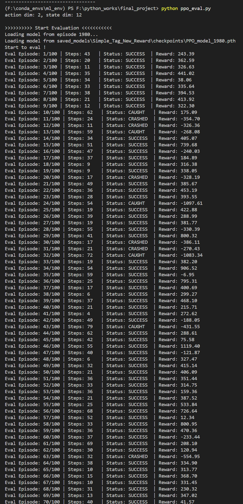

# 机器学习课程设计报告

> 小组成员：张韶恒，荣冬阳，史昱彬

## 训练设计
---
### simple_tag.py

1. **每次初始化的随机位置设计**
    限定猎人、猎物、庇护所的位置在一定范围内随机，同时满足一定的距离关系要求，防止出现某些元素靠太近的情况
    ```python
    class Scenario(BaseScenario):
        # ...other code ...
        def reset_world(self, world, agent_pos=None, check_pos=None, obstacles=None):
            self.prey_last_dist_to_shelter = {}
            self.last_dist = {}

            # 定义可调整的安全距离参数
            MIN_AGENT_DIST = 0.6
            MIN_OBSTACLE_DIST = 0.2 
            BORDER_BUFFER = 0.2
            MIN_SHELTER_OBSTACLE_DIST = 0.3 # 确保庇护所不会离障碍物太近

            # 设置固定的颜色和物体
            for i, agent in enumerate(world.agents):
                agent.color = np.array([0.35, 0.85, 0.35]) if not agent.adversary else np.array([0.85, 0.35, 0.35])
            for i, landmark in enumerate(world.landmarks):
                landmark.color = np.array([0.25, 0.25, 0.25])
            for i, border in enumerate(world.borders):
                border.color = np.array([0.8, 0.4, 0.4])
            for i, check in enumerate(world.check):
                check.color = np.array([0.8, 0.6, 0.8])

            # 获取智能体和障碍物的引用
            predator = self.adversaries(world)[0]
            prey = self.good_agents(world)[0]
            
            # 障碍物位置保持固定
            if obstacles is None:
                obstacle_pos = [[-0.35, 0.35], [0.35, 0.35], [0, -0.35]]
            else:
                obstacle_pos = obstacles
            for i, landmark in enumerate(world.landmarks):
                landmark.state.p_pos = obstacle_pos[i]
                landmark.state.p_vel = np.zeros(world.dim_p)

            # 带多重约束的随机位置生成
            # 在一个大循环中为庇护所、猎物和猎人同时寻找有效位置
            while True:
                # 步骤A: 随机生成所有三个物体的位置
                shelter_pos = np.random.uniform(-0.6, +0.6, world.dim_p)
                predator_pos = np.random.uniform(-0.9, +0.9, world.dim_p)
                prey_pos = np.random.uniform(-0.8, +0.8, world.dim_p)
                
                # 步骤B: 验证庇护所自身位置的合理性
                # 庇护所不能离边界太近
                if abs(shelter_pos[0]) > (1.0 - BORDER_BUFFER) or abs(shelter_pos[1]) > (1.0 - BORDER_BUFFER):
                    continue
                # 庇护所不能离障碍物太近
                too_close_to_obstacle_shelter = False
                for obs in world.landmarks:
                    dist_to_obs = np.linalg.norm(shelter_pos - obs.state.p_pos)
                    if dist_to_obs < (MIN_SHELTER_OBSTACLE_DIST + world.check[0].size + obs.size):
                        too_close_to_obstacle_shelter = True
                        break
                if too_close_to_obstacle_shelter:
                    continue

                # 步骤C: 在庇护所位置有效的前提下，验证猎物和猎人的位置

                # 猎物与猎人之间的距离必须足够远
                dist_to_predator = np.linalg.norm(prey_pos - predator_pos)
                if dist_to_predator < MIN_AGENT_DIST:
                    continue
                # 猎物与所有障碍物的距离必须都足够远
                too_close_to_obstacle_prey = False
                for obs in world.landmarks:
                    dist_to_obs = np.linalg.norm(prey_pos - obs.state.p_pos)
                    if dist_to_obs < (MIN_OBSTACLE_DIST + prey.size + obs.size):
                        too_close_to_obstacle_prey = True
                        break
                if too_close_to_obstacle_prey:
                    continue
                # 猎物与边界的距离必须足够远
                if abs(prey_pos[0]) > (1.0 - BORDER_BUFFER) or abs(prey_pos[1]) > (1.0 - BORDER_BUFFER):
                    continue
                    
                # 如果所有条件都满足，则设置所有位置并跳出循环
                prey.state.p_pos = prey_pos
                predator.state.p_pos = predator_pos
                world.check[0].state.p_pos = shelter_pos
                break
                
            # 重置所有智能体和庇护所的速度和通信状态
            for agent in world.agents:
                agent.state.p_vel = np.zeros(world.dim_p)
                agent.state.c = np.zeros(world.dim_c)
            world.check[0].state.p_vel = np.zeros(world.dim_p)

            # 边界位置保持固定
            pos = []
            x = -0.95; y = -1.0
            for count in range(20): pos.append([x, y]); x += 0.1
            x = 1.0; y = -0.95
            for count in range(20): pos.append([x, y]); y += 0.1
            x = 0.95; y = 1.0
            for count in range(20): pos.append([x, y]); x -= 0.1
            x = -1.0; y = 0.95
            for count in range(20): pos.append([x, y]); y -= 0.1
            for i, border in enumerate(world.borders):
                border.state.p_pos = np.asarray(pos[i])
                border.state.p_vel = np.zeros(world.dim_p)   
        # ...other code...
    ```
2. **reward函数设计**
    1. 我们分别以猎物离目标点距离、猎物与猎人相对位置以及相对速度、猎物本身速度大小上设置了一系列reward函数 
        ```python
        dist = np.sqrt(
                np.sum(np.square(agent.state.p_pos - world.check[0].state.p_pos)))
        # 猎物离目标点距离越远，惩罚越大
        if dist > 0.5:
            rew -= (0.8 * dist + 0.2)
        else:
            rew -= 1.2 * dist
        ```
        ```python
        # 猎物与猎人相对位置以及相对速度
        # 求相对关系
        vec_dist_aa = agent.state.p_pos - adversaries[0].state.p_pos # 猎物相对于猎手的位移矢量
        vec_velo_aa = agent.state.p_vel - adversaries[0].state.p_vel # 猎物相对于猎手的速度矢量
        # 二者作内积可由数值正负判断两个向量的方向关系
        # 如果res_in > 0就说明猎物在远离猎手
        res_in = np.inner(vec_dist_aa, vec_velo_aa)
        # 在位移上鼓励远离猎手
        dist_aa = np.sqrt(np.sum(np.square(vec_dist_aa)))
        rew += 0.3 * dist_aa 
        # 在速度上鼓励远离猎手
        vel_aa = np.sqrt(np.sum(np.square(vec_velo_aa)))
        if (res_in > 0):
            rew += 0.3 * vel_aa
        else:
            rew -= 0.3 * vel_aa
        ```
        ```python
        # 在猎物本身速度上鼓励运动快一点
        rew += 0.5 * np.sqrt(np.sum(np.square(agent.state.p_vel)))
        ```
    2. 此外我们设置碰撞障碍物、到达目标点、被猎人捕捉的奖励或惩罚数值，这些数值远大于上述reward函数，保证了核心目标不改变
        ```python
        class Scenario(BaseScenario):
            # ...other code ...
            def agent_reward(self, agent, world):
                # Agents are negatively rewarded if caught by adversaries
                rew = 0
                adversaries = self.adversaries(world)
                # 碰撞惩罚
                if agent.collide:
                    for a in adversaries:
                        if self.is_collision(a, agent):
                            rew -= 30
                for i, landmark in enumerate(world.landmarks):
                    if not landmark.boundary:
                        if self.is_collision(landmark, agent):
                            rew -= 30
                for i, border in enumerate(world.borders):
                    if self.is_collision(border, agent):
                        rew -= 20
                # ...other code...
                if dist < agent.size + world.check[0].size:
                    # 完成任务的奖励
                    rew += 30
                return rew
        ```
3. **训练流程设计**
    按照上文1、2点中设计训练5000轮，加载其3280轮模型，并添加了鼓励猎物速度方向指向目标点的函数，继续训练5000轮
    ```python
    vec_dist_ac = agent.state.p_pos - world.check[0].state.p_pos
    vec_velo_ac = agent.state.p_vel - world.check[0].state.p_vel
    dist = np.sqrt(np.sum(np.square(vec_dist_ac)))
    # 距离check点越远，惩罚越大
    if dist > 0.5:
        rew -= (0.8 * dist + 0.2)
    else:
        rew -= 1.2 * dist
    # 求猎物速度在指向目标点方向的分量
    res_in_ac = np.inner(vec_dist_ac, vec_velo_ac) / dist
    # 在速度上鼓励靠近目标点
    rew -= 0.1 * res_in_ac
    ```


    ```python
    def reward(self, agent, world):
        # 【核心修改】这个函数现在作为一个调度员
        # 它会根据 agent 的类型，调用相应的专用奖励函数
        if agent.adversary:
            return self.adversary_reward(agent, world)
        else:
            return self.agent_reward_simplified(agent, world)

    def agent_reward_simplified(self, agent, world):
        prey = agent
        predator = self.adversaries(world)[0]
        shelter = world.check[0]
        obstacles = world.landmarks

        # 1. 定义权重
        # 【最终结果权重】
        W_SUCCESS = 105.0         # 成功到达的巨大奖励
        W_FAILURE = -55.0        # 失败（被抓/撞墙）的巨大惩罚
        
        # 【过程引导权重】
        W_PROGRESS_TO_SHELTER = 8.0     # 奖励“取得进步”的权重 (基于动作)
        W_PROGRESS_AWAY_PREDATOR = 4.0  # 奖励“拉开距离”的权重 (基于动作)
        W_SHELTER_PROXIMITY_REWARD = 4.0 # 奖励“靠近目标”的状态 (引力奖励)
        
        # 【新增】速度对齐奖励权重
        # 奖励智能体的速度方向与朝向目标的方向一致
        W_VELOCITY_ALIGNMENT = 4.0

        W_PREDATOR_PROXIMITY_PENALTY = -5.0 # 惩罚“靠近危险”的状态
        W_OBSTACLE_PENALTY = -4.0 # 惩罚“靠近障碍物”的状态
        W_TIME_PENALTY = -0.05     # 时间成本

        # 终点冲刺区参数
        SPRINT_ZONE_RADIUS = 0.2  # 当距离小于这个值时，开始增强目标奖励
        MAX_BONUS_WEIGHT = 3.0     # 在最接近终点时，目标奖励的最大增强倍数

        rew = 0.0

        # 2. 计算当前距离和向量 
        dist_to_shelter = np.linalg.norm(prey.state.p_pos - shelter.state.p_pos)
        dist_to_predator = np.linalg.norm(prey.state.p_pos - predator.state.p_pos)
        dist_to_closest_obstacle = min([np.linalg.norm(prey.state.p_pos - o.state.p_pos) for o in obstacles])

        # 3. 计算事件奖励 (对最终结果的奖惩)
        if self.is_collision(prey, shelter):
            rew += W_SUCCESS
        elif self.is_collision(prey, predator) or any(self.is_collision(prey, o) for o in obstacles):
            rew += W_FAILURE

        # 计算平滑的奖励缩放因子

        shelter_reward_scaler = 1.0 # 默认为1.0, 不进行缩放
        if dist_to_shelter < SPRINT_ZONE_RADIUS:
            # 当进入冲刺区，缩放因子会从1.0平滑地增加到 MAX_BONUS_WEIGHT
            # (1 - dist / radius) 这个值从0 (在区域边缘) 变化到 1 (在区域中心)
            scaling_progress = (SPRINT_ZONE_RADIUS - dist_to_shelter) / SPRINT_ZONE_RADIUS
            shelter_reward_scaler = 1.0 + (MAX_BONUS_WEIGHT - 1.0) * scaling_progress


        # 4. 计算过程奖励 (引导每一步行为)
        
        # a), b), f) 所有与庇护所相关的奖励，现在都乘以这个动态的缩放因子
        last_dist_shelter = self.last_dist.get(f"{prey.name}_shelter", dist_to_shelter) #  获取上次与庇护所的距离
        progress_to_shelter = last_dist_shelter - dist_to_shelter #  计算向庇护所的进度
        rew += (W_PROGRESS_TO_SHELTER * progress_to_shelter) * shelter_reward_scaler #  根据进度给予奖励
        
        rew += (W_SHELTER_PROXIMITY_REWARD * (1 / (dist_to_shelter + 0.1))) * shelter_reward_scaler #  根据与庇护所的距离给予奖励

        if dist_to_shelter > 0.01: #  确保距离足够大，避免除以零
            vec_to_shelter = (shelter.state.p_pos - prey.state.p_pos) / dist_to_shelter #  计算指向庇护所的单位向量
            velocity_vec = prey.state.p_vel #  获取猎物的速度向量
            velocity_projection = np.dot(vec_to_shelter, velocity_vec) #  计算速度向量在指向庇护所方向上的投影
            rew += (W_VELOCITY_ALIGNMENT * velocity_projection) * shelter_reward_scaler #  根据速度方向给予奖励
            
        # c), d), e) 所有与躲避相关的惩罚，保持不变，不受冲刺区影响
        last_dist_predator = self.last_dist.get(f"{prey.name}_predator", dist_to_predator) #  获取上次与捕食者的距离
        progress_away_from_predator = dist_to_predator - last_dist_predator #  计算远离捕食者的进度
        rew += W_PROGRESS_AWAY_PREDATOR * progress_away_from_predator #  奖励值增加：根据远离捕食者的进度进行奖励

        if dist_to_closest_obstacle < prey.size + obstacles[0].size + 0.2: #  如果猎物与最近障碍物的距离小于两者大小之和加上0.2的安全阈值
             rew += W_OBSTACLE_PENALTY * (1 / (dist_to_closest_obstacle + 0.01)) #  奖励值增加：根据与障碍物的距离给予惩罚，距离越近惩罚越大

        rew += W_PREDATOR_PROXIMITY_PENALTY * (1 / (dist_to_predator + 0.1)) #  奖励值增加：根据与捕食者的距离给予惩罚，距离越近惩罚越大
        
        # 5. 持续的时间惩罚
        rew += W_TIME_PENALTY #  每步都添加一个时间惩罚，鼓励猎物尽快完成任务

        # 6. 更新“记忆”，为下一步计算做准备
        self.last_dist[f"{prey.name}_shelter"] = dist_to_shelter #  存储猎物到避难所的距离
        self.last_dist[f"{prey.name}_predator"] = dist_to_predator #  存储猎物到捕食者的距离

        return rew

    # =========================================================================================

    # 2. 这是专门为“猎物”设计的奖励函数 (agent_reward)
    # 我们将之前设计的分层逻辑放在这里

    # def agent_reward(self, agent, world):
    #     prey = agent 
    #     predator = self.adversaries(world)[0]
        
    #     # 1. 定义权重和超参数
    #     W_REACH_SHELTER = 300.0 #  到达避难所的奖励权重
    #     W_CAUGHT = -300.0 #  被捕食者抓住的惩罚权重
    #     W_HIT_OBSTACLE = -150.0 #  碰到障碍物的惩罚权重
    #     DANGER_ZONE = 0.5
        
    #     # “生存模式”权重
    #     W_SHIELDING = 6.0  # 主要奖励：利用障碍物躲避
    #     W_SHELTER_INCENTIVE_IN_DANGER = 2 # 【新】次要奖励：在危险中也要有朝向目标的倾向
        
    #     # “寻路模式”权重
    #     W_SHELTER_DISTANCE_CHANGE = 10.0 # 奖励距离缩短
    #     W_SHELTER_SEEKING = 5.0       # 奖励靠近目标的状态
    #     W_PREDATOR_AVOIDANCE = -1.0   # 对追捕者保持警惕
        
    #     W_OBSTACLE_AVOIDANCE = -2.5 #  障碍物规避的权重系数
    #     W_TIME_PENALTY = -0.1 #  时间惩罚的权重系数

    #     rew = 0.0 #  初始化奖励值为0.0
        
    #     # 2. 计算距离
    #     dist_to_predator = np.linalg.norm(prey.state.p_pos - predator.state.p_pos)
    #     shelters = world.check
    #     if shelters:
    #         dist_to_closest_shelter = min([np.linalg.norm(prey.state.p_pos - s.state.p_pos) for s in shelters])
    #     else:
    #         dist_to_closest_shelter = float('inf')

    #     obstacles = world.landmarks
    #     if obstacles:
    #         dist_to_closest_obstacle = min([np.linalg.norm(prey.state.p_pos - o.state.p_pos) for o in obstacles])
    #     else:
    #         dist_to_closest_obstacle = float('inf')

    #     # 3. 计算事件奖励
    #     if shelters and dist_to_closest_shelter < prey.size + shelters[0].size:
    #         rew += W_REACH_SHELTER
    #     if dist_to_predator < prey.size + predator.size:
    #         rew += W_CAUGHT
    #     if obstacles and dist_to_closest_obstacle < prey.size + obstacles[0].size:
    #         rew += W_HIT_OBSTACLE
            
    #     # 4. 分层计算过程奖励
    #     if dist_to_predator < DANGER_ZONE: #  如果捕食者在危险区域内
    #         # **生存模式**: 追捕者太近，首要任务是利用障碍物
    #         if obstacles:
    #             best_shield_reward = -float('inf') #  初始化最佳屏蔽奖励为负无穷
    #             for obs in obstacles:
    #                 dist_pred_to_obs = np.linalg.norm(predator.state.p_pos - obs.state.p_pos) #  计算追捕者到障碍物的距离
    #                 dist_prey_to_obs = np.linalg.norm(prey.state.p_pos - obs.state.p_pos) #  计算猎物到障碍物的距离
    #                 shield_reward = dist_pred_to_obs / (dist_prey_to_obs + 1e-6) #  加上1e-6防止除零
    #                 if shield_reward > best_shield_reward:
    #                     best_shield_reward = shield_reward #  更新最佳屏蔽奖励
    #             rew += W_SHIELDING * best_shield_reward #  应用屏蔽奖励权重
            
    #         # 【新】在生存模式下，依然给予一个微弱的、朝向庇护所的激励
    #         if shelters: #  如果存在庇护所，给予寻找庇护所的奖励，奖励值与到最近庇护所的距离成反比
    #             rew += W_SHELTER_INCENTIVE_IN_DANGER * (1 / (dist_to_closest_shelter + 0.1)) #  计算朝向最近庇护所的奖励，与距离成反比

    #     else:
    #         # **寻路模式**: 相对安全，首要任务是去庇护所
    #         if shelters:
    #             # a) 绝对距离奖励 (状态奖励) - 根据与最近庇护所的距离给予奖励
    #             rew += W_SHELTER_SEEKING * (1 / (dist_to_closest_shelter + 0.1))
                
    #             # b) 距离变化奖励 (动作奖励) - 根据与庇护所距离的变化给予奖励
    #             last_dist = self.prey_last_dist_to_shelter.get(prey.name)
    #             if last_dist is not None:
    #                 dist_diff = last_dist - dist_to_closest_shelter #  计算距离变化
    #                 rew += W_SHELTER_DISTANCE_CHANGE * dist_diff #  应用距离变化奖励权重
            
    #         rew += W_PREDATOR_AVOIDANCE * (1 / (dist_to_predator + 0.1)) #  在安全模式下，给予避开追捕者的奖励

    #     # 对障碍物的通用惩罚
    #     if obstacles and dist_to_closest_obstacle < 0.2:
    #         rew += W_OBSTACLE_AVOIDANCE * (1 / (dist_to_closest_obstacle**2 + 0.1))

    #     # 在计算完所有奖励后，更新“记忆”
    #     if shelters:
    #         self.prey_last_dist_to_shelter[prey.name] = dist_to_closest_shelter
                
    #     # 5. 通用时间惩罚
    #     rew += W_TIME_PENALTY
        
    #     return rew

    # 3. 这是专门为“追捕者”设计的奖励函数 (adversary_reward)
    # 我们可以保留原来的简单逻辑
    def adversary_reward(self, agent, world):
        # 追捕者因为抓住猎物而获得奖励
        rew = 0
        shape = True
        prey_agents = self.good_agents(world)
        
        # 可选的 shaping 奖励: 距离猎物越近，奖励越高
        if shape:
            rew -= 0.1 * min([np.linalg.norm(a.state.p_pos - agent.state.p_pos) for a in prey_agents])
        
        # 碰撞奖励: 如果抓住了任何一个猎物
        if agent.collide:
            for prey in prey_agents:
                if self.is_collision(prey, agent):
                    rew += 10 # 给予正奖励

        return rew
    ```


    
    
