# 哈尔滨工业大学（深圳）南工骁鹰战队

-----

<h2 style="text-align:center;"\> 硬件组第一次培训讲义——电路通识 </h2>

******
#### 撰写人：张韶恒        
#### 审核人：张韶恒
---
## 目录/教学要点

-----

### 一. 常用元器件介绍

***1.1 电阻 (Resistor)*** -[跳转](#11-电阻-resistor)
***1.2 电容 (Capacitor)*** -[跳转](#12-电容-capacitor)
***1.3 电感 (Inductor)*** -[跳转](#13-电感-inductor)
***1.4 连接器 (Connector)*** -[跳转](#14-连接器-connector)
***1.5 半导体器件 (Semiconductor)*** -[跳转](#15-半导体器件-semiconductor)
***1.6 集成芯片 (IC)*** -[跳转](#16-集成芯片-ic)

### 二. 基础电路知识

***2.1 基本电学物理量*** -[跳转](#21-基本电学物理量)
***2.2 基础电路结构*** -[跳转](#22-基础电路结构)
***2.3 基础电路理论*** -[跳转](#23-基础电路理论)
***2.4 常见电路分析*** -[跳转](#24-常见电路分析)

-----

### 一. 常用元器件介绍
---
### 1.1 电阻 (Resistor)
---
电阻是电路中最基本、最常用的元件，其本质是导体对电流的阻碍作用。它在电路中用于限制电流、调节电压（分压）、信号处理等。

#### 1.1.1 电阻的种类

  * **固定电阻**: 阻值在出厂时就已固定。
    * **直插式电阻 (插件电阻)**: 通过引脚插入电路板通孔中焊接，如常见的色环电阻。优点是焊接方便、散热效果好、机械强度高。缺点是体积大，不适合高密度集成电路，自动化生产效率低。
     
 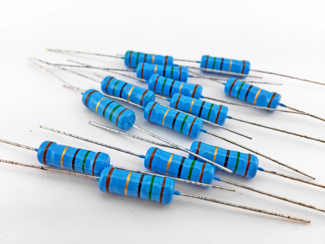

    * **贴片电阻 (SMD Resistor)**: 这是目前电路设计中的绝对主流。它没有引脚，直接焊接在电路板的表层焊盘上。优点是体积小、重量轻、高频特性好、适合大规模自动化生产。
    * **常用贴片电阻**: 精度一般（如1%、5%），主要用于对精度要求不高的分压、限流、上拉/下拉等常规场合，阻值多为kΩ级别。
      
 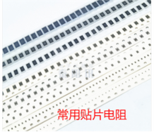

      
    * **精密采样电阻**: 精度非常高（如0.1%、0.5%），温度系数极低，阻值通常很小（mΩ级别）。它专门用于精确测量电路中的电流（通过测量其两端电压并利用欧姆定律计算），是电源和电机驱动等模块中的关键元件。
      
 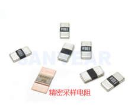

    * **功率电阻**: 专为承受大功率而设计，如水泥电阻、绕线电阻。它们将电阻丝绕在陶瓷基体上，并用散热良好的材料封装，常用于电源负载、电机刹车、浪涌电流限制等场合。

 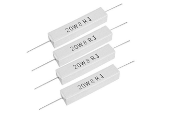

   

  * **可调电阻 (电位器)**: 阻值可以在一定范围内手动连续调节。它有三个端子，既可以作为可变电阻器使用，也可以作为分压器使用。常用于音量控制、亮度调节、电路参数校准等需要人为干预的场合。
 
 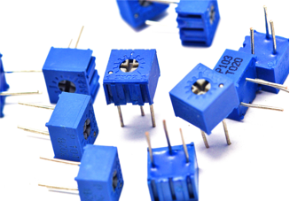

   

  * **敏感电阻**: 阻值会随着外界物理条件（如电压、光线、温度）的变化而显著变化，因此常被用作传感器。
      * **压敏电阻 (Varistor)**: 阻值对电压敏感。正常电压下电阻极大，当电压超过一个阈值时电阻瞬间变得极小，用于吸收电路中的浪涌电压，起到过压保护作用。
      
 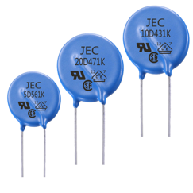

      * **光敏电阻 (Photoresistor)**: 阻值随光照强度变化，光线越强、电阻越小。用于制作光控开关、亮度检测等。
      
 

      * **热敏电阻 (Thermistor)**: 阻值对温度敏感，分为负温度系数（NTC，温度越高、电阻越小）和正温度系数（PTC，温度越高、电阻越大）两种。NTC常用于温度检测，PTC常用于制作可恢复保险丝，实现过流保护。  
      
 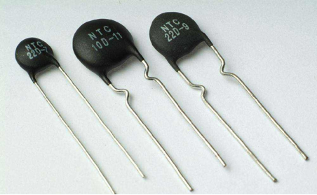

#### 1.1.2 贴片电阻的关键参数

  * **阻值**: 对电流的阻碍能力，单位是欧姆(Ω)。
  * **封装 (Package)**: 表示电阻的物理尺寸，行业常用英制单位命名，如0201、0402、0603、0805、1206等。封装尺寸越大，其额定功率和耐压值通常也越高。
  * **精度 (Tolerance)**: 实际阻值与标称值的最大允许偏差，如±1%、±5%。高精度电路需选用高精度电阻。
  * **功率 (Power Rating)**: 电阻能长时间安全工作的最大耗散功率。选型时，实际工作功率必须小于其额定功率，并留有足够裕量（通常为50%以上）。
  
 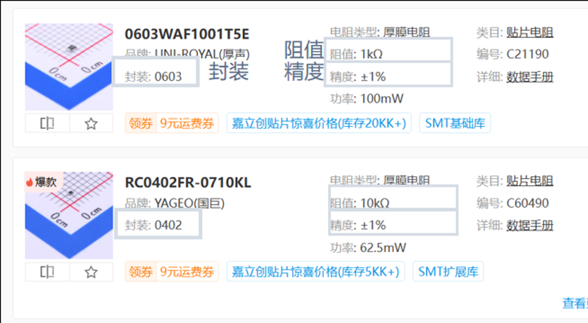

#### 1.1.3 贴片电阻的丝印标注

贴片电阻表面会通过丝印来标注其阻值。

  * **三位/四位数字法**:
      * 前两位或三位是有效数字，最后一位是10的幂指数。
      * 示例: "103" 表示 $10 \times 10^3 = 10k\Omega$。 "1002" 表示 $100 \times 10^2 = 10k\Omega$。
  
 

  * **字母R法**:
      * 字母"R"代表小数点。
      * 示例: "4R7" 表示 4.7Ω。 "R100" 表示 0.100Ω。
  
 

  * **EIA-96标准 (数字+字母)**:
      * 用于1%精度的电阻，前两位数字代表一个阻值代码（需查表），最后一位字母代表乘数（需查表）。
      * 示例: "01C" 中，查表知"01"代表100，"C"代表$10^2$，所以阻值为 $100 \times 10^2 = 10k\Omega$。

#### 1.1.4 电阻的常用功能

  * **分压**: 通过串联电阻网络，获取电源电压的一部分，是各类电压采样和基准设定的基础，如DCDC芯片的反馈电压采样。
  * **限流**: 串联在电路中，限制通过元器件（如LED、三极管基极）的电流，防止其因电流过大而损坏。
  * **上拉/下拉**:
      * **下拉**: 将一个不确定的信号线通过电阻接地，赋予其一个默认的低电平状态，防止信号悬空被干扰。如STM32的BOOT0引脚下拉以选择正常启动模式。
      * **上拉**: 将信号线通过电阻接到电源，赋予其一个默认的高电平状态。最常见的应用是I2C、UART等开漏输出的总线，需要外部上拉电阻来产生高电平。
  * **阻抗匹配**: 在高速信号传输或特定模拟电路（如运放）中，通过配置电阻来匹配输入/输出阻抗，以消除信号反射、减小噪声或补偿偏置电流影响。
  * **0欧电阻的应用**:
      * **充当跳线**: 方便在PCB上连接或断开某条线路，便于调试和功能配置。
      * **单点接地**: 在模拟地和数字地之间用0欧电阻跨接，既实现了电气上的连接，又在物理上提供了一个可控的噪声隔离路径。
      * **MOS驱动电路**: 在MOS管驱动电路中充当栅极电阻（占个位置,便于后续测试调换），用于控制开关速度、抑制高频振荡。

-----

### 1.2 电容 (Capacitor)
---
电容是由两个相互靠近的导体，中间夹一层不导电的绝缘介质构成的元件。其基本功能是储存电荷，核心特性是“通交流、隔直流”，两端电压不能突变。

#### 1.2.1 电容的种类

  * **贴片陶瓷电容 (MLCC)**: 容量范围从pF到uF级别，无极性，高频特性好，ESR（等效串联电阻）低。是目前应用最广的电容，常用于高频滤波、信号耦合和退耦。
  
 

  * **铝电解电容**: 利用电解质作为介质，可以获得非常大的容量（uF到mF级别），但体积较大，有极性（正负极不能接反），高频特性差。常用于电源的输入和输出端做大容量的滤波和储能。
  
 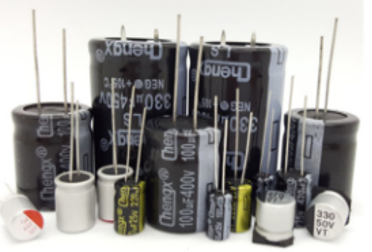

  * **超级法拉电容 (Supercapacitor)**: 介于传统电容和电池之间的一种储能元件。它拥有法拉级别的超高容量和极快的充放电速度，但耐压很低，有极性。能够储存大量能量，用作战队机器人的超级电容组，提供短时爆发功率。
  
 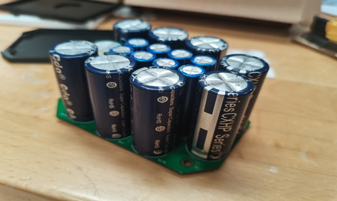

#### 1.2.2 陶瓷电容的关键参数

  * **容量 (Capacitance)**: 储存电荷的能力。单位是法拉(F)，常用uF, nF, pF。
  * **额定电压 (Rated Voltage)**: 电容能长期安全工作的最高电压。选型时必须留有充足裕量，通常要求额定电压大于1.5倍至2倍的实际工作电压。
  * **封装 (Package)**: 物理尺寸，与电阻类似。
  
 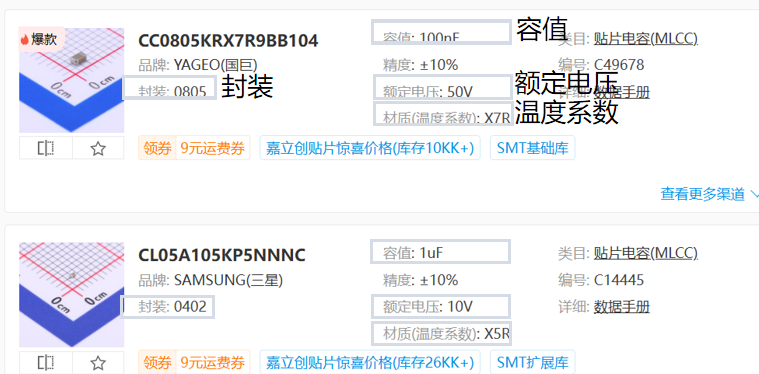

  * **介质材料 (Dielectric Material)**: 决定了电容的稳定性和性能。
      * **X7R, X5R**: II类电容，介电常数高，容量可以做得比较大，但容量会随温度、直流偏压的变化而下降。适用于对容量精度要求不高的大多数滤波、退耦场合。
      * **C0G (NPO)**: I类电容，介电常数低，容量较小，但容量非常稳定，基本不随温度、电压变化。适用于对精度和稳定性要求高的场合，如射频匹配、精密滤波和振荡电路。
  
 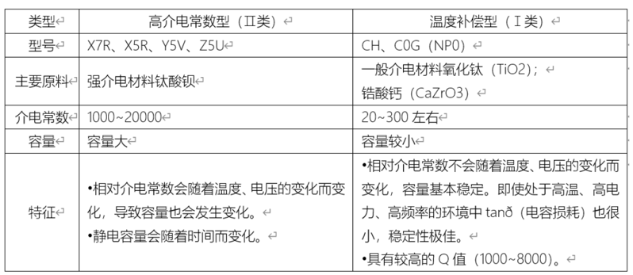

  * **等效串联电阻 (ESR)**: 电容的一个重要寄生参数，它影响电容的充放电速度和滤波效果。ESR越小，电容处理高频纹波的能力越强，损耗也越小。

#### 1.2.3 电容的选型与应用

  * **计算**: 根据电路需求（如BUCK电路的输入/输出纹波要求、LDO的稳定性要求）通过公式计算所需电容值。
  * **看手册**: 绝大多数芯片的数据手册会直接给出其外围电路中所需电容的推荐值，这是最可靠的选型依据。例如，自举电容(Bootstrap Capacitor)一般推荐100nF。
  * **经验值**: 对于几乎所有集成芯片的电源引脚，都需要在其旁边尽可能近的位置放置一个100nF (0.1uF) 的电容进行退耦，这是一个通用的设计规则。

#### 1.2.4 电容的常用功能

  * **滤波 (Filtering)**: 滤除电源中的交流纹波和噪声，为电路提供更纯净、稳定的电压。通常将大容量的电解电容（滤除低频纹波）和小容量的陶瓷电容（滤除高频噪声）并联使用，以实现宽频带滤波。
  * **储能 (Energy Storage)**: 利用电容储存能量，在需要时快速释放。例如BUCK电路的输出电容，在负载电流突然增大时提供瞬时电流以维持输出电压稳定。超级电容组是其极致应用。
  * **退耦 (Decoupling) & 旁路 (Bypass)**: 这是电容在高频数字电路中最关键的作用。
      * **退耦**: 放置在集成芯片的电源引脚附近，为芯片提供一个纯净、低阻抗的局部电源“小水塘”，滤除从电源线上传来的噪声，并为芯片内部逻辑门高速翻转时提供瞬时电流，防止电源轨电压跌落。
      * **旁路**: 为电路中的高频噪声信号提供一个对地的低阻抗路径，将其“旁路”掉，防止它干扰到其他电路。
  ---

### 1.3 电感 (Inductor)
---
电感是能将电能以磁场形式储存起来的元件，其核心特性是“通直流、阻交流”，流过它的电流不能突变，会抵抗电流的变化。

#### 1.3.1 电感的种类

  * **功率电感**: 通常具有磁芯，核心作用是储能和滤波，是各类开关电源（如BUCK、BOOST电路）中的核心元件，与电容配合进行能量传递和电压变换。
   
 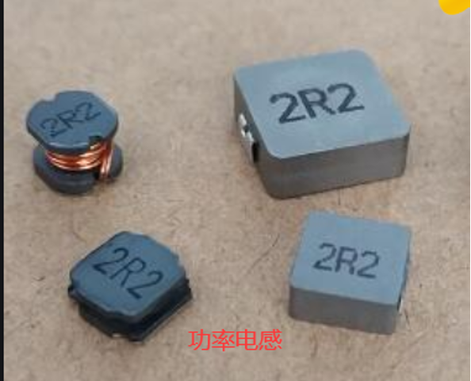

  * **磁珠 (Ferrite Bead)**: 是一种特殊的电感，它在低频时呈现低阻抗，但在特定高频段等效为一个电阻，能将高频噪声能量以热能形式耗散掉。专门用于滤除信号线或电源线上的高频噪声。也常用于模拟地和数字地的单点连接处，以抑制高频噪声流通。
   
 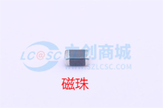

  * **共模扼流圈 (Common Mode Choke)**: 结构上是两组同向绕制的线圈。它对差分信号（有用信号）呈现很低的阻抗，但对共模信号（干扰噪声）呈现很高的阻抗，因此能够有效滤除差分信号线上的共模干扰，同时不影响有用信号的传输。常用于USB、CAN等差分总线接口。

 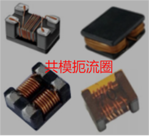

#### 1.3.2 功率电感的丝印标注

  * **三位数字法**: 前两位是有效数字，第三位是10的幂指数，单位是uH。
      * 示例: "101" 表示 $10 \times 10^1 = 100uH$。 "100" 表示 $10 \times 10^0 = 10uH$。
    
 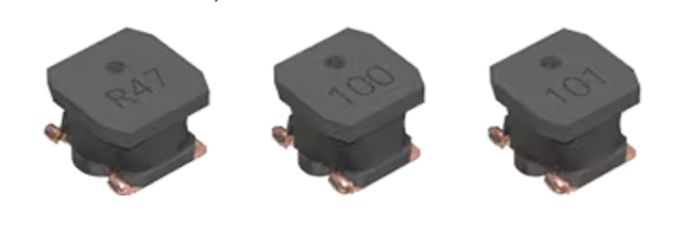

  * **字母R法**: R代表小数点，单位是uH。
      * 示例: "R47" 表示 0.47uH。

---
### 1.4 连接器 (Connector)
---
连接器是电路中用于实现可拆卸连接的接口元件，用于电路板与电路板之间、电路板与外部设备之间的电气连接。

  * **功率型连接器**: 设计用于传输较大的电流和电压，如电源的输入和输出。特点是接触电阻小，插拔力大，能承载大电流。
      * **常用型号**: XT30, XT60。   
     

      
 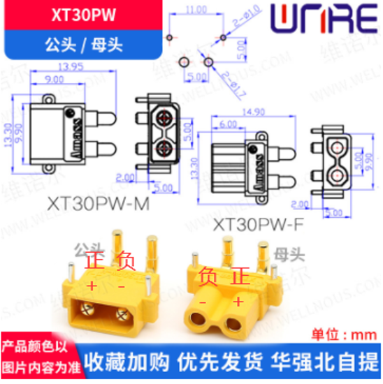

      * **使用惯例**: 为安全起见，电源输入端（带电侧）一般用母头（插孔），输出端（负载侧）用公头（插针），以防止暴露的带电插针意外短路。
   
  * **信号型连接器**: 用于传输小电流的通信信号。特点是引脚密度高，体积小。
      * **常用型号**: GH1.25, XH2.54, 以及各种间距的排针、FPC连接器等。

---
### 1.5 半导体器件 (Semiconductor)
---
这是现代电子学的基石，其功能基于对半导体材料中载流子运动的控制，核心结构是PN结。

#### 1.5.1 PN结原理

当P型半导体（多数载流子为空穴）和N型半导体（多数载流子为电子）结合时，在交界面处电子和空穴会相互扩散并复合，形成一个缺少载流子的“耗尽层”，耗尽层内部存在一个由N区指向P区的内建电场。

 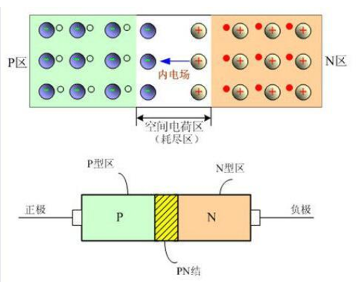

  * **正向偏置**: 在P区加正电压、N区加负电压时，外加电场与内建电场方向相反，削弱内建电场，使耗尽层变薄，多数载流子可以顺利通过，电流可以顺利流过，表现为导通。
  * **反向偏置**: 在P区加负电压、N区加正电压时，外加电场与内建电场方向相同，增强内建电场，使耗尽层增厚，阻碍多数载流子的运动，电流无法流过，表现为阻断。
  * **核心性质**: 单向导电性。

#### 1.5.2 二极管 (Diode)

二极管就是利用PN结单向导电性制成的最基本的半导体器件。

  * **发光二极管 (LED)**: 一种特殊的PN结，在正向导通时，电子和空穴复合会以光子的形式释放能量，从而发光。是各种指示灯和照明灯具的核心。
  
 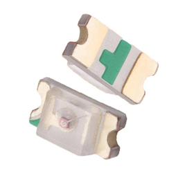

  * **稳压二极管 (Zener Diode)**: 利用PN结的反向击穿特性。当施加的反向电压达到特定值（击穿电压）时，二极管进入击穿区，其两端电压会被钳位在一个几乎恒定的值，常用于提供简单的基准电压或进行电压限制。
  
 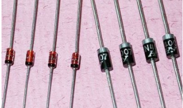

  * **肖特基二极管**: 它由金属-半导体结构成，而非PN结。其优点是正向导通电压非常低（约0.2V-0.4V），且反向恢复时间极短，这意味着它的开关速度非常快，损耗小。非常适合在高速开关电路（如开关电源）中用作续流或整流二极管。
  
 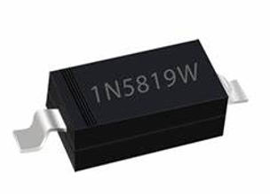

  * **TVS/ESD二极管**: 专用于电路保护的二极管。
      * **TVS**: 瞬态电压抑制二极管，具有极快的响应速度和强大的浪涌吸收能力，并联在电源输入端，用于吸收雷击、开关等引起的浪涌和尖峰电压，保护后级电路。
      * **ESD**: 静电放电保护二极管，电容量极低，专门用于高速信号线上，防止人体或设备带来的静电损坏敏感的芯片接口。

#### 1.5.3 三极管 (BJT)

  * **类型**: 分为NPN型和PNP型两种结构。
  
 

  * **工作原理**: 一种**电流控制型**器件。它通过控制基极（B）注入的微小电流，来线性地控制集电极（C）和发射极（E）之间流过的大电流，具有显著的电流放大作用。
  * **导通条件**: 对于NPN管，当基极-发射极电压 $U_{BE} > 0.7V$时导通。对于PNP管，当发射极-基极电压 $U_{EB} > 0.7V$时导通。
  * **应用**: 常用作信号放大器或电子开关。

#### 1.5.4 MOS管/场效应管 (MOSFET)

  * **类型**: 分为N沟道(NMOS)和P沟道(PMOS)两种。
  * **工作原理**: 一种**电压控制型**器件。它通过控制施加在栅极（G）和源极（S）之间的电压 $V_{GS}$ ，来控制漏极（D）和源极（S）之间的导电沟道是否形成，从而像水龙头一样控制MOS管的导通与关断。
  
 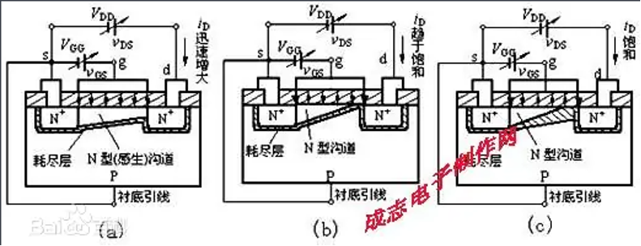

  * **导通条件**: 对于增强型NMOS，当 $V_{GS}$ 大于其阈值电压时导通。对于增强型PMOS，当 $V_{SG}$ 大于其阈值电压时导通。
  * **核心特点**:
      * **高输入阻抗**: 栅极与沟道之间是绝缘的，因此栅极电流几乎为0，驱动功耗低。
      * **低导通电阻**: 现代MOS管的导通电阻可以做到mΩ级别，导通损耗很小。
      * **开关速度快**: 开关速度远高于三极管，适合高频应用。   
  
  * **应用**: 是现代开关电源、电机驱动电路和数字逻辑电路中的核心开关元件。
---
### 1.6 集成芯片 (IC)
---
集成芯片（IC）是将成千上万甚至数十亿个晶体管、电阻、电容等元件通过复杂的半导体工艺集成在一小块硅晶片上，以实现特定或通用功能的微型电子器件。

  * **专用集成芯片 (ASIC)**: 为实现某种特定功能而设计，功能固定但性能高效。例如，电源管理芯片(PMIC)、电机驱动芯片、CAN总线收发器、音频解码器等。
  
 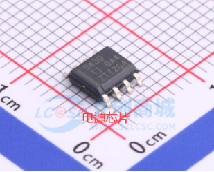

  * **微控制器 (MCU)**: 是一种通用的可编程芯片，整合了CPU核心、内存(RAM)、程序存储器(Flash)、以及各种常用的外设接口（如GPIO, ADC, UART, I2C, SPI, CAN）于一体。可以通过烧录代码来执行复杂的逻辑控制和运算任务，是绝大多数嵌入式系统和机器人的“大脑”。
  
 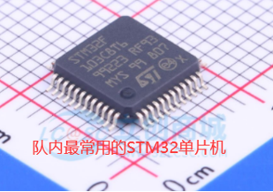

-----

### 二. 基础电路知识
---

### 2.1 基本电学物理量
---
  * **电压 (Voltage)**
      * **定义**: 电压是用于表征电路中两点之间电位差的物理量，也称电势差。它是驱动电荷定向移动形成电流的根本原因。
      * **单位**: 伏特 (V)。
  * **电流 (Current)**
      * **定义**: 电流是单位时间内通过导体任意横截面的电荷量。
      * **单位**: 安培 (A)。
  * **电源 (Power Source)**: 是为电路提供能量的装置。
      * **电压源**: 理想情况下，电压源能为电路提供一个恒定的电压，其两端电压不随流过它的电流大小而改变。
      * **电流源**: 理想情况下，电流源能为电路提供一个恒定的电流，流经它的电流不随其两端连接的负载电压而改变。
---
### 2.2 基础电路结构
---
  * **支路 (Branch)**: 电路中每一个二端口元件（如电阻、电容等）都可以看作一条支路。
  * **节点 (Node)**: 三条或三条以上支路的连接点称为节点。它是分析电路时应用KCL定律的基本单元。
  * **路径 (Path)**: 连接电路中任意两个节点的通路被称为路径。
  * **回路 (Loop)**: 电路中任何一个闭合的路径都构成回路。它是分析电路时应用KVL定律的基本单元。

 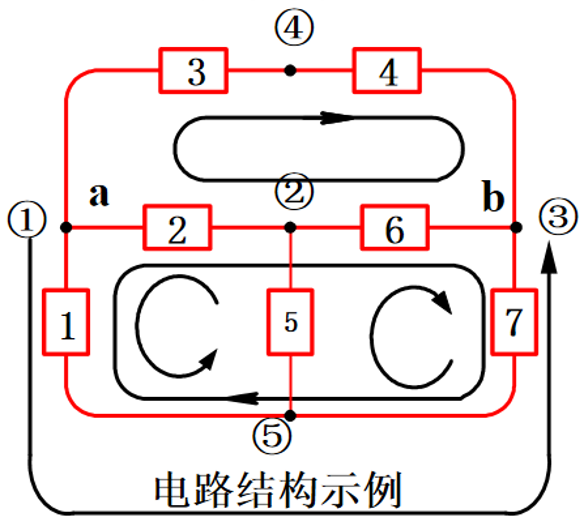

-----

### 2.3 基础电路理论
---
#### 2.3.1 欧姆定律 (Ohm's Law)
---
对于线性电阻元件，在电路中通过它的电流与它两端的电压成正比。这是分析电阻性电路最基本的定律。

  * **表达式**: $V = I \times R$
  * 其中V是电压，I是电流，R是电阻。
---
#### 2.3.2 基尔霍夫定律 (Kirchhoff's Laws)
----
基尔霍夫定律是电路分析的两大基石，适用于任何复杂电路。

  * **基尔霍夫电流定律 (KCL - Kirchhoff's Current Law)**
      * **定义**: 在任意时刻，所有流入一个节点的电流代数和等于零。其物理本质是电荷守恒，即节点不能储存电荷。通俗地说，流入节点的总电流量等于流出该节点的总电流量。
      * **表达式**: $\Sigma I = 0$
      * **规定**: 通常规定流入节点的电流为正，流出节点的电流为负。
  
 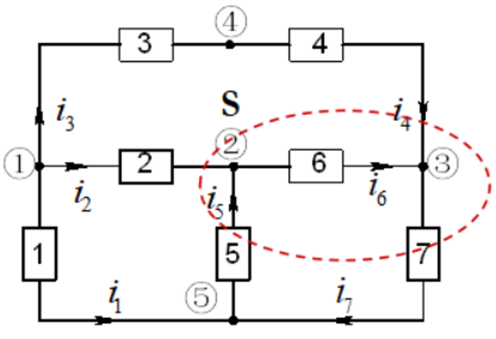

  * **基尔霍夫电压定律 (KVL - Kirchhoff's Voltage Law)**
      * **定义**: 在任意时刻，沿着电路中任意一个闭合回路，所有元件上电压降的代数和等于零。其物理本质是能量守恒，即电荷沿回路一周，其电势能没有净变化。
      * **表达式**: $\Sigma U = 0$
      * **规定**: 当电压参考方向与回路绕行方向相同时取正号，反之取负号。

 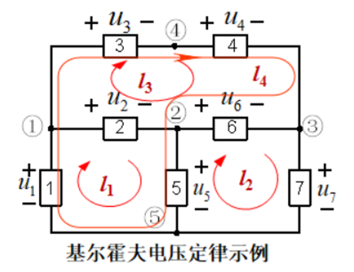

---
#### 2.3.3 电压叠加原理 (Superposition Theorem)
---
在一个由多个独立电源构成的线性电路中，任何一个元件上的电流或电压，等于每个独立电源单独作用时在该元件上产生的电流或电压的代数和。

 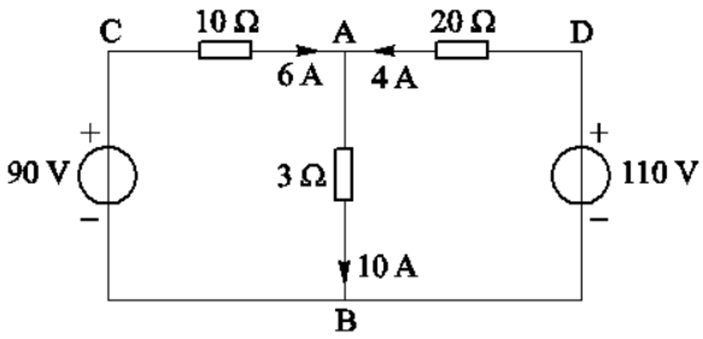

  * **分析方法**: 当分析某一个独立电源的作用时，需要将其他所有独立电压源用导线短路（视为0V），所有独立电流源断开（视为0A），然后计算该电源产生的响应。最后将所有响应叠加。
  * 类似的，还有通用的叠加定理，电流源不分析时视为断路，电压源不分析时视为短路。

-----

### 2.4 常见电路分析
---
#### 2.4.1 运算放大器 (Operational Amplifier, Op-Amp)
---

 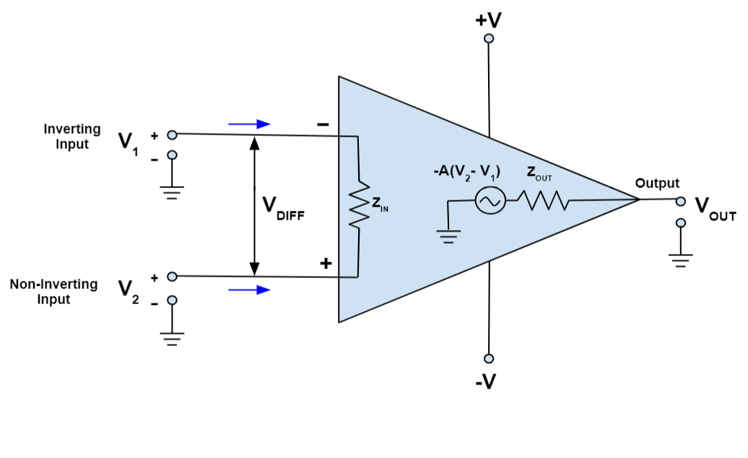

运放是一种具有极高放大倍数的差分放大器，是模拟电路设计中最灵活、最重要的构建模块之一。分析其线性应用电路时，我们主要依据两个重要的“虚”特性（适用于理想运放模型）：

  * **虚短 (Virtual Short)**: 当运放工作在负反馈（深度负反馈）状态下（输出端通过某种方式连接回==反向输入端==），其正向输入端（+）和反向输入端（-）的电压将趋于相等，近似认为它们之间是“短路”的，但并没有电流流过。
  * **虚断 (Virtual Open)**: 理想运放的输入阻抗被认为是无穷大，因此可以认为流入或流出其两个输入端的电流为零，如同“断路”。

基于这两个原则，我们可以轻松分析多种经典运放电路：

  * **电压跟随器**: 电路输出Vout直接连接到反向输入端，输入Vin连接到正向输入端。根据“虚短”，$V_{out} = V_{-} = V_{+} = V_{in}$。它的电压增益为1，不放大电压，但能提供极高的输入阻抗和极低的输出阻抗，起到“缓冲”和“隔离”的作用，常用于驱动负载或隔离前后级电路。
  
 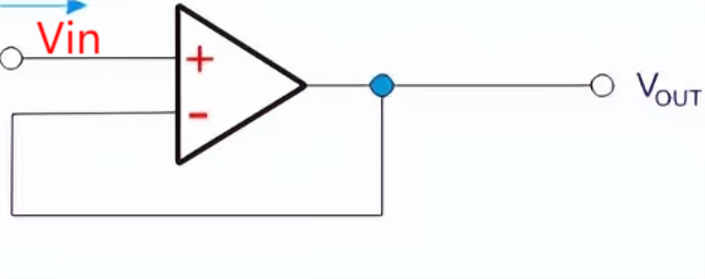

  * **反向比例放大器**: 输入信号$V_{in}$通过电阻$R_{1}$连接到反向输入端，反馈电阻$R_{f}$连接在输出和反向输入端之间，正向输入端接地。根据“虚短”（反向输入端电压等于正向输入端，为0V）和“虚断”（流入反向输入端的电流为0），可以推导出输出电压关系为：
    $V_{out} = -\frac{R_{f}}{R_{g}} \times V_{in}$
    输出信号与输入信号相位相反。
    
 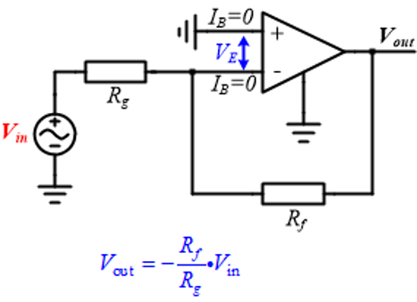

  * **同向比例放大器**: 输入信号$V_{in}$连接到正向输入端，反向输入端通过电阻$R_{1}$接地，反馈电阻$R_{f}$连接在输出和反向输入端之间。可以推导出输出电压关系为：
    $V_{out} = (1 + \frac{R_{f}}{R_{g}}) \times V_{in}$
    输出信号与输入信号相位相同。
   
 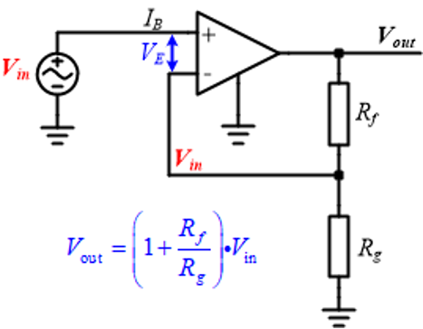

  * **积分电路**: 反馈路径上使用电容C，输入信号通过电阻R连接到反向输入端。根据电容的电流电压关系 $i_{C} = C \frac{du_{C}}{dt}$ 和虚短虚断原则，可以得到输出与输入的关系为积分关系：
    $V_{out} = -\frac{1}{R_{1}C_{1}} \int_{0}^{t} V_{in} dt$
    
 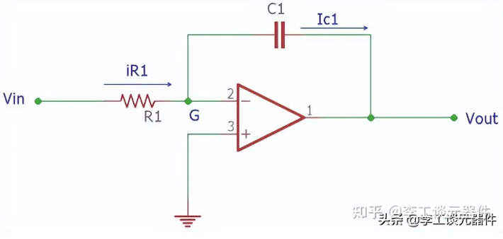

    
    该电路能将输入信号对时间进行积分，是模拟计算和波形变换的基础。