# 哈尔滨工业大学（深圳）南工骁鹰战队
---
<h2 style="text-align:center;"> 硬件组第三讲培训讲义——设计电源电路培训 </h2>

***
#### 撰写人：崖峥嵘      
#### 审核人：张韶恒
---
## 目录/教学要点
---

### 一. 电源电路模块设计
***1.1 设计目的*** -[跳转](#设计目的)  

***1.2 LDO特性*** -[跳转](#ldo特性)

***1.3 开关电源的基本构成思路（以Buck电路为例）*** -[跳转](#buck-boost电路应用)

### 二. 芯片手册研读

***2.1 选型*** -[跳转](#选型)

***2.2 原理图设计*** -[跳转](#原理图设计)

***2.3 PCB设计*** -[跳转](#pcb设计)

### 三. 原理图部分解析

***3.1 原理图部分解析*** -[跳转](#原理图部分)

***3.2 PCB部分解析*** -[跳转](#pcb部分)

### 四. 设计实例

***4.1 12V转3.3V电源模块设计*** -[跳转](#12v转3v3电源模块设计)

***4.2 下单流程与注意事项*** -[跳转](#下单流程与注意事项)

---

### 一、电源电路模块设计
---
### 设计目的：
#### 为什么要设计电源电路模块：本质上为了满足不同芯片的供电需求与电压限制
>ex:树木（类比一些芯片与驱动）需要数十升水量，花朵（类比另一些芯片与驱动）只需要数十毫升的水量且不可承受过量水源（overvoltage），那么从黄河（电源vin）引进的水渠需要先用工具（升降压电路）分配再灌溉(vout)而非直接引入黄河
---
### LDO特性
#### LDO[^LDO]（低压差线性稳压器）
- 低压差：输出电压和输入电压的差值很低。

- 线性：是指其调整管（通常为MOSFET[^调节电压的mos管]或BJT）工作在饱和区（或称放大区），通过连续调节其等效电阻来实现电压的稳定，整个过程不存在高频开关动作。

- 稳压：当输入电压VIN在正常范围内时，输出电压VOUT都稳定在一个我们需要的固定电压值

> LDO适合低功率、对噪声要求高的应用，尤其是输入和输出电压差不大的时候。

> 而在输入电压 < 输出电压，宽输入电压，大压差，大电流等情况下buck-boost电路[^buck-boost电路]更合适
---
### 开关电源的基本构成思路（以Buck电路为例）
#### 从0设计buck电路
- 改变开关通断控制占空比得到方波（电压纹波大）
- 加电容对电压“削峰补枯”降低电压纹波（电容电流的加入使电流过大）
- 加电感对电流“削峰补枯”降低电流纹波与电流峰值（开关断开时电流突降至0产生高压危险的感应电动势）
- 加入续流二极管使能量逐渐减少，电流缓降。
- 最终加上续流二极管之后的电路就如右图所示，在MOS管，电感，电容的共同作用之下能够输出一个相对稳定的电压。
#### boost电路工作原理
- 当控制端的输入信号$u_{GS}$为高电平时，此时开关管***VQ***导通，相当于短路，其等效电路如图

 

  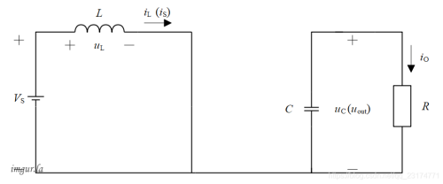

通过电路可以看出，此时输入电压给电感***L***充电，需要注意这时电感两端电压$u_{L}$的极性为左正右负，并且随着时间的增加，电感上的电流$i_{L}$（即输入电流$i_{S}$）不断增大。此时二极管***VD***反向截止，相当于断路。而此时的电容***C***向负载***R***放电，随着时间的增加，电容***C***两端的电压$u_{C}$（即输出电压$u_{out}$）在不断减小。

- 当控制端的输入信号$u_{GS}$为低电平时，此时开关管***VQ***截止，相当于断路，其等效电路如图所示。

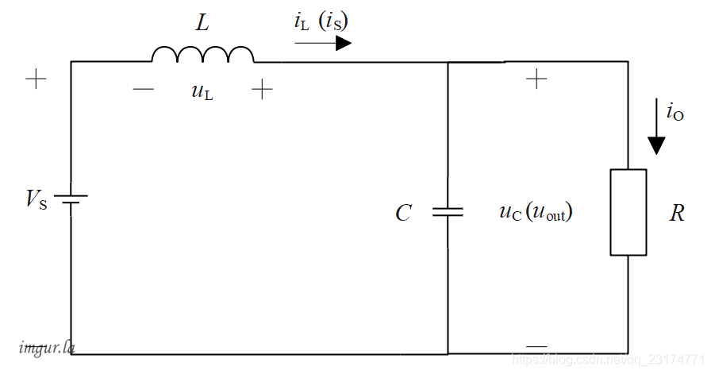

此时电感***L***两端电压$u_{L}$的极性变为右正左负，使得***VD***导通，电感放电，且随着时间的增加，电感上的电流$i_{L}$（即输入电流$i_{S}$）不断减小。这时输入电压$V_{S}$和电感***L***上的电压叠加起来，一起给电容***C***充电，同时给负载***R***供电。随着时间的增加，电容***C***两端的电压$u_{C}$即输出电压$u_{out}$）在不断增加。

  
#### 扩展buck-boost电路应用
- boost电路
- buck-boost电路（负压）
- 四开关==Buck-boost电路==[^Buck-boost电路]（正压）
---
### 二、芯片手册研读
---
### 选型
---

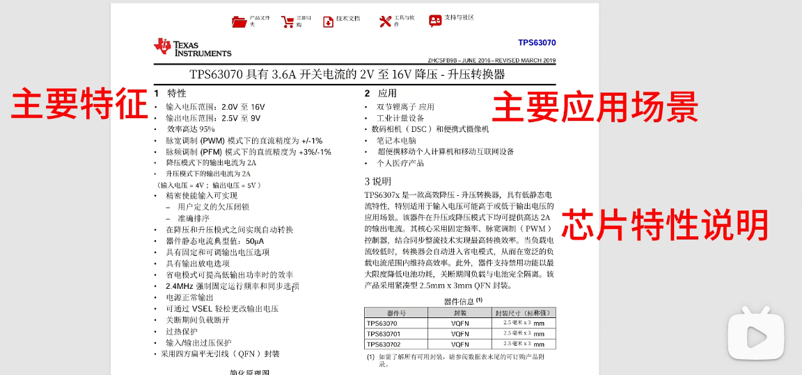

> 依据主要特征，应用场景与芯片特性作选择
---
### 原理图设计
---
- 引脚功能（PIN FUNCTIONS）：明白各个引脚功能与注意事项(相当于芯片需要遵守的规则)

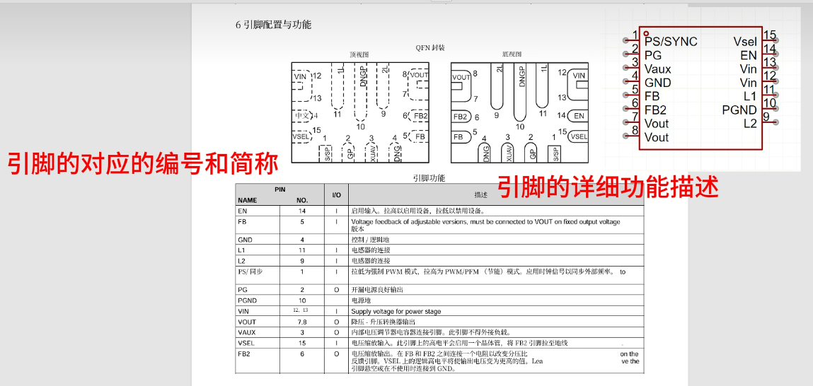

- 典型应用电路：借鉴外围电路并根据自身需求作更改

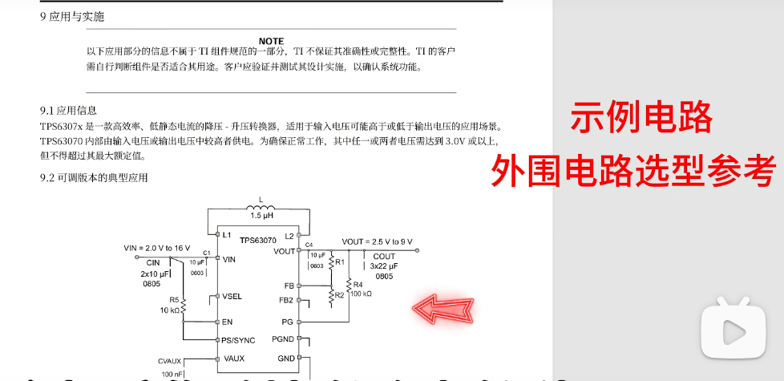

- 操作:依据手册操作提示作更改

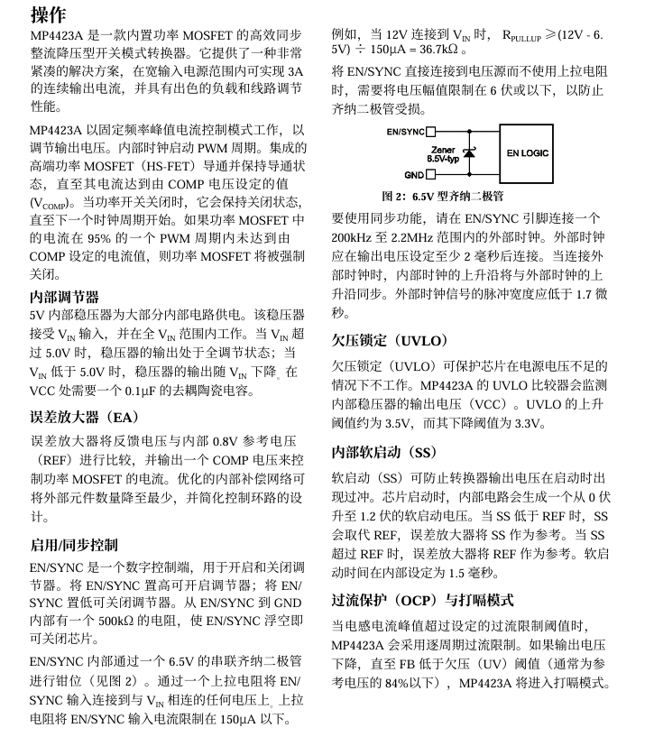

---
### PCB设计
---
-  Layout设计：通信与散热问题
> 使用推荐的PCB布局才能更好发挥芯片性能 

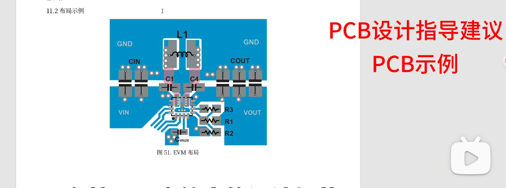
##

---
### 三、嘉立创EDA专业版的定义解析与操作步骤（实操比理论更重要）
---
### 原理图部分
---

##### 项目建立
> 这是设计的第一步。在嘉立创EDA中，需要创建一个新项目（Project），以便组织所有相关文件（如原理图、PCB、库文件）。项目文件有助于管理版本和协作。建议在开始时设置好项目名称和存储路径，避免混乱。

##### 建立原理图与pcb：
> 在项目中，需要分别创建原理图文件（.sch）和PCB文件（.pcb）。这两者通常通过“设计”菜单中的“更新PCB”或类似功能关联起来，确保原理图的更改能自动同步到PCB布局。

##### 元件库和立创商城：
> 嘉立创EDA提供了内置元件库，包含常用元件符号和封装。还可以从立创商城（LCSC）直接搜索和导入元件。建议在设计前先确认所需元件是否在库中，或学习如何自定义库元件。

##### 电气工具和绘图工具：

> 电气工具：包括导线（Wire）、总线（Bus）、端口（Port）等，用于建立电气连接,确保信号正确传递。
绘图工具：如文本、线条、形状等，用于添加==注释==或图形，这些工具常用于标注设计说明。

##### 基本操作（缩放、连线、空格、改快捷键等）：

> - 缩放：使用鼠标滚轮或快捷键（如Ctrl+滚轮）调整视图，方便细节查看。
> - 连线：通过点击元件引脚绘制导线，确保连接正确。嘉立创EDA有自动连线功能，但极容易出错，不建议使用。 
> - 空格：用于旋转元件，在放置时调整方向。
> - 改快捷键：自定义快捷键可以提高工作效率（通过设置菜单修改）。建议熟悉默认快捷键，并根据习惯优化。
这些操作是基础，熟练后能大幅提升设计速度。

##### 绘制原理图：
> 实际绘制电路图的过程：放置元件、连接导线、添加标签和注释。确保逻辑清晰，避免交叉或未连接的点。使用“网络标签”（Net Label）简化复杂连接。绘制时，保持原理图整洁，便于后续检查和调试。

##### DRC检测：
> Design Rule Check（设计规则检查）用于验证原理图的电气正确性，如未连接引脚、短路或冲突。运行DRC before proceeding to PCB可以提前发现错误。嘉立创EDA的DRC工具会提示问题，修复后再继续。

##### 导出bom：
> Bill of Materials（物料清单）列出所有元件及其参数（如值、封装、数量）。导出BOM后，可用于采购或成本估算。嘉立创EDA支持导出Excel或CSV格式，并可直接链接到立创商城下单。

##### 下单：
> 通过嘉立创平台（如立创商城）下单PCB制造或元件采购。集成功能允许一键从BOM导入元件列表，简化流程。确保BOM准确，以避免采购错误。

##### 更新PCB：
> 将原理图更改同步到PCB布局。这通过“设计” > “更新PCB”完成，它会添加新元件、删除旧元件或调整网络。更新后，PCB布局会自动反映原理图变化，但需手动调整布局和布线。
---
### PCB部分
---
PCB部分涉及物理布局和制造准备。

##### 基本设置（板框绘制、DRC设置）：

> - 板框绘制：定义PCB的物理尺寸和形状，使用线条或矩形工具绘制。板框决定了PCB的外形，需符合机械要求。
>- DRC设置：配置设计规则，如最小线宽、间距、孔径等。这些规则基于制造能力（如嘉立创的工艺要求），设置好后DRC会自动检查违规。建议在开始布局前设置DRC，以避免后续返工。

##### 基本操作（空格、缩放、连线、交叉选择、3D、显示单层等）：

>- 空格：旋转元件或对象，便于布局。
>- 缩放：调整视图以查看细节或整体布局。
>- 连线：在PCB上绘制导线（Tracks），连接元件引脚。使用自动布线工具可节省时间，但手动布线能优化信号完整性。
>- 交叉选择：在原理图和PCB之间高亮相关元件，方便对照修改。
>- 3D：查看PCB的3D模型，检查元件放置和机械兼容性。
>- 显示单层：单独显示某一层（如Top Layer或Bottom Layer），用于调试或检查特定层。
这些操作帮助高效完成布局，尤其是3D和交叉选择功能，能减少错误。

##### 绘制PCB：
> 实际布局过程：放置元件、布线（手动或自动）、添加==过孔==和==泪滴==。考虑因素包括信号完整性、热管理和EMC。建议先放置关键元件（如IC），再布线电源和信号线。使用网格和对齐工具保持整洁。

##### 铺铜：
> 添加铜皮（Copper Pour）用于接地或电源网络，以减少噪声、改善散热。在嘉立创EDA中，您可以选择网络（如GND）并绘制铺铜区域。==设置铺铜规则为直连==。设置为‘直连’可以为大电流路径提供最低的阻抗和最好的散热效果。

##### DRC检测：
> 再次运行DRC，检查PCB是否符合规则（如线宽、间距、未连接网络）。这是制造前的关键步骤，修复所有错误以确保PCB可生产。嘉立创EDA的DRC报告会详细列出问题。

##### 调整丝印：
> 丝印层（Silkscreen）用于添加文本和标识（如元件值、版本号）。==调整丝印方向一致==以方便后续焊接辨识元件位置。

##### 下单：
> 生成Gerber文件，通过嘉立创平台（如立创商城）下单PCB制造。导入Gerber文件生成订单。
----
### 四、设计实例（以一个DC-DC为例子）
---
#### 12V转3v3电源模块设计
> 要求：设计一个12v转3v3的电源模块
---
#### 1、选型：mp4423芯片

   

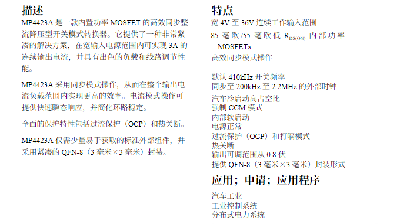

#### 2、建立工程

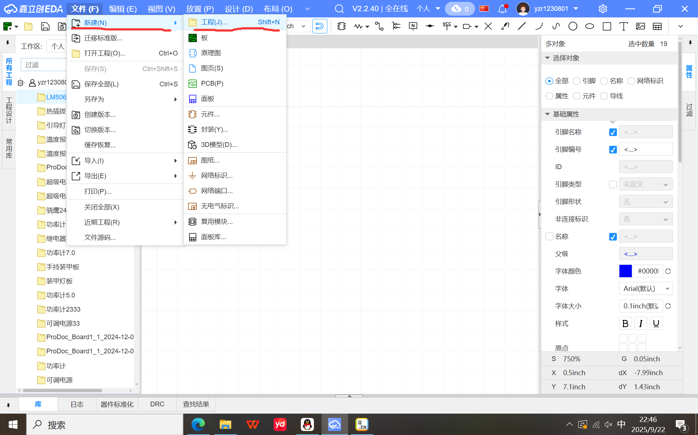

   

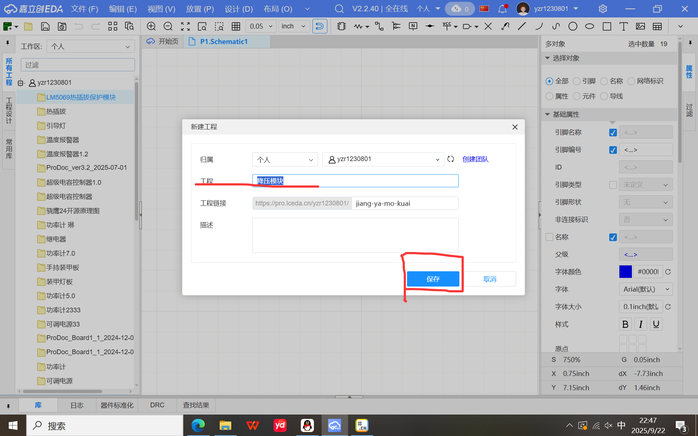

#### 3、参考典型应用电路设计
>保证芯片能正常运行   

> 并依据芯片的引脚作用与电气特性为外围元器件作选型

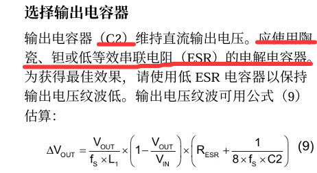

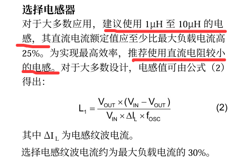

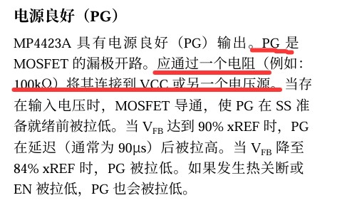

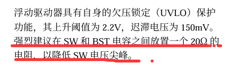

> 在我们的设计实例中，目标是获得一个3.3V的输出电压。通过查阅手册中提供的典型应用电路图（见 Page 12），可以看到官方给出的参考设计正是3.3V/3A的输出，其反馈电阻R1为41.2kΩ，R2为13kΩ。

>虽然我们可以直接采用这些值，但作为一名合格的工程师，我们应当具备验证其正确性的能力。这是一个将理论应用于实践的关键步骤，能够让我们从“复制电路”提升到“理解电路”。

**现在，我们利用手册 `Page 15` 提供的输出电压设置公式来亲手验证这些电阻值的正确性。**

**1. 找到核心公式与参数**:
    * 在datasheet的“设置输出电压”一节中，给出了计算反馈电阻R2的公式 ，这个公式是基于标准的电压反馈环路推导出来的。
    * 从该公式 $R2=\frac{R1}{\frac{V_{ouT}}{0.792V}-1}$ 中，我们可以得知芯片内部的基准电压 (Reference Voltage) 为 **0.792V**。
    * 因此，输出电压 $V_{OUT}$ 和反馈电阻 R1、R2 的关系遵循标准的电压分配公式：
        $$V_{OUT} = V_{REF} \times (1 + \frac{R1}{R2})$$
        其中，$V_{REF}$ 就是0.792V。
         
**2. 代入参数进行计算**:
    * 我们将典型应用电路中的电阻值代入上述公式：
        * R1 = 41.2kΩ 
        * R2 = 13kΩ 
    * 计算过程如下：
        $$V_{OUT} = 0.792V \times (1 + \frac{41.2k\Omega}{13k\Omega})$$
        $$V_{OUT} = 0.792V \times (1 + 3.16923)$$
        $$V_{OUT} = 0.792V \times 4.16923$$
        $$V_{OUT} \approx 3.302V$$
 
**3. 得出结论**:
    计算结果约为 **3.302V**，与电路图标称的 **3.3V** [cite: 2499] 基本完全一致（细微差别源于电阻的标称值精度）。这有力地证明了手册中典型应用电路的参数是正确无误的。

>通过这个简单的验证过程，我们不仅确认了电路设计的正确性，也加深了对DC-DC转换器是如何通过外部反馈电阻来设定输出电压的理解。在未来的设计中，当你需要设定一个不同的输出电压（例如5V）时，就可以充满信心地运用这个公式来计算所需的电阻值了。

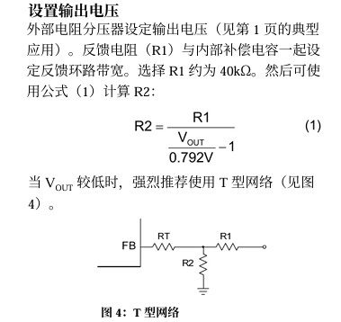

#### 4、（在检查原理图-DRC后）导入原理图进行PCB设计

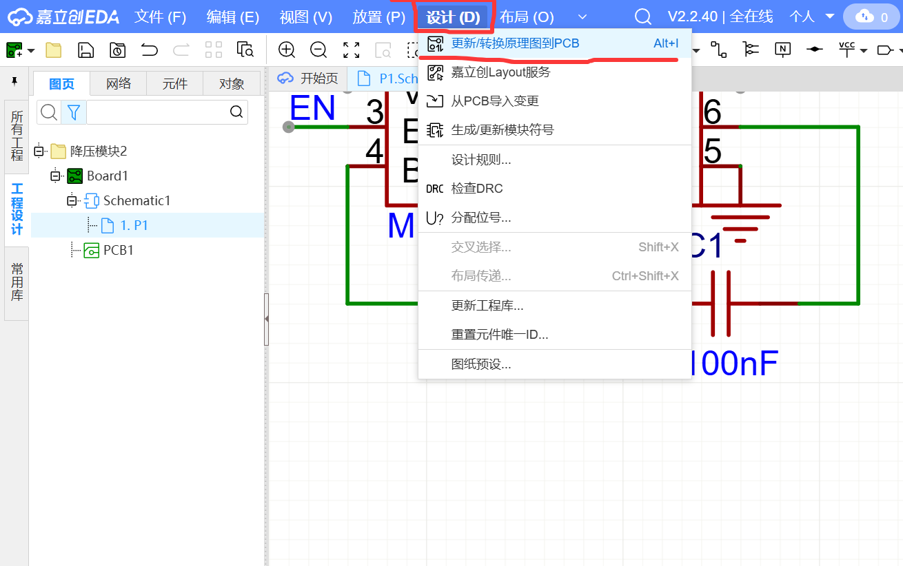

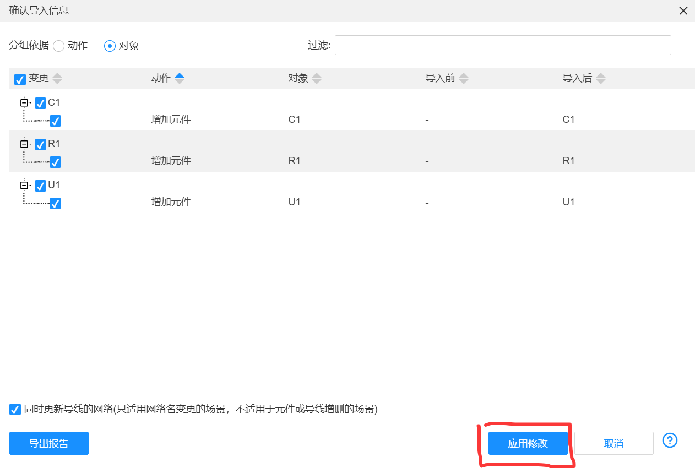

> 依据芯片手册推荐PCB布局绘制

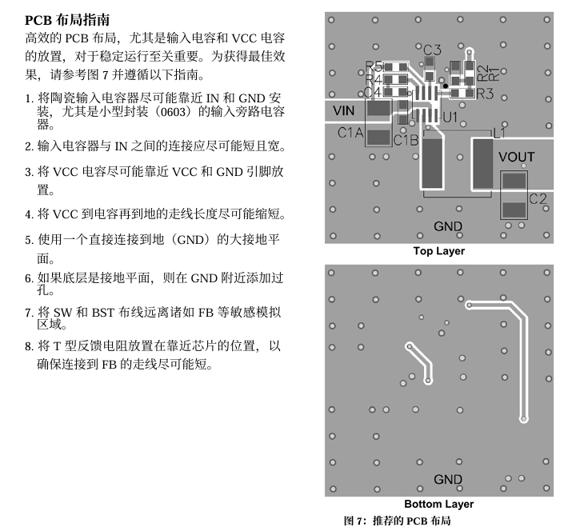

>该示例仅设计一个简单电源模块，若是设计一块功能完整的板子，可继续以下==下单==流程（==下单前应先找人审核原理图与PCB再发加工==）
---
#### 下单流程与注意事项
---
#### （1）（在检查DRC后）PCB下单

>空白选择处基本以免费为选择项。另外PCB下单每月有两张优惠券领取实现免费下单，可上网寻找领取方法。

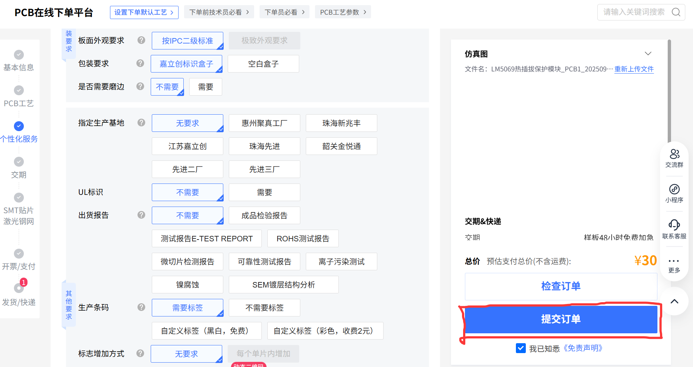

> 订单提交后依据提示付费即可

#### （2）元器件下单

> 检查元器件是否正确（若器件无货或不符合可点击更换型号或回到设计阶段重新选型），接着点击一键下单

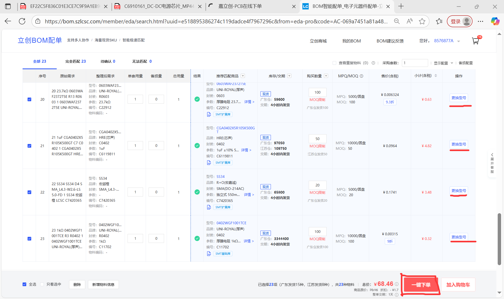

> 新增我校发票信息作后续报销使用，最后提交订单

>至此完成了一块板子从设计要求到发加工的全过程

[^buck-boost电路]:dcdc升降压电路特点
1:设计方案非常成熟
2:转换效率高一般能到90%以上
3:原理简单
4:能满足大功率输出的要求

[^Buck-boost电路]:Q1和Q3同时工作，Q2和Q4同时工作。并且两组MOS交替导通，如右图。如果把Q2和Q4换成二极管，那么也是同样能工作，只不过没有同步整流。
   对于这种控制方式，在CCM(连续导通模式)情况下我们可以得到公式：Vin*D=Vout（1-D）也就是说，Vout=Vin*D/(1-D).  这个电压转换比和我们常见的buck-boost是一样的。

[^LDO]:线性稳压器（LDO)
1.输出电压只能低于输入电压
2.输出电流一般较小
3.原理简单
4.设计简单，占用面积小
5.一般转化效率不高

[^调节电压的mos管]:LDO内部基本都是由4大部件构成，分别是分压取样电路、基准电压源、误差放大电路和晶体管调整电路。
[1]分压取样电路： 通过电阻R1和R2对输出电压进行采集；
[2]基准电压： 通过bandgap（带隙电压基准）产生的，目的是为了温度变化对基准的影响小；
[3]误差放大电路： 将采集的电压输入到比较器反向输入端，与正向输入端的基准电压（也就是期望输出的电压）进行比较，再将比较结果进行放大；
[4]晶体管调整电路： 把这个放大后的信号输出到晶体管的控制极（也就是PMOS管的栅极或者PNP型三极管的基极），从而这个放大后的信号（电流）就可以控制晶体管的导通电压了，这就是一个负反馈调节回路。

