# 哈尔滨工业大学（深圳）南工骁鹰战队

-----

<h2 style="text-align:center;"\> 硬件组第二次培训讲义——STM32&通信协议入门 </h2>

***
#### 撰写人：陈琳        
#### 审核人：张韶恒
---
## 目录/教学要点
---

***1. 初识STM32*** -[跳转](#1-初始STM32) 

***2. CubeMX配置流程*** -[跳转](#2-cube)

***3. GPIO与TIM***  -[跳转](#3-GPIO与TIM)

***4. 常见通信方式与协议的介绍*** -[跳转](#4-通信协议)

---
<a id="1-初始STM32"> </a>
### 一、初始STM32


---

在一片集成电路芯片外集成中央处理器、存储器、I/O接口电路，构成的一个完整的计算机系统，称为单片微型计算机 ，因此就简称为单片机（`Single Chip Microcomputer`）。简单来说，单片机就是一个微型计算机。

STM32就是一款应用十分广泛的单片机。它是ST公司基于ARM Cortex-M 内核开发的32位微控制处理器（`MCU，Microcontroller Unit`）。

引出芯片所提供的所有接口，并和外设、元器件集成到一块PCB（`Printed Circuit Board`）上，就构成了最小系统板。

通过这些外设，可以利用STM32实现丰富多样的功能，如点亮LED，驱动电机，控制彩屏，也可以感知温度湿度，测量电压电流，远距离通信，甚至可以搭建网络服务器，实现一个游戏机——可以说，有自动化的地方就可以有它的身影。

STM32有诸多系列，根据实际情况对性能的要求，可以选择不同的芯片。这些系列一般包括主流产品（F0、F1、F3）、超低功耗产品（L0、L1、L4、L4+）和高性能产品（F2、F4、F7、H7）。

一片STM32芯片的命名规范如下，可以由数据手册查到。下面以STM32F103RBT6为例：

<p align="center"> </p>​

STM32的开发方式有以下三种：

- 直接读写寄存器：非常底层，运算效率高。但是需要查手册来看各外设对应寄存器的配置，比较麻烦。
- 标准库：对读写寄存器的操作进行了一定程度的函数封装（目前库函数已停止更新）
- HAL库：全称`Hardware Abstraction Layer`，即硬件抽象层，是ST公司目前力推的开发方式。
---
<a id="2-cube"> </a>
### 二、CubeMX的配置

---

CubeMX是意法半导体公司开发的一款图形化工具，可以通过分布过程为STM32处理器配置引脚并生成初始化C代码的工具。

我们使用CubeMX主要是使用其引脚规划和分配的功能。队里一般使用的环境配置参照这个视频：[番外篇 Windows下环境配置 【南工骁鹰嵌入式软件培训】_哔哩哔哩_bilibili](https://www.bilibili.com/video/BV1214y1j7Vw?spm_id_from=333.788.videopod.sections&vd_source=c05300c7436196d7925b29df2626bcee)，使用的是CubeMX + VSCode + Ozone。也有其它的方案，比如CubeMX + Keil5的，参照这个视频：[第零节 开发环境搭建_哔哩哔哩_bilibili](https://www.bilibili.com/video/BV1Sy4y1y7B1?spm_id_from=333.788.videopod.episodes&vd_source=c05300c7436196d7925b29df2626bcee&p=2)

---
<a id="3-GPIO与TIM"> </a>
### 三、GPIO与TIM

---

### 1. GPIO
---
### 简介

​`General Purpose Input Output`，即通用I/O端口，是STM32的一种外设。

GPIO按照A、B、C...来命名，每个GPIO外设有16个引脚，定义为PX0~15。

一般来说引脚可支持电平为0V~3.3V，部分引脚可容忍5V(`Five Tolerate, FT`)。单片机内部通常将高电平，如3.3V，认为是逻辑1；而低电平0V则被认为是逻辑0.

<p align="center"> </p>

（VCC通常为单片机供电电压，为3.3V）

左图中，使用GPIO的输入功能来监测按钮的开闭情况：按钮松开时，IO口的电平被上拉电阻拉至VCC，读到的数据是1；按钮闭合时，电阻下端的节点接地，读到的数据是0。

右图中，使用GPIO的输出功能来控制LED的亮灭：IO口写1，输出高电平，LED点亮；IO口写0，LED无法导通，状态为熄灭。

GPIO的内部结构图：

<p align="center"> </p>​

由于外部信号极有可能会出现脉冲等噪声的影响，为了让信号更加清晰，所以就设置了TTL肖特基触发器（相当于一个滞回比较器）。<p align="center"> </p>​

图为加入TTL肖特基触发器前后对信号处理的效果

‍

### 八种模式

GPIO可以配置成八种模式：输入浮空、模拟输入、输入上拉、输入下拉、开漏输出、推挽输出、推挽式复用功能和开漏复用功能。

#### 输入浮空

<p align="center"> 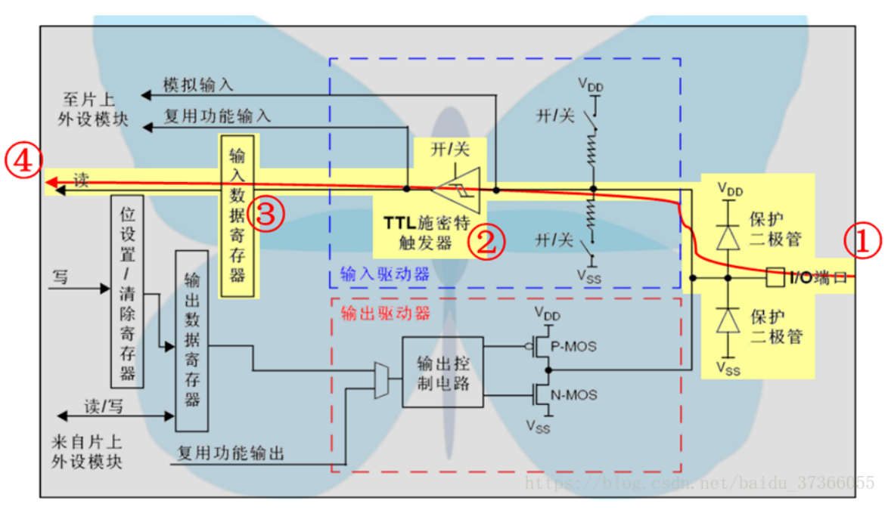</p>​

（上图中的TTL施密特触发器应为TTL肖特基触发器，下面同理）

通俗讲浮空就是浮在空中，就相当于此端口在默认情况下什么都不接，呈高阻态，这种设置在数据传输时用的比较多。

一般实际运用时，不建议让引脚悬空，因为外部电压有不确定性。

#### 模拟输入

<p align="center"> </p>​

一般是将外部的模拟信号输入到内部的ADC（模数转换器）中。信号不经过TTL肖特基触发器，不会被整形。

#### 输入上拉

<p align="center"> </p>​

拉就是把点位拉高，比如拉到Vcc；上拉就是将不确定的信号通过一个电阻钳位在高电平。电阻同时起到限流的作用。

图中的指出的上拉电阻处的开关在GPIO配置成输入上拉模式后会闭合。当外部电压（即I/O端口处）为低电平时，单片机读到的数据是低电平；但如果不是低电平，流入TTL肖特基触发器的电平都将被上拉电阻拉至VCC。

#### 输入下拉

<p align="center"> </p>​

就是把电压拉低，拉到GND。与上拉原理相似，图中的下拉电阻处的开关会闭合。

#### 推挽输出

<p align="center"> </p>​

推挽是指两个三级管或MOS管分别受到互补信号的控制，在一个管子导通的时候另一个总是截止。推挽输出中，PMOS和NMOS都工作，对于高低电平均有较强的驱动能力。

数据寄存器为1，上管导通、下管关断，输出VCC；数据寄存器为0，上管关断，下管导通。

<p align="center"> 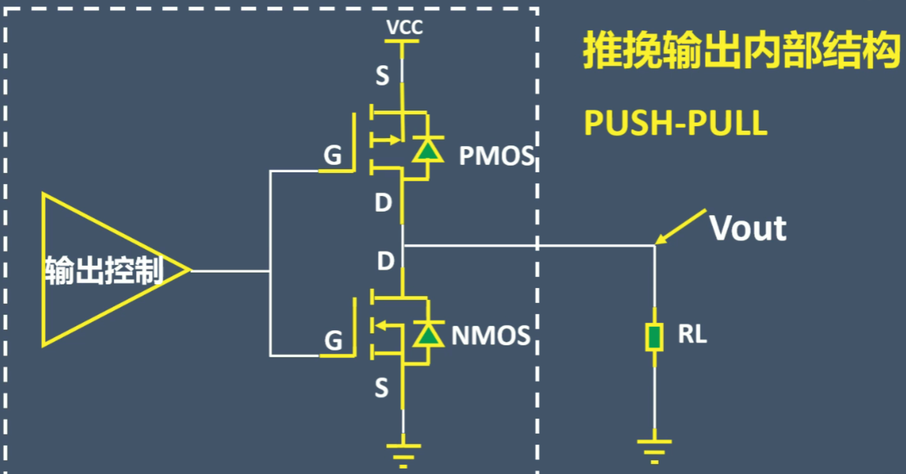</p>​

但推挽输出的一个缺点是，如果当两个推挽输出结构相连在一起，一个输出高电平，即上面的MOS导通，下面的MOS闭合时；同时另一个输出低电平，即上面的MOS闭合，下面的MOS导通时，电流会从第一个引脚的VCC通过上端MOS再经过第二个引脚的下端MOS直接流向GND。整个通路上电阻很小，会发生短路，进而可能造成端口的损害。这也是为什么推挽输出不能实现“线与”的原因。

#### 开漏输出

<p align="center"> </p>​

只有NMOS工作，PMOS不工作；

数据寄存器为1，下管断开，输出为高阻模式（漏极相当于开路，所以叫开漏）；数据寄存器为0，下管导通，输出低电平。

<p align="center"> </p>该模式只有低电平有驱动能力，因此如果想要在使用该模式时还能输出高电平，需要外接上拉电阻（一般为4.7k）。

开漏输出可以很方便的调节输出的电平，因为输出电平完全由上拉电阻连接的电源电平决定，所以在它比较适合使用在需要电平转换的地方。（相比推挽输出，在外接上拉电阻后高电平的数值调整更自由。）

开漏输出的另一个好处在于可以实现"线与"功能。所谓的"线与"指的是多个信号线通过一根总线连接在一起。只有当所有信号全部为高电平时，总线上电平为高电平；只要有任意一个或者多个信号为低电平，总线为低电平。而推挽输出就不行，如果高电平和低电平连在一起，会出现电流倒灌，损坏器件。

#### 复用功能：

很少用到，这里不讲。

---

### Cube中的配置：

打开CubeMX新建工程后，可以看到右侧显示有芯片及其引脚分布。点击任一想要配置的引脚，在下拉菜单中可以选择GPIO的输入`GPIO_Output`或输出`GPIO_Input`功能。<p align="center"> </p>​

点击右侧System Core - GPIO，再点击对应的GPIO编号，可以配置GPIO的各种参数：

<p align="center"> </p>​

#### GPIO mode

##### **输出**

- ​`Output Push Pull`: 推挽输出，芯片绝对控制芯片输出电平高低（最常用）
- ​`Output Open Drain`:开漏输出，只有下拉的NMOS起作用，通常用于某些通信中。

  例如配置iic时系统自动配置了复用开漏输出功能：

  <p align="center"> 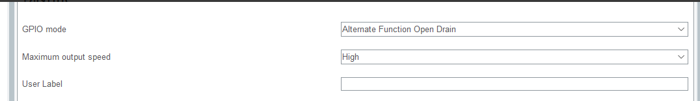</p>

##### **输入**

- ​`No pull-up and no pull-down`：默认不上拉也不下拉，会让引脚处于不确定的状态，一般不选
- ​`Pull-up`：上拉
- ​`Pull-down`：下拉

‍

#### GPIO Pull-up/Pull-down:

可以选择接入上/下拉电阻，或不接。

‍

#### Maximum output speed：

了解即可。

<p align="center"> </p>​

### 常用函数 --GPIO

```c
void HAL_GPIO_WritePin(GPIO_TypeDef *GPIOx, uint16_t GPIO_Pin, GPIO_PinState)
/**GPIO写函数
*参数1：GPIO_TypeDef *GPIOx，GPIO的端口，如GPIOA
*参数2：GPIO_Pin，GPIO的引脚号，如GPIO_PIN_13
*参数3：写入电平：GPIO_PIN_RESET（低电平），GPIO_PIN_SET（高电平）
如HAL_GPIO_WritePin(GPIOC, GPIO_PIN_13, GPIO_PIN_RESET)为给GPIOC的13号引脚写低电平
*/
```

```c
void HAL_GPIO_ReadPin(GPIO_TypeDef* GPIOx, uint16_t GPIO_Pin)
/**GPIO读函数
*参数1：GPIO端口
*参数2：GPIO引脚号
*返回值：引脚电平
*/
```

```c
void HAL_GPIO_TogglePin(GPIO_TypeDef *GPIOx, uint16_t GPIO_Pin)
/**GPIO电平翻转函数
*参数1：GPIO端口
*参数2：GPIO引脚号
*/
```

‍

---

### 2. TIM
---
### 认识STM32的时钟系统

时钟是单片机运行的基础，时钟信号推动单片机内各部分执行相应的指令，好比CPU的脉搏，决定CPU的速率。单片机内部外设都是基于时序逻辑电路搭建的，与时序有关的数字电路都需要一个定时系统来支持。每个外设都应工作在某一频率的时钟之下。

STM32有四个时钟源：

- 高速外部时钟：`HSE`​
- 低速外部时钟：`LSE`​
- 高速内部时钟(RC)：`HSI`​
- 低速内部时钟(RC)：`LSI`​

主频接的时钟源是高速外部时钟，是板子上集成的石英晶振（每块板子一般都要有）。配置时钟树时应该提前查好对应的频率并填入相应的位置。

​`HSE`和`HIS`频率是一样的，但是外部时钟接的石英晶振比内部的RC震荡电路产生的频率更稳定，所以一般都选`HSE`。

通过在时钟树中配置时钟源的选择和倍频分频系数，即可配置系统时钟频率和外设频率。

时钟树的简图：

简单来说，`外部时钟信号HSE`通过一系列分频、倍频后进入`AHB分频器`。时钟信号于是就分为两路，一路进入`APB1分频器`，另一路进入`APB2分频器`，这两路时钟信号分别给`APB1总线`和`APB2总线`提供时钟信号。单片机的外设各自搭在这两条总线上，从上面获取时钟信号。

<p align="center"> </p>​

Cube中`Clock Configuration`界面：

一般来说，在填入正确的外部时钟晶振频率、勾选了`HSE`-`PLLCLK`后，在`HCLK`上输入想要的频率后点击回车键，CubeMX可以自动配置每一外设的频率。

<p align="center"> </p>​

### TIM介绍

TIM是一个定时器，与时钟树不是一个概念：时钟树控制着整个系统的时钟频率，而TIM是在时钟树分频后的某个频率下的用于计数的外设。简单来说，TIM就是一个计数器。

<p align="center"> 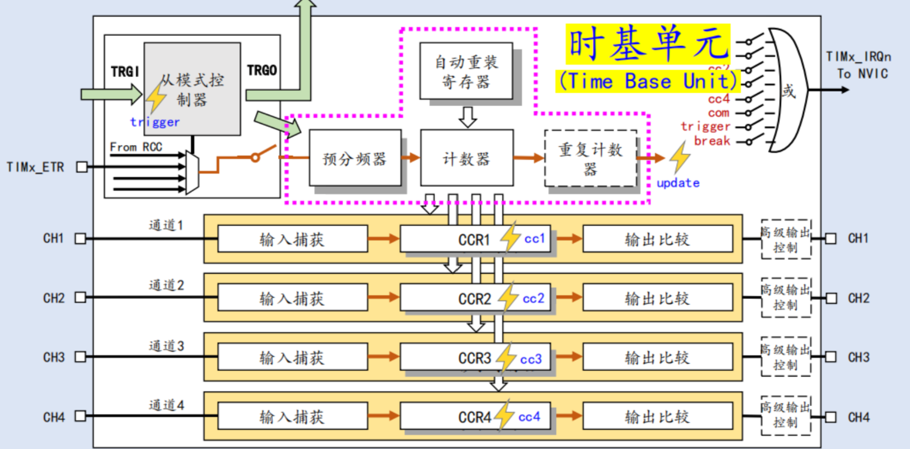</p>​

TIM的结构简图

#### TIM的时基单元

<p align="center"> 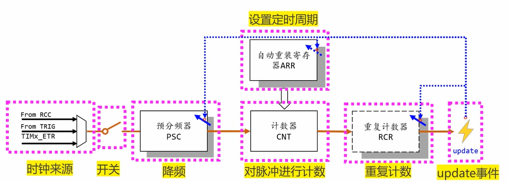</p>​

##### 时钟来源

<p align="center"> 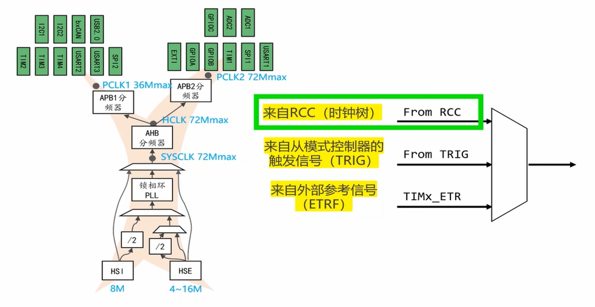</p>​

TIM有三种时钟信号来源，其中RCC就是来自外部信号分频后得到的信号，一般都选择它。

##### 预分频器PSC：

- ​`Prescaler`， 实现降频功能

- 分频系数 = PSC + 1

- PSC 范围在 0 ~ 65535 间

##### 自动重装寄存器 ARR 与 计数器 CNT

- ARR :` Auto Reload Register`， 设置定时周期；
- CNT：对脉冲计数
- ARR 和 CNT 的范围都在 0 ~ 65535 间
- 计数方式：

  - TIM有三种计数方式：

    - 向上计数（一般用这个）：假设自动重装寄存器值为N，那么计数器在经过N个脉冲后，也会计数到N(初值为0)，再来一个脉冲就会溢出，向后产生一个脉冲并且计数器归0，所以计数的个数是N+1，也就是输入N+1个脉冲后，计数器值归0并产生一个脉冲。
    - 向下计数：假设自动重装寄存器值为N，那么计数器初值为N，在经过N个脉冲后，会降到0，再来一个脉冲就会溢出向后产生一个脉冲，并且计数器值归为N，所以计数的个数是N+1，也就是输入N+1个脉冲后，计数器值归为N并产生一个脉冲
    - 中心对齐（一般不用）<p align="center"> </p>​

##### 重复计数器RCR：

<p align="center"> </p>​

- ​`Repetition Counter Register`​
- 重复计数次数 = RCR + 1
- RCR 范围在 0 ~ 65535 间
- 只有高级定时器才有RCR

##### 一个例子：

如何实现秒针每转5圈响铃一次：

<p align="center"> </p>​

假如外部时钟信号为32.768k，每当有一个update事件就表示响铃1次；秒针每秒转1次，也就是说，PSC降频后的信号为1Hz，同时计数方式为上计数。所以

- 将PSC设置为32768-1，得到1Hz
- 将CNT设置为60-1，使得每60秒就转1圈；
- 将RCR设置为5-1，使得每5圈产生一次update事件，即响铃。

##### TIM寄存器的预加载机制

寄存器预加载相当于一个缓冲机制：

<p align="center"> 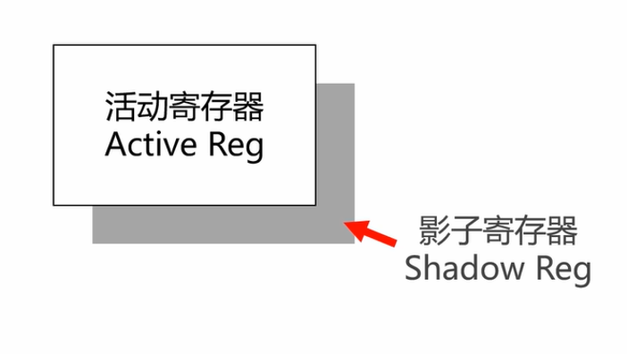</p>  
比方说我们想向寄存器写值。值先进入影子寄存器，在某一事件发生后，影子寄存器里的值进入到活动寄存器，值才生效。

这是为了安全起见，比如在定时器运行的过程中突然改变ARR的值：

<p align="center"> 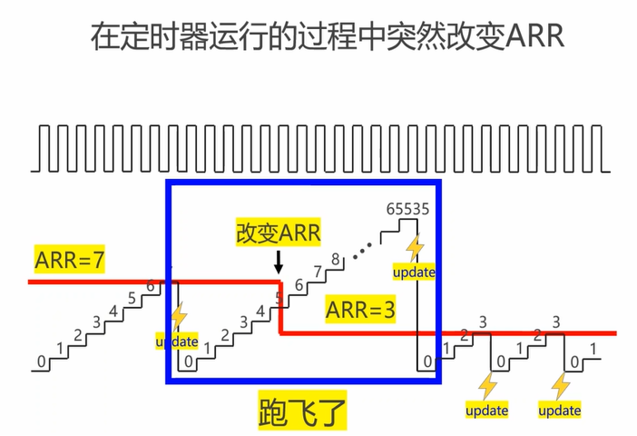</p>​

假如这时CNT的值比新的ARR大。在向上计数模式下，CNT会一直递增，那么无论如何都会比ARR大——除非计数到65535，CNT发生溢出，CNT才会比ARR小，计数才恢复正常。

我们将CNT比ARR大的那段异常波形称作定时器跑飞了，这是我们不希望发生的。

如果使用了ARR寄存器的预加载：

<p align="center"> </p>​

新写入的ARR被写入了影子寄存器里，而没有实际生效，所以还是八个脉冲发生一次溢出，并产生一次update事件。

由于该update事件发生了，影子寄存器里的值就会进入到活动寄存器中。之后就可以按照新的定时周期开始计数了。

一般来说，PSC、RCR的预加载是强制打开的，ARR的要手动打开（在Cube中选定即可）

#### 在Cube中配置时基单元

设置脉冲来源$\to$设置ARR（记得-1）$\to$设置PSC（记得-1）$\to$设置计数方式

<p align="center"> 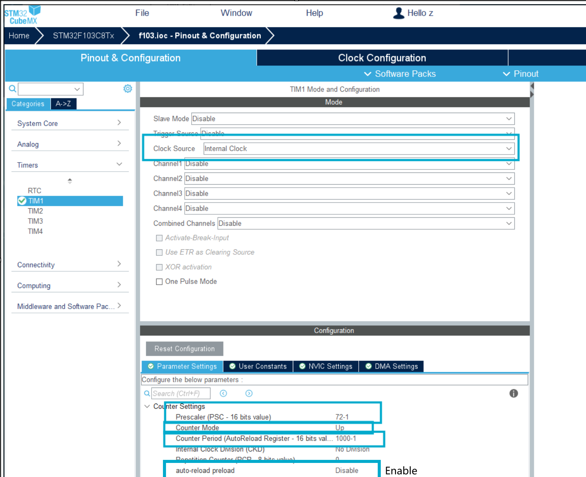</p>​

‍

#### TIM的分类

STM32中的TIM分为三大类：基本定时器（TIM6和TIM7）、通用定时器（TIMx）和高级控制定时器（TIM1和TIM8）。

基本定时器具有最基本的定时功能，可编程控制定时周期，计数器溢出能产生中断/DMA请求。

通用定时器除了基本定时器的功能外，还可配置计数器装载方式，具有4个独立通道，每个通道均可进行输入捕获、输出比较、PWM输出以及单脉冲模式。中断源更多（向上溢出/向下溢出、计数器初始化/启动/停止、输入捕获、输出比较等）。

高级定时器在通用定时器的基础上，还增加了数个功能：可输出嵌入<u>死区时间</u>的互补PWM、允许在指定数目的计数器周期之后更新定时器寄存器的重复计数器、刹车输入信号可以将定时器输出信号置于复位或者一个已知状态，中断源也多了一个<u>刹车</u>信号输入。

死区：通常来说，大功率电机、变频器等，末端都是由大功率管、IGBT等元件组成的H桥或3相桥。每个桥的上半桥和下半桥是是绝对不能同时导通的。但高速的PWM驱动信号在达到功率元件的控制极时，往往会由于各种各样的原因产生延迟的效果，造成某个半桥元件在应该关断时没有关断，造成功率元件烧毁。死区就是在上半桥关断后，延迟一段时间再打开下半桥；或在下半桥关断后，延迟一段时间再打开上半桥，从而避免功率元件烧毁。这段延迟时间就是死区（在这段时间中，上、下半桥的元件都是关断的）。死区时间控制在通常的低端单片机所配备的PWM中是没有的。

刹车功能的目的是保护由这些定时器生成的PWM信号所驱动的功率器件。当被故障触发时，刹车电路会关闭PWM输出，并将其强制设为预定义的安全状态。

‍

#### TIM的更新中断

中断是指，主程序运行过程中，出现了特定的中断触发条件（即中断源），使得CPU暂停当前运行的程序，转而去处理中断程序，处理完成后有返回来原来被暂停的位置继续运行。

定时器的中断中，更新事件可以作为一个中断源来产生中断，因此我们利用中断函数来给更新事件计数。<p align="center"> </p>​

记得给update interrupt使能：

<p align="center"> 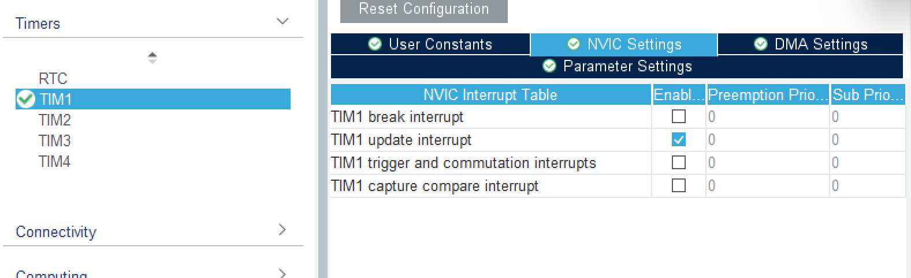</p>​

##### 以中断方式使用时基单元的函数：

<p align="center"> </p>​

```c
HAL_StatusTypeDef HAL_TIM_Base_Start_IT(TIM_HandleTypeDef *htim);
/**
*以中断方式启动时基单元
*参数htim：定时器句柄的指针
*如：HAL_TIM_Base_Start_IT(&htim1);
**/

//对应的回调函数
void HAL_TIM_PeriodElapsedCallback(TIM_HandleTypeDef *htim)
{
	if(htim == &htim1)//固定写法，因为可能有多个定时器共用这个回调函数的情况，需要对句柄进行判断
	{
	}
}
```

关于回调函数：要使用时在驱动文件中寻找，weak表示弱定义，Callback就是回调。在使用时，需要将weak后面的部分复制到主文件的自定义函数那一栏中重新定义。在触发中断后，单片机所要执行的中断程序就是我们写的这个回调函数里面的程序。

<p align="center"> </p>‍

---


### 输出比较
---
### PWM
---
​`Pulse Width Modulation`，即脉冲宽度调试，可以产生一个由 TIMx_ARR 寄存器确定频率、由CCR寄存器确定占空比的信号。

CCR： `Capture / Compare Register` 捕获比较寄存器<p align="center"> </p>  
可以调制脉冲的周期 or 占空比，从而改变高&低电平的宽度，或等效模拟电压的大小（因应用需求而异）。

<p align="center"> </p>​

###### **PWM的三个参数：**

- 频率/周期

  - ​`Freq = CK_PSC / ((PSC + 1) * (ARR + 1))`​
  - 注：`CK_PSC`就是`TIMx_clk`​

- 占空比（duty): 在一个周期内高电平时长所占的比例

  - ​`Duty = CCR / (ARR + 1)`​

- 分辨率：占空比变化的快慢（细腻程度）

###### 在**Cube中的配置：**

- 挑一个通道

- 选择PWM Generation
- 填写各参数

<p align="center"> </p>​

##### 支持实现输出比较功能的内部结构：

<p align="center"> 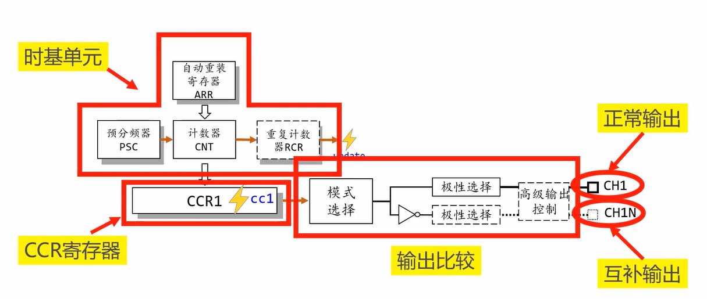</p>​

###### 模式选择：

根据CCR与CNT的比较结果，有不同的输出方式。一共有8种，一般用最后两种。

<p align="center"> 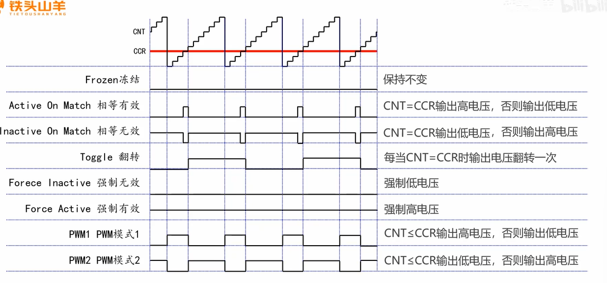</p>​

###### 互补输出：

只有高级定时器才有互补输出。

如在使用PWM驱动MOS管时使用：<p align="center"> 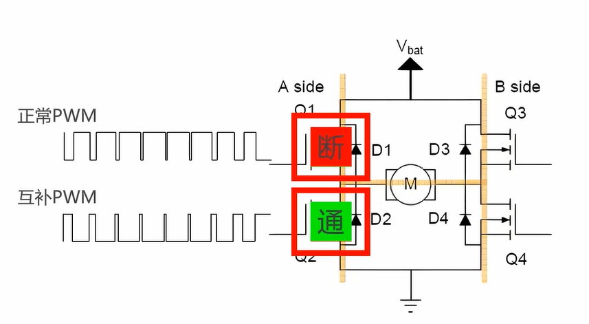</p>​

###### 极性选择：

有`Positive`正常输出 和 `Negative`互补输出两种：

- 两路都选正常输出：

<p align="center"> </p>​

- 一路选正常，一路选互补：

<p align="center"> 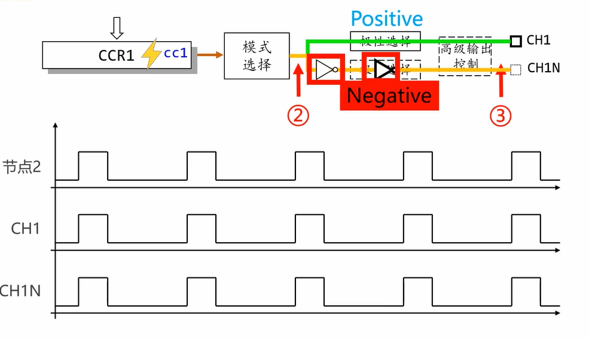</p>​

---
### 常用函数 --TIM
---
​`HAL_TIM_Base_Start();`​

- 功能：启动定时器基础计数。
- 参数：定时器句柄指针。
- 返回值：HAL状态。

​`HAL_TIM_Base_Stop();`​

- 功能：停止定时器基础计数。
- 参数：定时器句柄指针。
- 返回值：HAL状态。

​`HAL_TIM_Base_Start_IT();`​

- 功能：启动定时器基础计数并启用中断。
- 参数：定时器句柄指针。
- 返回值:HAL状态。

​`HAL_TIM_Base_Stop_IT();`​

- 功能：停止定时器基础计数并禁用中断。

- 参数：定时器句柄指针。

- 返回值：HAL状态。

​`HAL_TIM_PWM_Start();`​

- 功能：启动定时器的PWM输出。
- 参数：定时器句柄指针、PWM通道。
- 返回值：HAL状态。

​`HAL_TIM_PWM_Stop();`​

- 功能：停止定时器的PWM输出。
- 参数：定时器句柄指针、PWM通道。
- 返回值：HAL状态。

---
### 四、常见通信方式与协议的介绍
<a id="4-通信协议"> </a>

---
### 1. 通信方式介绍:
---
- #### 半双工/全双工/单工

- **单工：** 单方向收发数据，譬如，只能A发送数据，B接收数据。

- **半双工：** 双方分时收发数据，譬如，“A发送数据，B接收数据”或者“A接收数据，B发送数据”，两个方向不能同时进行。

- **全双工：** 双方同时收发数据，譬如，“A发送数据，B接收数据”同时“A接收数据，B发送数据”，两个方向同时进行。

- #### 同步/异步

- **同步：** 通信双方通过共享的时钟线来同步数据传输，确保数据按照同一节奏发送和接收。

- **异步：** 通信双方没有共享时钟信号，而是通过开始位、停止位和固定波特率实现同步。

- #### 串行/并行

- **串行通信：** 数据位通过单根线一一发送，下图显示了二进制（0100 0011）中字母“C”的串行传输。当时钟线为高电平时，接受数据。高电平为1，低电平为0。<p align="center"> 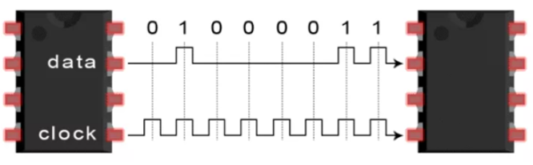</p>​

- **并行通信：** 数据位在导线中同时传输。下图显示了二进制（0100 0011）中字母“C”的并行传输。当时钟线为高电平时，8个数据位同时接受数据。高电平为1，低电平为0。

<p align="center"> 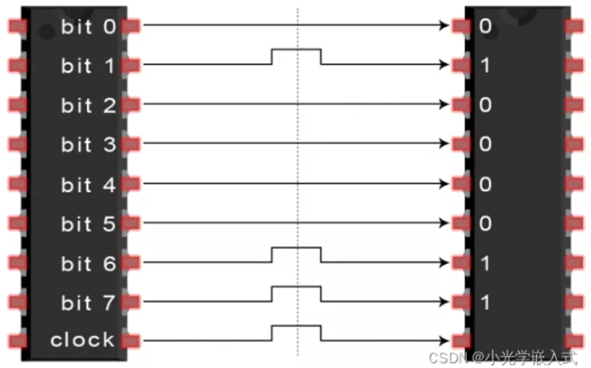</p>​

---
### 2. 常见通信协议介绍:
---
 #### 2.1 UART
---
串口通信：通用异步收发器，全称是 `Universal Asynchronous Receiver/Transmitter`。

(USART：通用同步/异步收发器，`Universal Synchronous Asynchronous Receiver/Transmitter`）<p align="center"> </p>​

- 全双工：TX，RX分别有一根线。

- 异步：没有时钟线

- 点对点：A只能与B通信
- 内部使用推挽输出

  <p align="center"> 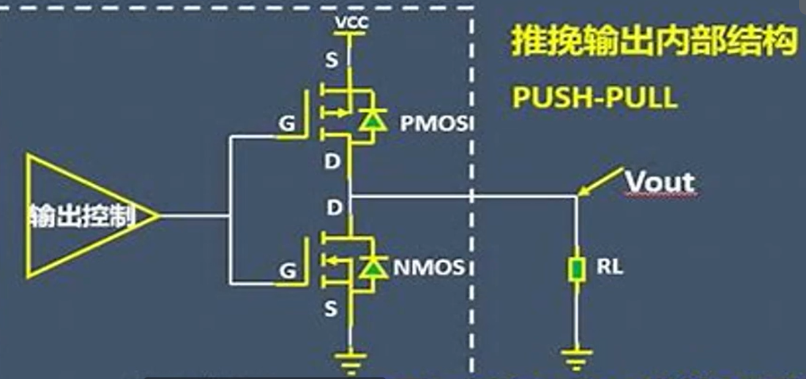</p>​
- 硬件连接：此RX接彼TX，此TX接彼RX

- TTL电平：逻辑1在2.4V - 5V 之间， 逻辑0在0 - 0.8V之间

- #### 数据帧格式：

<p align="center"> 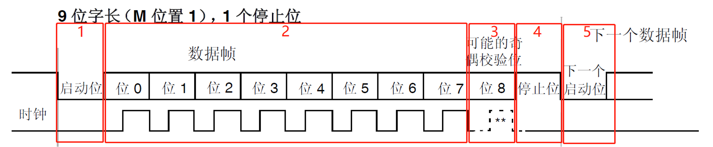</p>​

起始位 + 数据位 + 可能的奇偶校验位 + 停止位

- #### 空闲位或起始位

- 处于逻辑“1”状态，表示当前线路上没有资料传送，进入空闲状态。处于逻辑“0”状态，表示开始传送下一数据段。

- #### 数据位

- 紧接着起始位之后。数据位的个数可以是4、5、6、7、8等，依照2进制构成一个字符。通常采用ASCII码

  - ASCII码：`American Standard Code for Information Interchange`，即美国信息交换标准代码，主要用于显示现代英语。每一组二进制数代表特定字符<p align="center"> </p>​
- 从最低位开始传送，靠时钟定位。

- #### 奇偶校验位

- 奇校验：统计数据包里出现多少个1，假如出现奇数次1则该位置0，假如出现偶数次1则该位置1，以此来保证整段数据中1的个数为奇数次，借此校验资料传送的正确性。
- 偶校验：同理反之。
- 需要在两端设备同时都设置

- #### 停止位：

- 它是一个字符数据的结束标志。可以是1位、1.5位、2位的高电平
- 由于数据是在传输线上定时的，并且每一个设备有其自己的时钟，很可能在通信中两台设备间出现了小小的不同步。因此停止位不仅仅是表示传输的结束，并且提供计算机校正时钟同步的机会。适用于停止位的位数越多，不同时钟同步的容忍程度越大，但是数据传输率同时也越慢。

- #### 波特率
<p align="center"> 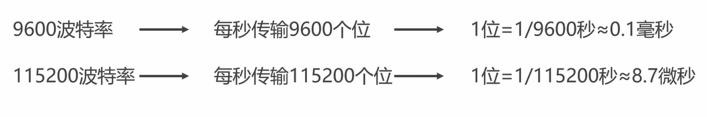</p>​

- 即每秒传输的二进制位数， 用`b/s (bps)`表示。
- 收发双方需选择一样的波特率。
- 波特率越高，传输速度越快   
---    
### 2.2 RS232、RS485

UART的一种变种。

---
- ### RS232

TTL信号受到干扰时容易被干扰，因此引入了232电平：

<p align="center"> </p>​

电平使用负逻辑，逻辑1定义为-3V - -15V，逻辑0定义为+3V - +15V

<p align="center"> 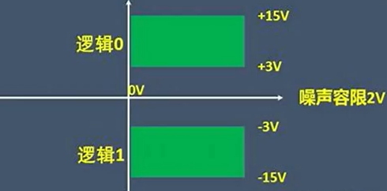</p>​

使用相应的芯片就可以将TTL电平变为232电平

<p align="center"> 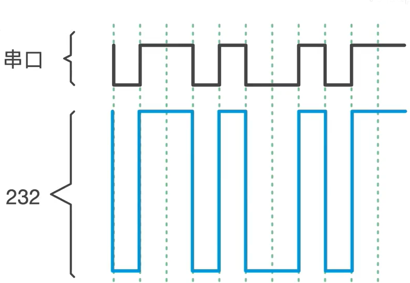</p>​

抗干扰能力变强，传输距离也可以更长，安全距离可达15m，不过运输速度较慢。

‍

- ### RS485

传输方式采用差分信号，抗干扰能力强。且外部接线一般两根线以双绞线的形式缠绕在一起，即使受到干扰也是两根线同时受到干扰，但差值变化不大。硬件上信号收发线为差分信号线，参照接下来CAN处的介绍。

<p align="center"> 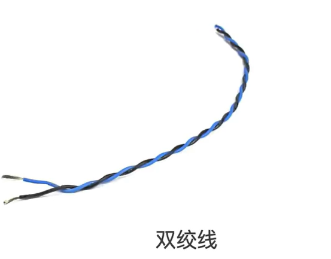</p>​

![屏幕截图 2025-09-10 135807](assets/屏幕截图%202025-09-10%20135807-20250910170108-9de0n1y.png"></p>

逻辑1：A相对B电压在+2 - +6V间； 逻辑0：A相对B电压在-2 - -6V间

<p align="center"> </p>​

‍

<p align="center"> 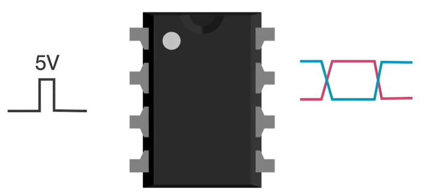</p>​

传输距离更长，频率更高：

<p align="center"> 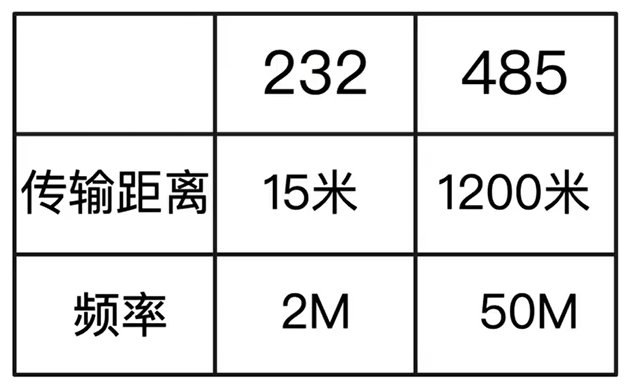</p>​

采用半双工，可进行一主多从的组网通讯，即和很多设备进行通讯。

<p align="center"> </p>​

---

### 2.3 SPI
---
串行外围设备接口 `Serial Peripheral Interface`，高速、全双工、同步的通信总线。在芯片管脚上占用四根线，主要应用在FLASH，实时时钟，AD转换器，还有数字信号处理器和数字信号解码器之间。

- ### 结构

SPI的主机拥有绝对主导权，通信前利用片选线SS选中对应从机与之进行通信。其他设备保持高阻态。  
通信时双方进行寄存器的内容交换速率；SPI由于是同步通信，通信速率完全由主机控制,可以从几百bps到几百Mbps不等,取决与双方硬件承受能力与PCB设计。

<p align="center"> </p>​

- SS：决定主机与哪一从机通信，低电平才有效。不同的从机有不同的SS线（因此SPI内部结构可以是推挽输出）
- GND：图中没有，但是主从机的地线一定是接在一起的
- SCK：时钟线，信号由主机产生
- MOSI：`Master Output, Slave Input`，主机输出，从机接收（相当于数据线）<p align="center"> </p>​
- MISO：`Master Input, Slave Output`，主机接收，从机输出<p align="center"> </p>​

‍

SPI通信中NSS（即片选线）可以分为软件模式和硬件模式，硬件模式之下使用原生的SPI的NSS引脚，软件模式之下可以用任意一个GPIO引脚作为NSS引脚。这样在拥有多个从机的时候我们可以通过软件模式下GPIO的拉高和拉低来实现通信目标的选择。

 - ### 数据收发示例：

<p align="center"> </p>​

要给从机1发送数据01100100：

- 主机 SCLK、MOSI、MISO → 并联到从机 1、从机 2、从机3 的对应引脚（共享总线）；

- 通过代码“点名”，拉低从机1NSS上的电平，其它从机的NSS保持高电平（NSS可以通过GPIO上的某一引脚来实现）
- 启动数据传输（数据从主到从时，从机也可以给主机发送数据）
- 传输结束后，NSS1拉高

 - ### 五个参数

这里与Cube中的配置有关，了解即可，一般默认。

- #### 1.波特率

- 每秒钟传输高低电压的数量。

- 一般取几兆到几十兆赫兹，选取原则：

  - 允许的最大值
  - 设备能承受的
  - 电路板能承受的

- #### 2、比特位传输顺序

- MSB First：先传最高有效位（MSB：Most Significant Bit）
- LSB First：先传最低有效位（LSB：Least Significant Bit）

- #### 3、数据位的长度

8-bit：以8位为一组，每组1字节

16-bit：以16位为一组，每组1个16位整数

波形一般一致，如何选择看实际情况；一般用8-bit

- #### 4、时钟极性与时钟相位

<p align="center"> 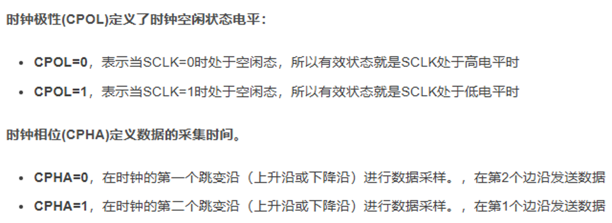</p>​

---

### IIC
---

全称为`Inter-Integrated Circuit`，可实现一主多从的总线通信（半双工通信）。其中任何能够进行发送和接收的设备都可以成为主总线。一个主控能够控制信号的传输和时钟频率。当然，在任何时间点上只能有一个主控。

<p align="center"> 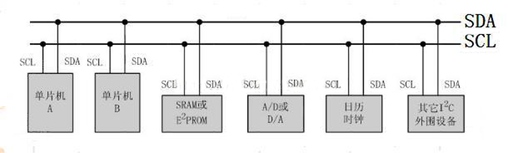</p>​

‍

IIC简单有效，整体占用空间小，可传输距离长达25英尺，并且能够以10Kbps的最大传输速率支持40个组件。

硬件连接：只有两根线，即数据线`SDA`与时钟线`SCL`。时钟信号由主控器件产生。所有接到IIC总线设备上的串行数据SDA都接到总线的SDA上，各设备的时钟线SCL接到总线的SCL上。对于并联在一条总线上的每个IC都有唯一的地址。

主机和从机的SCL/SDA都使用开漏输出。因为推挽输出可能存在不同芯片的PMOS和NMOS同时导通的情况，会造成短路，烧毁芯片。开漏输出需外接上拉电阻，使得逻辑1能够获得一个稳定的高电平支撑；阻值一般是4.7k。

开漏输出可以实现逻辑线与：

- 若向所有IO引脚写1，输出高阻抗，但是因为总线的存在，输出电压就是1
- 任意引脚写0，该引脚输出低电压，总线电压被拉低<p align="center"> </p>

注：因为STM32的硬件IIC非常复杂，更重要的是它并不稳定，所以我们一般不使用它自带的IIC，而是通过软件的方式来模拟。


### 通信过程

起始位 + 寻址 + 数据传输 + 停止位

#### 起始位：

空闲状态下总线为高电平。要发送数据时，在SCL为高电平时，向SDA发送下降沿：

<p align="center"> 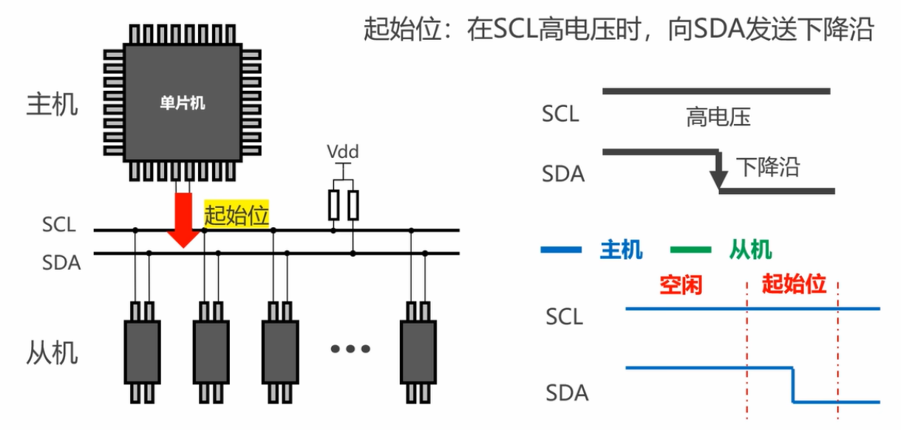</p>​


#### 寻址：

主机先发送从机的地址，“呼叫”从机。

地址后的一位写是主机要读还是写数据。

发送完后主机释放SDA，即恢复总线上的高电平，等待从机上的应答，即等待从机将总线电平拉低。

<p align="center"> </p>​

寻址NAK的原因：

- 地址填错；要寻址的从机不存在
- 要寻址的从机正忙，未来得及回复ACK
- 从机坏了

#### 数据传输

同样地，主机写/读完数据后释放SDA，等待从机应答后继续发送/读取数据。

<p align="center"> 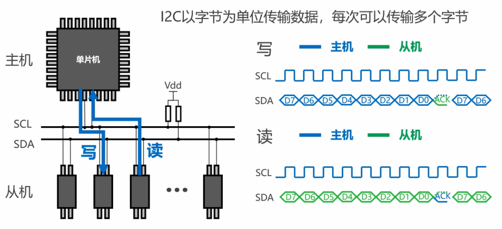</p>​

#### 停止位

在SCL为高电平时，向SDA发送上升沿。

<p align="center"> 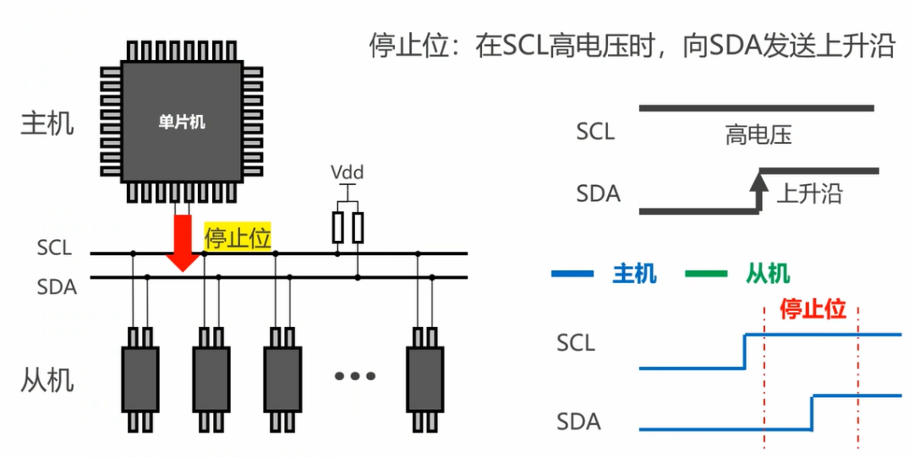</p>​

#### 一个例子：

- 向从机0x78写0x5a，0x33

- 读1个字节

<p align="center"> </p>​

### 通信速率：

了解即可。

<p align="center"> 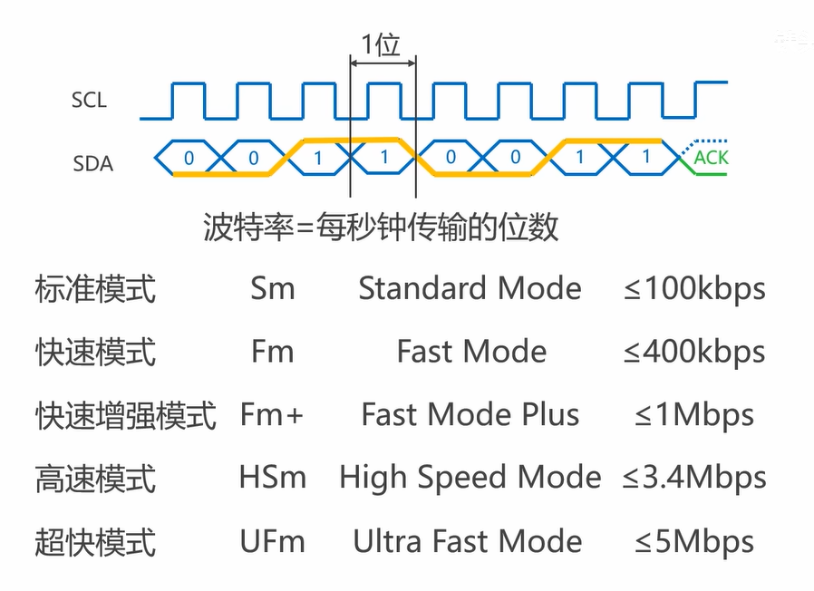</p>​

---
### CAN总线
---
### 简介

全称为`Controller Area Network`，广泛应用于汽车、工业控制和机器人等需要高可靠性和实时数据交换的领域。它支持多节点通信和消息优先级仲裁机制，确保关键数据优先传输。CAN 协议无需主控时钟，同步实现数据传输，速度可达 1 Mbps，并内置错误检测与纠正机制，确保通信的安全与可靠性。

CAN 通过 两条差分信号线（`CAN_H` 和 `CAN_L`） 传输数据，具备强抗干扰能力，即使在电磁环境复杂的场景中也能稳定工作。

### 硬件连接

一般情况需要使用CAN收发芯片，并且在需要走阻抗为100欧的差分线（长度需要相同），并且需要使用一个120欧的终端电阻。<p align="center"> </p>​

还需要注意，我们给单片机配置的引脚时`CAN_TX`和`CAN_RX`，这两者是不需要走差分线的；但是`CAN_H`和`CAN_L`是需要严格走差分线的。<p align="center"> </p>​

<p align="center"> 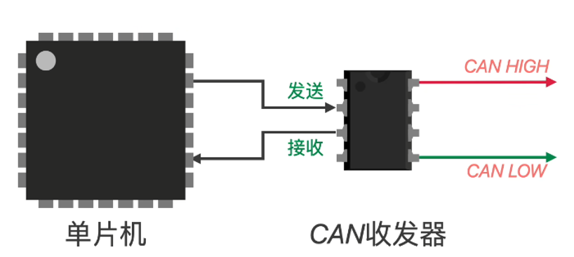</p>​

‍

### 显性电平和隐性电平：

两根信号线的电压差CAN_H - CAN_L表示CAN总线的电平，与传输的逻辑信号1或0对应。显性为0，隐性为1。发送逻辑1时收发器不作反应，发送逻辑0时收发器试图让总线上出现电压差。当节点需要发送数据时，它会通过输出显性电平来将数据传输到总线上。

由于显性电平0可以覆盖隐性电平1，因此当多个节点同时尝试发送数据时，具有最高优先级的节点（通常通过其ID号决定）将能够成功地将数据发送到总线上。

<p align="center"> </p>​

​

‍

‍
