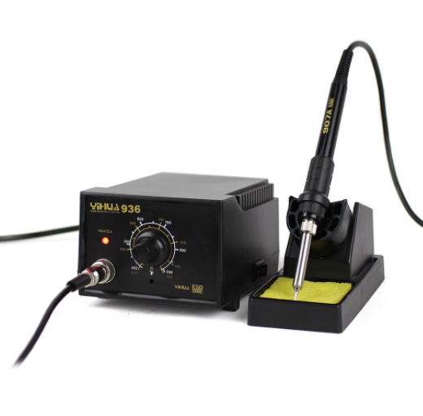
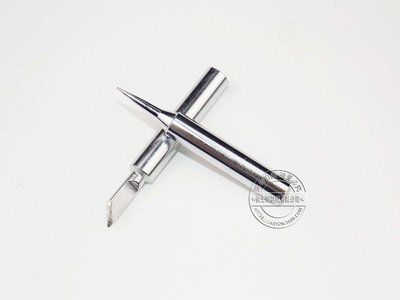
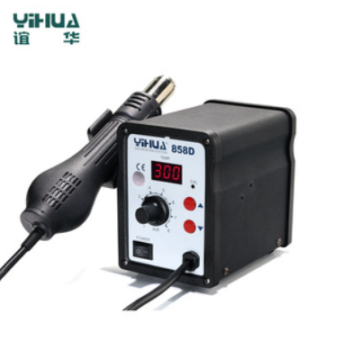
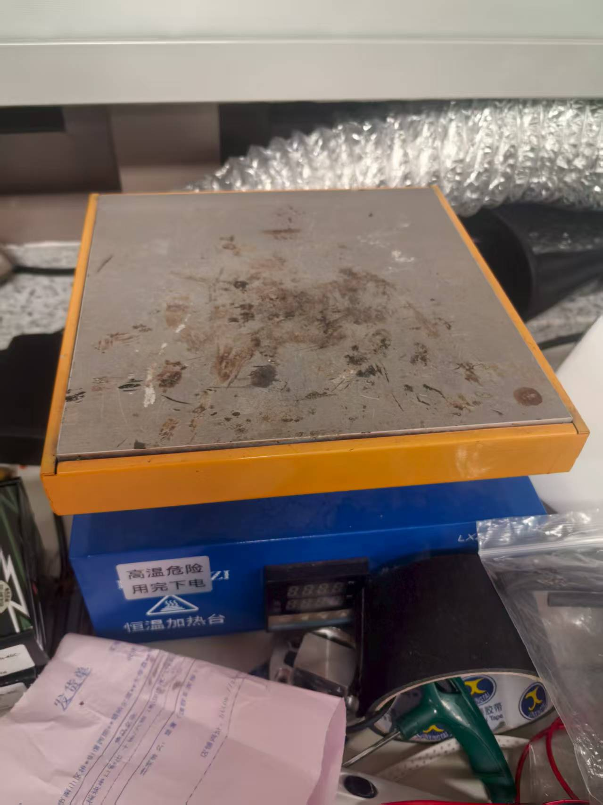
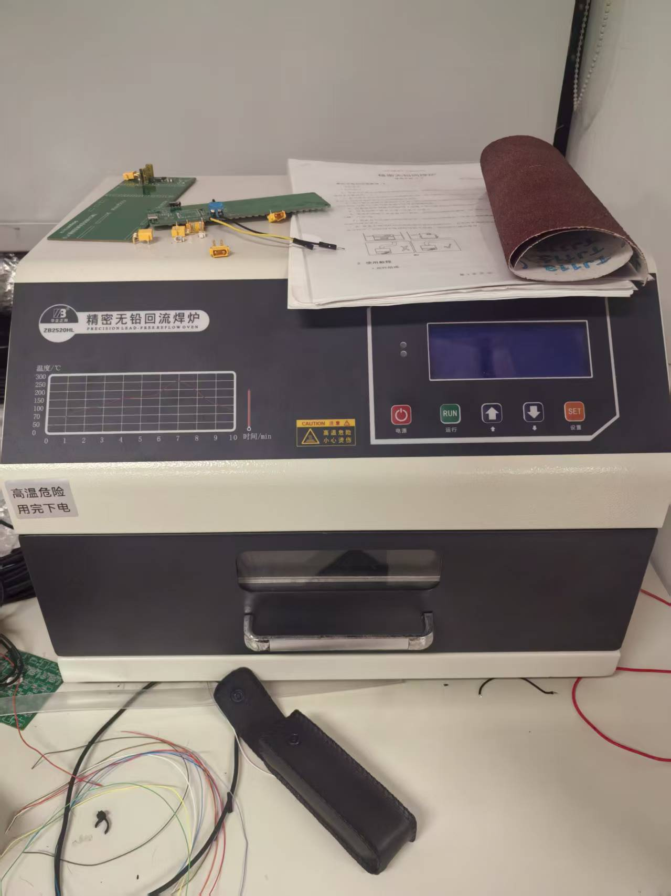
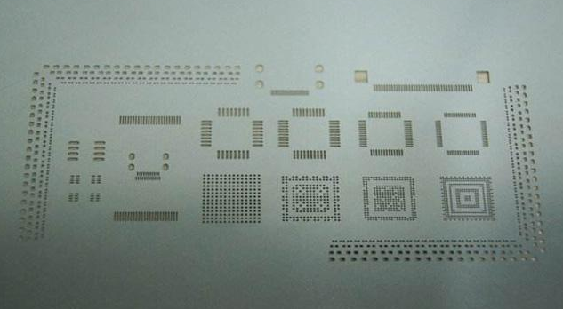
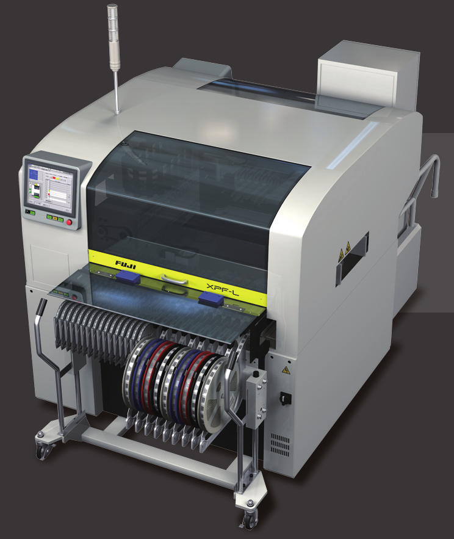
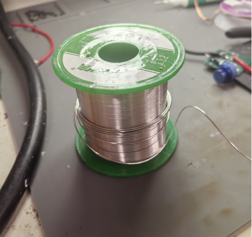
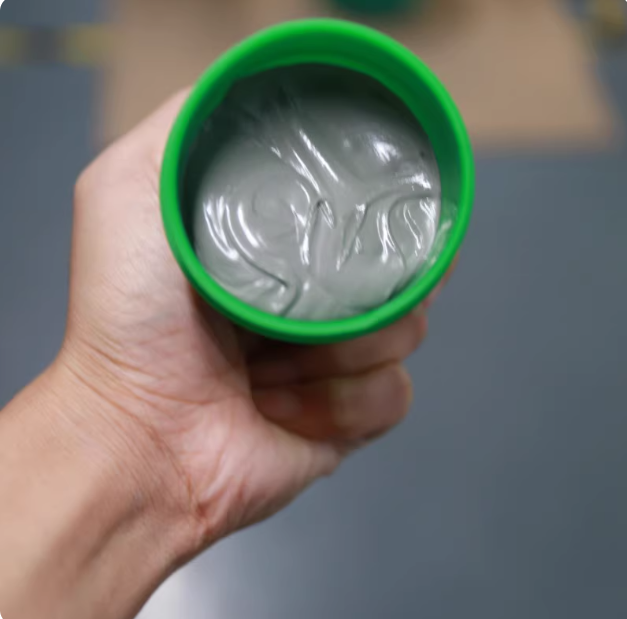
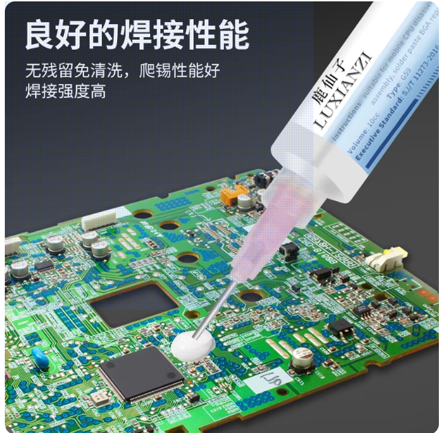

# 哈尔滨工业大学（深圳）南工骁鹰战队
---
<h2 style="text-align:center;"> 硬件组第四讲培训讲义——焊接培训 </h2>

***
#### 撰写人：杨目川        
#### 审核人：张韶恒
---
## 目录/教学要点
---
### 一. 常见焊接方式及器材
***1.1 电烙铁***  -[跳转](#11-电烙铁)
***1.2 热风枪***  -[跳转](#1-2-热风枪)
***1.3 加热台***    -[跳转](#1-3-加热台)
***1.4 回流焊炉和钢网*** -[跳转](#1-4-回流焊炉和钢网)
***1.5 贴片机***    -[跳转](#1-5-贴片机)
### 二. 焊接常用材料
***1.  锡丝***  -[跳转](#2-1-锡丝)
***2. 锡膏***   -[跳转](#2-2-锡膏)
***3. 助焊剂*** -[跳转](#2-3-助焊剂)
### 三.焊接技巧
***1. 焊接基本技巧***   -[跳转](#3-1-焊接基本技巧)
***2. 温度选择***   -[跳转](#3-2-温度选择)
***3. 其他注意事项***   -[跳转](#3-3-其他注意事项)
***
### 一.常见焊接方式及器材

---

### 1.1 电烙铁
---

  

  电烙铁如图所示，呈一个笔状。烙铁的内部有一个陶瓷发热芯，上面缠绕电阻丝，电阻丝发热后将热量传导给金属外壳。图中能看到的金属部分在烙铁工作时都是高温的，切莫接触。电烙铁常常被用来焊接直插式的器件以及一些大功率器件。   
  
烙铁如果放在桌子或者其他东西上，轻则烫坏东西，重则引发火灾；所以烙铁必须放在图中的这个架子上。架子下面有一块高温海绵，沾水浸湿后可以用来去除烙铁上多余的锡。只需将烙铁在海绵上刮一下，原本融化的锡就会因为降温变成锡球。
左边的旋钮可以调节烙铁的温度。我们实验室里的烙铁高级一点，是用按钮调节的，而且可以实时监控烙铁头的温度。

  

常见的烙铁头有两种，如图所示，分为刀头和笔头，分别适合用于不同的焊接情况。可以看到第一张图中烙铁的金属部分靠起始端的地方，那里可以扭开以更换烙铁头。平时我们使用的一般都是刀头。
下面同学们请观看一段视频，看看电烙铁是如何使用的。
https://www.bilibili.com/video/BV1xV411r7YY?spm_id_from=333.788.videopod.episodes&vd_source=b6a240204b5585dc5a0c03e3ca028454&p=2

---
### 1.2 热风枪
---

  

第二种常见的器材是热风枪。热风枪常常被用来焊接贴片式的器件。热风枪通过风机吸收空气，将它们吹过热的电阻丝加热后再吹出高温热风，实现对焊锡的加热。与烙铁一样，末端的金属部分是高温的，平时必须放在架子上。
机器上一般可以调节温度和风速。不同的温度适用于不同的焊锡，适当的提高风速可以加速锡的融化，但要注意，热风枪可能会吹飞一些微小的器件，因此不宜将风速开的过高。
热风枪的风速和温度均可调节。风速应遵循‘够用即可’的原则，通常从中低档开始，以确保不会吹跑轻小的贴片元件。在热量感觉不足时，应优先考虑适当提高温度或延长加热时间，而不是大幅增加风速。过高的风速是导致元件移位或丢失的常见原因。
另外，风枪吹出的热风可能波及到周围的器件，可能会让一些你已经焊好的器件松动，或者让一些塑料的连接器融化变形。这一点是需要注意的。   

下面我们还是看一段用风枪焊接的视频。   

https://www.bilibili.com/video/BV1xV411r7YY?spm_id_from=333.788.videopod.episodes&vd_source=b6a240204b5585dc5a0c03e3ca028454&p=6

---
### 1.3 加热台

  

下面要讲的器材是加热台。加热台的上方整个金属表面都可用于加热，使用时将PCB放在加热台上，加热台可以直接利用金属表面将热量充分传导给PCB。加热台的优势在于能够非常稳定、充分地加热每一个焊盘，让焊锡充分融化。就不像烙铁或者风枪那样，风枪你可能吹十几秒钟它就是不花，化了之后拿开一下锡又凝固了。
但加热台也有缺点，充分加热一整块PCB需要一个较长的时间。如果只是其中的一块器件有故障，那么这时候风枪或者烙铁就会方便很多。另外，加热台不能焊接双面都有器件的板子，比如我一面已经焊好了器件，你要焊另一面的时候就不可能再把这一面放到加热台上加热了。
加热台实际上主要是在用来焊接一些特殊封装的芯片（如BGA）时，或者用来拆卸芯片，搬板时具有优势。     

下面我们也来观看一段视频。   

https://www.bilibili.com/video/BV17e411M744/?spm_id_from=333.337.search-card.all.click&vd_source=b6a240204b5585dc5a0c03e3ca028454

---
### 1.4 钢网和回流焊炉
 --- 

  

  

上面讲的主要都是小批量焊接的方式，如果要批量地快速焊接就需要用到回流焊炉和钢网。
钢网上的每一个孔洞都对应着PCB上的一个需要上锡的焊盘，把钢网叠在PCB上对齐后就可以直接将锡膏（锡膏是一种膏状的焊锡流体，后面会具体讲）刷一遍，这样PCB上该上锡的地方就都上了锡。   

之后，我们将元器件一个个摆放到对应的位置，就可以放入回流焊炉中。
回流焊炉能够按照我们设定的温度曲线对PCB进行加热，在加热的过程中锡膏会变成融化的锡，之后降温实现焊接。
回流焊的优势在于能够批量焊接，如果你同时要焊几块相同的板子，就可以批量地上锡，放元器件，最后批量地加热。与用热风枪或者烙铁比省去了一个个加热的过程，解放了双手。   

另外，用钢网来上锡会比一般我们自己涂锡膏要强，这样一刷下来的锡会比较均匀地分布在焊盘上，且不会过量或过少。可以减少虚焊或者连锡的问题。

---
### 1.5 贴片机
---

  

贴片机是一种大型的自动化机器。将PCB用钢网上好锡之后，跟元器件一起放进去它就能自动按照预先设定的点位自动将元器件放到对应的位置，之后放入回流焊炉加热。   

但是使用起来较麻烦，因为要预先编程。比较适合一些批量的焊接。比如战队里的一个能量机关模型的扇叶，上面的灯就都是贴片上去的。另外，一些工厂里也会使用这种机器，比如你再jlc打板的时候可以选择SMT，SMT就是它会帮你把整个板子焊好，给你发过来的时候就是一块完整的板子。jlc就是用贴片机实现的。
这个东西我们平时也不常用。

---

### 二. 焊接常用材料
---

### 2.1 锡丝
---

  

焊锡丝就是这样锡制的软质细线。我们刚才在讲烙铁的视频中就看到过这个了。使用时可以用烙铁融化，用来焊接。锡丝并不是纯的锡，其中会掺杂一些铅或者其他金属来降低熔点。因此锡丝可以分为有铅和无铅的两大类。不同的掺杂成分和比例会让锡丝的熔点不同。   

另外，锡丝内部是中空的，其中有助焊剂，可以避免锡被烙铁加热时过快地氧化。   

锡丝焊接时，助焊剂和铅在高温下会产生烟尘，吸入对人体有害。所以焊台旁边配备了一个抽风管，可以用来吸烟尘。如果同学们还怕吸入烟气的话，可以选择用N95的口罩。

---

### 2.2 锡膏      
 

  

刚才我们在贴片焊接的视频里看过怎么使用锡膏。锡膏是含锡的粘稠膏状流体，实际上里面是很多非常细小的铅球，和助焊剂等成分。同样，锡膏中也会加入铅或者一些其他的金属如银，铜，也可以分为有铅和无铅两大类。
不同的掺杂成分和比例同样会带来不同的熔点，锡膏也可以此分为低温锡膏，中温锡膏和高温锡膏三大类。不同的锡膏在回流焊时就需要设置不同的温度。低温的锡膏可用于焊接耐受温度较低的元件比如led，或者塑料连接件等。高温锡膏焊出的焊点强度最高，而且因为熔点高，能够耐受一些极端环境。中温锡膏则是平衡了两者的优缺点，常用与一般的电路板比如电脑，手机的主板。

---

### 2.3 助焊剂
---
 

  

助焊剂在刚才我们都提到过，也有这种单独用的助焊剂。常见的助焊剂一般用松香作为基底，加入不同量的活化剂以增强去氧化剂。助焊剂常被用来拆卸元器件或者除掉多余的锡。
有的时候你会发现锡怎么加热都不化，这就是因为锡的表面形成了一层氧化层。而松香具有弱酸性，所以可以腐蚀掉氧化层，促进锡的融化。
但是，残留的助焊剂可能会腐蚀电路板或者造成短路，所以焊接完成后我们一般要使用pcb清洁剂除掉板子上残留的助焊剂。
***

### 三.焊接技巧
---
### 3.1 基本焊接技巧
---
焊接的本质就是加热锡，然后让锡在焊盘和引脚上形成良好的连接。可以看到这张ppt上面的图，这是一个常见的焊接直插式元件的图，只有左边的这两种是良好的焊接。这样的金字塔或火山口的形状才能说明锡把引脚和焊盘紧密包裹，之间没有缝隙，有良好的电气连接和机械强度。
焊接中常见的两种问题就是虚焊和连锡。前者是锡太少，后者是锡太多。图中的第三个例子中，锡太多而遮住了引脚和焊盘的链接部分，我们不能判断此时有没有虚焊，第四个和第五个都是锡太少，连接强度不足而且存在虚焊的可能。第六个不对称，会对机械强度和电气连接起影响；第七个有不规则的形状，一般要么是温度不够，要么是引脚和焊盘不清洁，这样的一坨锡里面可能与引脚或焊盘之间有间隙；第八个和第三个是类似的问题。最后一个的引脚都插歪了。
一般来说，如果锡充分融化，而且焊盘和引脚都保持清洁的话，锡和铜之间会自然地浸润，而锡的表面张力会自然让锡形成第一个例子中的情况。如果你发现怎么样锡都不能形成这个样子，那大概率就是温度不够，或者锡氧化了，可以加一点助焊或者直接加锡，因为锡中也有助焊剂。再或者就是焊盘和引脚不干净，有一些脏东西。
左下角这张图就是一个操作顺序的范例，这样的顺序可以确保锡的充分加热。
在贴片焊接中我们也有同样的要求，每一个焊点都需要呈比较自然的曲面状，不能有尖刺或者其他不规则的形状。但是贴片焊接一般不用烙铁，所以一般不会出什么大问题。

---

### 3.2 温度选择
---
实验室的这些焊接设备的温度都可调。在用电烙铁焊接时，一般可以将温度调到350℃以上，不用超过380℃。如果是拆卸的话，可以适当调高温度，不过一般380，390度都是够用的了。超过400摄氏度的情况都比较少见。
用热风枪时，对于我们常用的焊锡，270多摄氏度左右就够了。如果想焊接的快一点可以调到280℃以上；同样如果是拆卸的话可以适当调高温度，但一般不会超过320度。
注意，在使用这两种设备时会很容易加热到其他已经焊好的期间，对于一些不耐热的器件，可能直接导致损坏。
如果使用回流焊炉，则一般视使用的锡膏种类调节温度。一般回流焊炉有预设的温度曲线供我们选择。

---

### 3.3 其他注意事项
---
焊接时要注意有一些元件是不耐热的，不能过度加热。一般在元件的数据手册的末尾有推荐焊接条件，大家可以提前看一下。
因此焊接的时候要遵循一定的顺序，先焊耐热的后焊不耐热的。注意先焊比较扁的原件比如各种贴片元件。最后焊一些比较高的原件比如各种连接器，直插原件。不然你焊完一面焊另一面的时候就会放不平。
最后就是再强调一定要浸润。一般浸润了，这个元件焊的就是好的。
