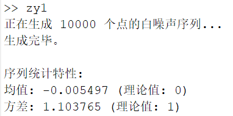
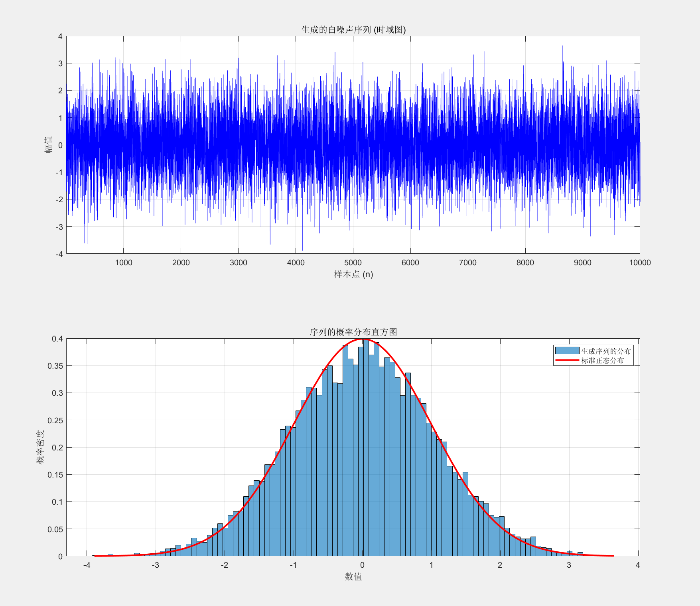

## 系统与建模第二次作业
---
### 张韶恒 自动化三班 2023312309
---
### 一、代码展示
---

**代码设计的思路为**：乘同余法生成一个在 (0, 1) 区间均匀分布的伪随机数，然后利用中心极限定理，将12个这样的随机数相加，得到一个近似服从标准正态分布的随机数。最后，将生成的随机数序列作为白噪声序列。

**代码如下所示：**

```matlab
function generate_white_noise()
    % 系统建模与仿真作业2
    % 任务：利用乘同余法和中心极限定理生成服从标准正态分布的离散白噪声过程
    % 作者：张韶恒
    % 日期：10月14号凌晨///累死了

    % 一些参数设置
    N = 10000; % 设置需要生成的白噪声序列的长度

    % Step 1 & 2: 调用核心函数生成正态分布序列
    % 这个序列根据定义即为所需的白噪声序列
    fprintf('正在生成 %d 个点的白噪声序列...\n', N);
    white_noise_sequence = generate_normal_clt(N);
    fprintf('生成完毕。\n\n');
```
```matlab
    % Step 3: 验证与可视化
    % 计算并显示序列的均值和方差
    % 对于标准正态分布，均值应接近0，方差应接近1
    seq_mean = mean(white_noise_sequence);
    seq_var = var(white_noise_sequence);
    fprintf('序列统计特性:\n');
    fprintf('均值: %f (理论值: 0)\n', seq_mean);
    fprintf('方差: %f (理论值: 1)\n', seq_var);

    % 1. 绘制生成的白噪声序列时域波形
    figure('Name', '白噪声序列分析');
    subplot(2, 1, 1);
    plot(1:N, white_noise_sequence, 'b-');
    grid on;
    title('生成的白噪声序列 (时域图)');
    xlabel('样本点 (n)');
    ylabel('幅值');
    xlim([1, N]);

    % 2. 绘制序列的直方图以验证其正态分布特性
    subplot(2, 1, 2);
    histogram(white_noise_sequence, 100, 'Normalization', 'pdf');
    hold on;

    % 绘制标准正态分布的概率密度函数曲线用于对比
    x = linspace(min(white_noise_sequence), max(white_noise_sequence), 1000);
    pdf_curve = normpdf(x, 0, 1);
    plot(x, pdf_curve, 'r-', 'LineWidth', 2);
    grid on;
    title('序列的概率分布直方图');
    xlabel('数值');
    ylabel('概率密度');
    legend('生成序列的分布', '标准正态分布');
    hold off;

end

function normal_seq = generate_normal_clt(num_points)

    normal_seq = zeros(1, num_points); % 预分配内存
    N_sum = 12; 
    % 初始化乘同余法的种子
    % 使用当前时间来初始化，确保每次运行结果不同
    % 如果需要可复现的结果，可以设置一个固定的奇数，例如 x0 = 1;
    c = clock;
    seed = floor(c(6) * 1e6) + 1;
    if mod(seed, 2) == 0
        seed = seed + 1; % 确保种子是奇数
    end

    for i = 1:num_points
        sum_uniform = 0;
        for j = 1:N_sum
            % 调用乘同余法生成一个(0,1)均匀分布的随机数
            [rand_num, seed] = multiplicative_congruential_rand(seed);
            sum_uniform = sum_uniform + rand_num;
        end
        
        % 根据中心极限定理，12个(0,1)均匀分布随机变量之和近似服从均值为6, 方差为1的正态分布
        % 即 sum_uniform ~ N(N_sum * 0.5, N_sum * 1/12) = N(6, 1)
        % 将其标准化，得到标准正态分布 N(0, 1)
        % 标准化公式: Z = (X - mu) / sigma = (sum_uniform - 6) / 1
        normal_seq(i) = sum_uniform - 6;
    end
end

function [uniform_rand, next_seed] = multiplicative_congruential_rand(current_seed)
    % 函数使用乘同余法生成一个在(0, 1)区间均匀分布的伪随机数
    % 实现依据: "乘同余法"
    % 公式: x_i = (A * x_{i-1}) mod M
    
    % 参数选择
    % M = 2^k, k > 2
    % A mod 8 = 3 或 A mod 8 = 5
    % x0 (种子) 为奇数
    
    k = 31; % 选择一个较大的k以获得较长的周期
    M = 2^k; 
    
    % 选择一个满足条件的乘数 A。65539 是一个常用选择。
    % 19 mod 8 = 3
    A = 19; 

    % 执行乘同余法
    next_seed = mod(A * current_seed, M);
    
    % 将生成的整数序列归一化到 (0, 1) 区间
    uniform_rand = next_seed / M;
end
```
---
### 二、运行结果展示
---
**运行结果如下所示：**

命令行窗口：


---

运行结果图像展示：
