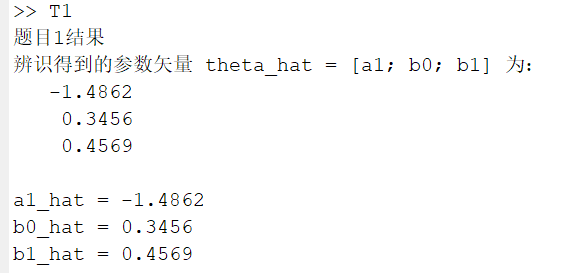
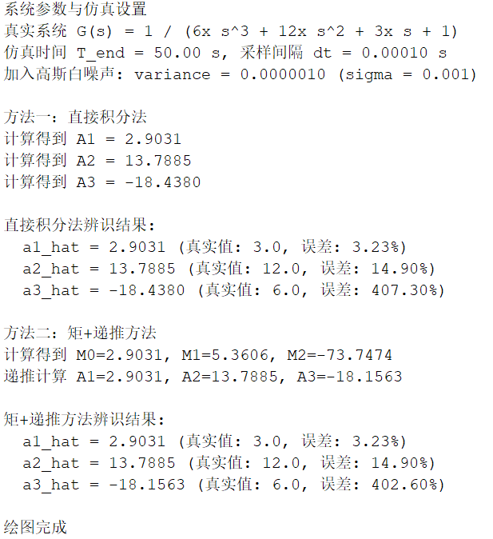
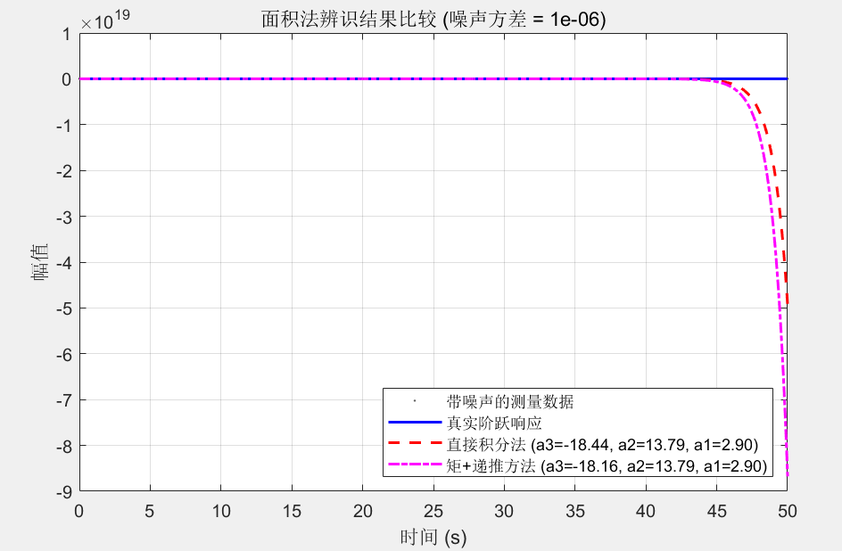
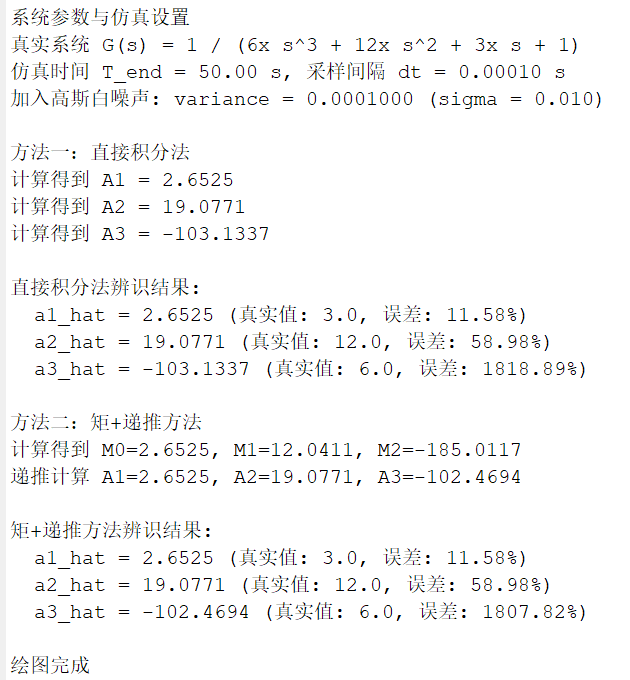
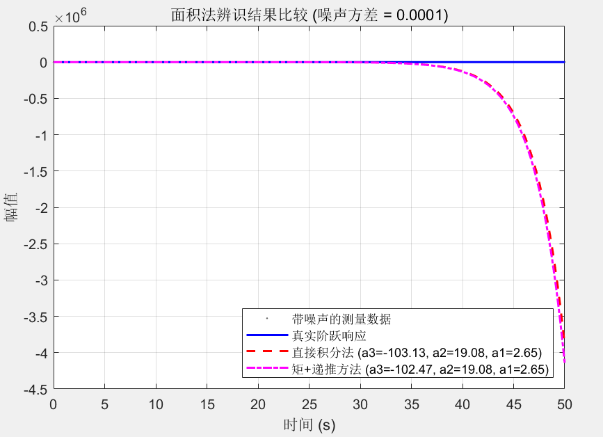
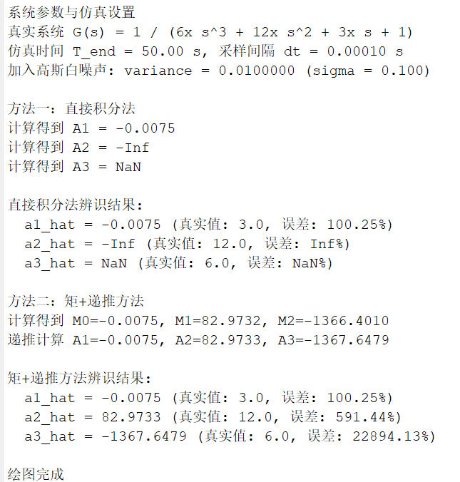
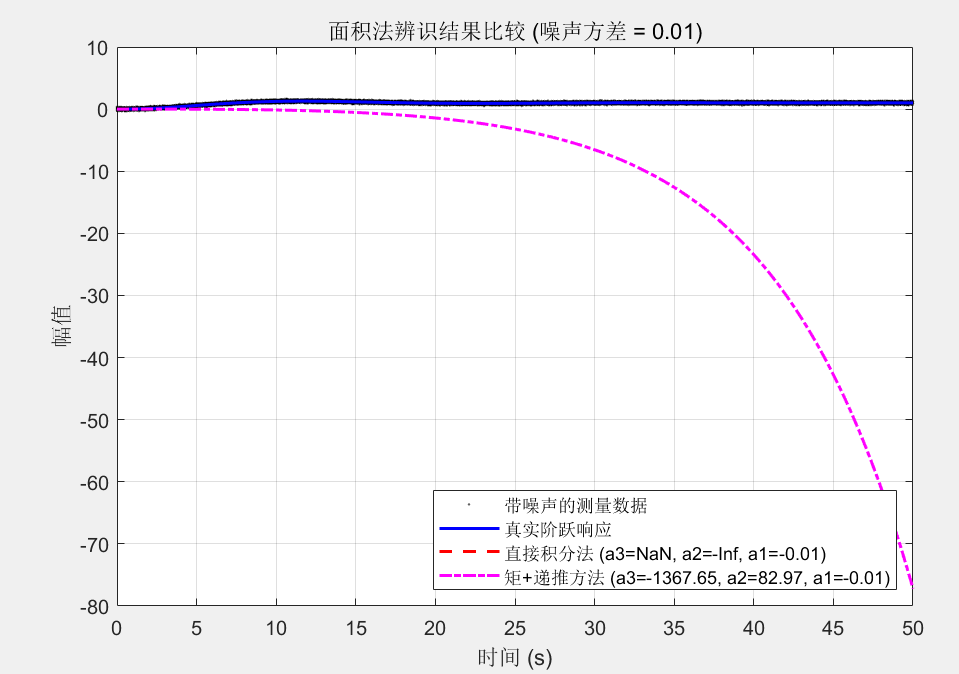
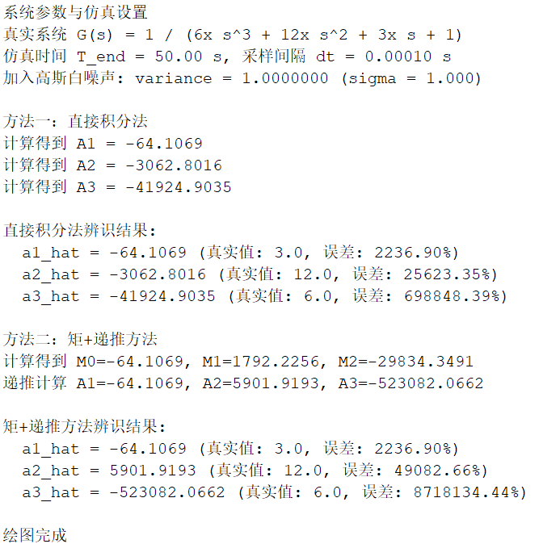
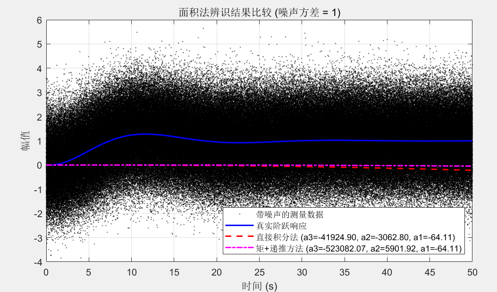

## 系统建模与仿真作业三
### 张韶恒 2023312309
---
### T1:
```matlab
    % 定义已知的输入 u 和输出 y 数据
    u = [2.1; -2.7; 0.8; 1.5; -2.1];
    y = [0.3; 0.5; -0.2; 0.6; 0.83];

    % 辨识模型: y(k) = -a1*y(k-1) + b0*u(k) + b1*u(k-1)
    % 待求参数: theta = [a1; b0; b1]
    % 矩阵形式: Y = Phi * theta

    % 构建 Y 向量
    % Y = [y(2); y(3); y(4); y(5)]
    % 从 k=2 开始构建，因为 k=1 时没有 k-1 项
    Y = y(2:5);

    % 构建 Phi 矩阵
    % Phi 的每一行对应一个 k: [-y(k-1), u(k), u(k-1)]
    % k=2: [-y(1), u(2), u(1)]
    % k=3: [-y(2), u(3), u(2)]
    % k=4: [-y(3), u(4), u(3)]
    % k=5: [-y(4), u(5), u(4)]
    Phi = [ -y(1:4), u(2:5), u(1:4) ];

    % 求解 theta = Phi \ Y
    % 这是 MATLAB 中求解超定方程组 Y = Phi * theta 的标准最小二乘解
    theta_hat = Phi \ Y;

    % 显示最终估计的参数
    fprintf('题目1结果\n');
    fprintf('辨识得到的参数矢量 theta_hat = [a1; b0; b1] 为：\n');
    disp(theta_hat);
    fprintf('a1_hat = %.4f\n', theta_hat(1));
    fprintf('b0_hat = %.4f\n', theta_hat(2));
    fprintf('b1_hat = %.4f\n', theta_hat(3));
```
### 运行结果：


---
### T2:
```matlab
    clear; clc; close all;

    a3_true = 6;
    a2_true = 12;
    a1_true = 3;
    den_true = [a3_true, a2_true, a1_true, 1];
    G_true = tf(1, den_true);

    % 仿真参数
    T_end = 50;       % 仿真结束时间
    dt = 0.0001;        % 采样时间间隔
    t = (0:dt:T_end)'; % 时间向量

    % 噪声参数
    noise_variance = 0.000001; % 噪声方差
    noise_sigma = sqrt(noise_variance);

    % 生成带噪声的阶跃响应
    h_clean = step(G_true, t); % 获取纯净的阶跃响应

    % 加入高斯白噪声
    rng('default'); % 为了结果可复现
    noise = noise_sigma * randn(size(h_clean));
    h_noisy = h_clean + noise;

    % 数据预处理
    % 归一化/无因次化 (使用噪声数据的最后一个点作为稳态估计值)
    h_star = h_noisy / h_noisy(end);
    % 基准积分项
    integrand_base = 1 - h_star;

    fprintf('系统参数与仿真设置\n');
    fprintf('真实系统 G(s) = 1 / (%.fx s^3 + %.fx s^2 + %.fx s + 1)\n', a3_true, a2_true, a1_true);
    fprintf('仿真时间 T_end = %.2f s, 采样间隔 dt = %.5f s\n', T_end, dt);
    fprintf('加入高斯白噪声: variance = %.7f (sigma = %.3f)\n\n', noise_variance, noise_sigma);

    %% 直接积分硬求A1 A2 A3法————作为对比用的法一
    fprintf('方法一：直接积分法\n');
    % 计算 A1 = c1
    A1_direct = trapz(t, integrand_base);
    c1_direct = A1_direct;
    fprintf('计算得到 A1 = %.4f\n', A1_direct);

    % 计算 A2 = c2
    G1_direct = tf(1, [c1_direct, 1]);       % G1(s) = 1/(c1*s + 1)
    h1_star_direct = step(G1_direct, t);     % 计算 h1*(t)
    d1_direct = h1_star_direct - h_star;     % 计算 h1* - h*
    I1_direct = cumsum(d1_direct) * dt;      % 第一次积分
    A2_direct = trapz(t, I1_direct);         % 第二次积分
    c2_direct = A2_direct;
    fprintf('计算得到 A2 = %.4f\n', A2_direct);

    % 计算 A3 = c3
    G2_direct = tf(1, [c2_direct, c1_direct, 1]); % G2(s) = 1/(c2*s^2 + c1*s + 1)
    h2_star_direct = step(G2_direct, t);          % 计算 h2*(t)
    d2_direct = h2_star_direct - h_star;          % 计算 h2* - h*
    I2_inner_direct = cumsum(d2_direct) * dt;     % 第一次积分
    I2_middle_direct = cumsum(I2_inner_direct) * dt; % 第二次积分
    A3_direct = trapz(t, I2_middle_direct);       % 第三次积分
    c3_direct = A3_direct;
    fprintf('计算得到 A3 = %.4f\n', A3_direct);

    % 辨识出的参数
    a1_id_direct = c1_direct;
    a2_id_direct = c2_direct;
    a3_id_direct = c3_direct;

    fprintf('\n直接积分法辨识结果:\n');
    fprintf('  a1_hat = %.4f (真实值: %.1f, 误差: %.2f%%)\n', a1_id_direct, a1_true, abs(a1_id_direct-a1_true)/a1_true*100);
    fprintf('  a2_hat = %.4f (真实值: %.1f, 误差: %.2f%%)\n', a2_id_direct, a2_true, abs(a2_id_direct-a2_true)/a2_true*100);
    fprintf('  a3_hat = %.4f (真实值: %.1f, 误差: %.2f%%)\n', a3_id_direct, a3_true, abs(a3_id_direct-a3_true)/a3_true*100);

    % 创建辨识出的传递函数
    G_id_direct = tf(1, [a3_id_direct, a2_id_direct, a1_id_direct, 1]);

    %% 先求矩M1 M2 M3 递推求 A1 A2 A3法————作为对比用的法二
    fprintf('\n方法二：矩+递推方法\n');

    % 计算 M0, M1, M2
    M = zeros(3, 1); % M(1)=M0, M(2)=M1, M(3)=M2
    M(1) = trapz(t, integrand_base .* ((-t).^0 / factorial(0))); % M0
    M(2) = trapz(t, integrand_base .* ((-t).^1 / factorial(1))); % M1
    M(3) = trapz(t, integrand_base .* ((-t).^2 / factorial(2))); % M2
    fprintf('计算得到 M0=%.4f, M1=%.4f, M2=%.4f\n', M(1), M(2), M(3));

    % 递推计算 A1, A2, A3
    A_moment = zeros(3, 1); % A_moment(1)=A1, A_moment(2)=A2, A_moment(3)=A3
    A_moment(1) = M(1);                            % A1 = M0
    A_moment(2) = M(2) + A_moment(1) * M(1);       % A2 = M1 + A1*M0
    A_moment(3) = M(3) + A_moment(1) * M(2) + A_moment(2) * M(1); % A3 = M2 + A1*M1 + A2*M0
    fprintf('递推计算 A1=%.4f, A2=%.4f, A3=%.4f\n', A_moment(1), A_moment(2), A_moment(3));

    % 辨识出的参数
    a1_id_moment = A_moment(1);
    a2_id_moment = A_moment(2);
    a3_id_moment = A_moment(3);

    fprintf('\n矩+递推方法辨识结果:\n');
    fprintf('  a1_hat = %.4f (真实值: %.1f, 误差: %.2f%%)\n', a1_id_moment, a1_true, abs(a1_id_moment-a1_true)/a1_true*100);
    fprintf('  a2_hat = %.4f (真实值: %.1f, 误差: %.2f%%)\n', a2_id_moment, a2_true, abs(a2_id_moment-a2_true)/a2_true*100);
    fprintf('  a3_hat = %.4f (真实值: %.1f, 误差: %.2f%%)\n', a3_id_moment, a3_true, abs(a3_id_moment-a3_true)/a3_true*100);

    % 创建辨识出的传递函数
    G_id_moment = tf(1, [a3_id_moment, a2_id_moment, a1_id_moment, 1]);

    %% 对比一下谁的效果好 + 画图分析
    figure;
    % 绘制带噪声数据和真实响应
    plot(t, h_noisy, 'k.', 'MarkerSize', 2, 'DisplayName', '带噪声的测量数据');
    hold on;
    plot(t, h_clean, 'b-', 'LineWidth', 1.5, 'DisplayName', '真实阶跃响应');

    % 计算辨识模型的阶跃响应
    h_id_direct = step(G_id_direct, t);
    h_id_moment = step(G_id_moment, t);

    plot(t, h_id_direct, 'r--', 'LineWidth', 1.5, 'DisplayName', ...
        sprintf('直接积分法 (a3=%.2f, a2=%.2f, a1=%.2f)', a3_id_direct, a2_id_direct, a1_id_direct));
    plot(t, h_id_moment, 'm-.', 'LineWidth', 1.5, 'DisplayName', ...
        sprintf('矩+递推方法 (a3=%.2f, a2=%.2f, a1=%.2f)', a3_id_moment, a2_id_moment, a1_id_moment));

    hold off;
    grid on;
    xlabel('时间 (s)');
    ylabel('幅值');
    title(['面积法辨识结果比较 (噪声方差 = ' num2str(noise_variance) ')']);

    legend('Location', 'southeast', 'Interpreter', 'none'); 

    fprintf('\n绘图完成\n');
```
### 运行结果：
#### 第一组：白噪声方差0.000001



---

#### 第二组：白噪声方差0.0001



---

#### 第三组：白噪声方差0.01



---

#### 第四组：白噪声方差1

